# From Sand to Software: A Complete Guide to Computer Architecture & Operating Systems

> **A first-principles journey through the hardware and software that powers every modern computer**
>
> *For beginners who want to understand how computers really work — all the way from transistors to web browsers*

---

## Table of Contents

1. [Introduction](#1-introduction)
2. [Computer Architecture](#2-computer-architecture)
3. [Binary and Hexadecimal](#3-binary-and-hexadecimal)
4. [Operating Systems](#4-operating-systems)
5. [Processes](#5-processes)
6. [Memory Management](#6-memory-management)
7. [Filesystems](#7-filesystems)
8. [Virtualization](#8-virtualization)
9. [Putting Everything Together](#9-putting-everything-together)
10. [Complete Glossary](#10-complete-glossary)

---

# 1. Introduction

## What a Computer Really Is

At its simplest, a computer is a **machine that manipulates data according to a list of instructions**. That's it. Everything you see — windows, buttons, videos, games — is just data being manipulated at incredible speeds.

But here's the surprising part: a computer is fundamentally **dumb**. It can only do a handful of extremely simple operations:
- Read a number from one place and move it to another
- Add two numbers together
- Compare two numbers
- Jump to a different instruction based on a comparison

That's almost the entire repertoire. The magic isn't in the complexity of individual operations — it's in the **speed and scale** at which they're performed. Modern CPUs execute billions of these simple operations per second.

> [!NOTE]
> **Key Insight**: A computer's power comes from composition, not complexity. Simple operations performed billions of times per second create the illusion of intelligence.

## How Software Becomes Electrical Signals

This journey — from human-readable code to electrical signals — is the fundamental transformation that makes computing possible:

```
Human: print("Hello")
               ↓
Compiler: translates to machine code
               ↓
Machine Code: 10111000 01001000 01100101 01101100...
               ↓
CPU Decoder: interprets bits as instructions
               ↓
Control Unit: sends electrical signals
               ↓
Transistors: switch on/off to perform operations
               ↓
Result: "Hello" appears on screen
```

Each layer abstracts away complexity. Programmers rarely think about transistors, but every line of code ultimately becomes patterns of electrons moving through silicon.

## The Journey from Pressing a Key to Executing Instructions

When you press the letter 'A' on your keyboard, here's what happens in the span of a few milliseconds:

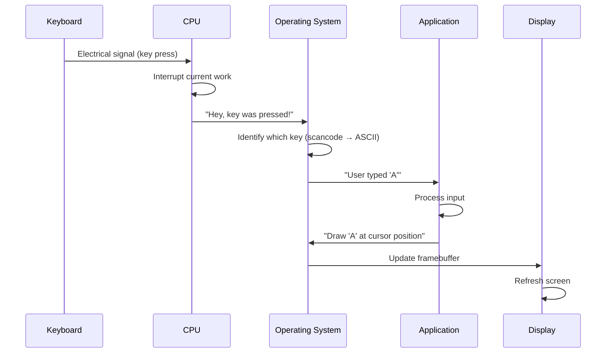

This entire journey happens in **under 10 milliseconds** — faster than you can perceive.

## The Relationship Between Hardware and Software

Hardware and software form a **stack of abstractions**:

```
┌─────────────────────────────────────┐
│         Applications                │  ← What users interact with
│           (Chrome, Word, VS Code)     │
├─────────────────────────────────────┤
│         Operating System            │  ← Manages resources, provides services
│     (Linux, Windows, macOS)         │
├─────────────────────────────────────┤
│         Firmware / BIOS/UEFI        │  ← Boots the system, initializes hardware
├─────────────────────────────────────┤
│      Instruction Set Architecture   │  ← The contract between software & hardware
│           (x86, ARM, RISC-V)        │
├─────────────────────────────────────┤
│         Microarchitecture           │  ← How the CPU implements the ISA
├─────────────────────────────────────┤
│           Digital Logic             │  ← Gates, flip-flops, registers
├─────────────────────────────────────┤
│           Transistors               │  ← The physical switches
├─────────────────────────────────────┤
│             Silicon                 │  ← The raw material
└─────────────────────────────────────┘
```

Software lives at the top of this stack. Hardware lives at the bottom. Each layer provides an abstraction that hides the complexity of the layers below it.

> [!TIP]
> **Mental Model**: Think of this like a car. You press the gas pedal (high-level command). The pedal isn't directly connected to the wheels — there's an engine control unit, fuel injectors, pistons, and gears in between. Each layer translates your command into something the next layer can understand. Similarly, in computing, each layer translates a high-level command into lower-level operations.

---

## Summary

- A computer is a machine that manipulates data according to a list of instructions
- All software ultimately becomes electrical signals that switch transistors
- The journey from input to output involves many layers of abstraction
- Hardware and software form a stack — each layer hides the complexity below

## Key Terms

| Term | Definition |
|------|------------|
| **Transistor** | An electronic switch that can be on (1) or off (0) |
| **Machine Code** | Binary instructions that a CPU can execute directly |
| **Compiler** | Translates high-level code (C, Python) into machine code |
| **Abstraction** | Hiding complex details behind a simpler interface |
| **ISA** | Instruction Set Architecture — the boundary between hardware and software |

## Frequently Asked Questions

**Q: Can a computer understand any language?**
A: No. A CPU only understands its own machine code (binary instructions specific to that architecture). High-level languages like Python or JavaScript must be translated into machine code by interpreters or compilers before the CPU can execute them.

**Q: Why do we need so many layers?**
A: Layers make computing practical. Without them, every programmer would need to think in terms of transistors and electrical signals. Layers allow innovation at each level independently — you can improve the hardware without rewriting software, and vice versa.

**Q: What's the difference between hardware and software?**
A: Hardware is physical — you can touch it. Software is a sequence of instructions stored as data. Software tells hardware what to do. The same hardware can run infinitely many different software programs.

## Common Interview Questions

1. "Explain what happens when you type a URL into a browser and press Enter."
2. "What's the difference between a compiler and an interpreter?"
3. "Why do computers use binary instead of decimal?"

## Mini Quiz

1. What is the fundamental building block of all digital circuits?
2. Name the four main layers in the hardware/software stack.
3. What does ISA stand for?
4. True or False: A CPU can execute Python code directly.
5. What transforms high-level code into machine code?

## Practical Exercises

1. Write "Hello, World!" in a high-level language (like Python), then find a tool that shows the compiled machine code.
2. Draw your own abstraction stack diagram for a specific application you use daily.
3. Research: How many transistors are in a modern CPU? Compare this to a CPU from 1990.

## Further Reading

- *Code: The Hidden Language of Computer Hardware and Software* by Charles Petzold — excellent introduction to how computers work from first principles
- "How Computers Work" series on YouTube by Crash Course Computer Science
- [NAND to Tetris](https://www.nand2tetris.org/) — build a complete computer from logic gates

---

# 2. Computer Architecture

## 2.1 The CPU

### Intuitive Explanation

Think of the CPU (Central Processing Unit) as the **brain of the computer**. But unlike a human brain, a CPU doesn't think — it follows instructions with perfect, mechanical obedience. It has no creativity, no intuition, and no judgment. What it does have is **raw, relentless speed**.

A CPU's entire existence is a loop:
1. **Fetch** the next instruction from memory
2. **Decode** what the instruction wants
3. **Execute** the instruction
4. Repeat billions of times per second

### Technical Explanation

#### The Fetch-Decode-Execute Cycle

This is the heartbeat of every computer. Also called the **instruction cycle**, it's the fundamental operation of a CPU.

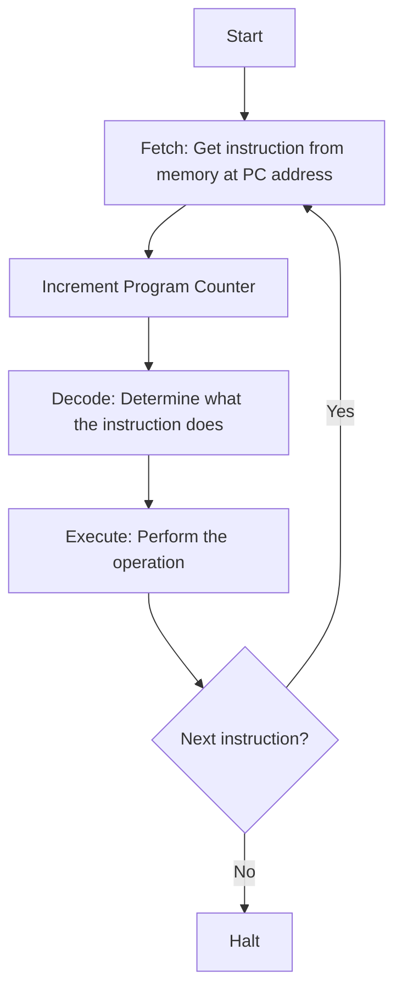

**Step 1: Fetch**
- The CPU looks at the **Program Counter (PC)**, which holds the memory address of the next instruction
- It sends this address over the **address bus** to RAM
- RAM returns the instruction data over the **data bus**
- The instruction is stored in the **Instruction Register (IR)**

**Step 2: Decode**
- The **Control Unit** examines the instruction in the IR
- It figures out: What operation? What data? Where to store the result?
- It activates the appropriate CPU components

**Step 3: Execute**
- The **Arithmetic Logic Unit (ALU)** performs calculations if needed
- Data moves between registers, memory, or I/O devices
- Results are stored back

#### ALU (Arithmetic Logic Unit)

The ALU is the **calculating engine** of the CPU. It can perform:

- **Arithmetic**: addition, subtraction (multiplication and division are often done via multiple additions/subtractions or a dedicated FPU)
- **Logic**: AND, OR, NOT, XOR
- **Comparison**: equality, greater-than, less-than
- **Shift**: moving bits left or right

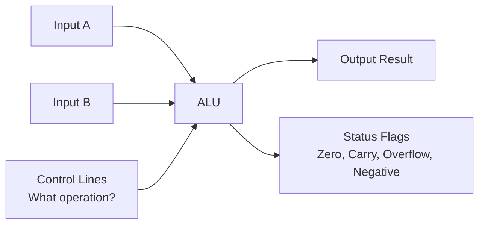

#### Control Unit

The Control Unit is the **traffic cop** of the CPU. It:
- Reads instructions from memory
- Decodes them
- Coordinates the ALU, registers, and memory access
- Generates timing and control signals

It does NOT perform calculations — it tells other components what to do.

#### Registers

Registers are **super-fast storage locations inside the CPU**. They're the fastest memory in the computer hierarchy — faster than cache, faster than RAM, faster than SSDs. But they're also extremely limited in number (typically 16–32 general-purpose registers in modern CPUs).

| Register Type | Purpose | Size (modern) |
|--------------|---------|---------------|
| **Program Counter (PC)** | Holds address of next instruction | 64 bits |
| **Instruction Register (IR)** | Holds the current instruction being executed | Varies |
| **Accumulator (ACC)** | Stores intermediate results | 64 bits |
| **General Purpose Registers (GPR)** | Store data and addresses | 64 bits each |
| **Stack Pointer (SP)** | Points to top of the call stack | 64 bits |
| **Base Pointer (BP/FP)** | Points to current stack frame | 64 bits |
| **Status Register (FLAGS)** | Stores flags (zero, carry, overflow) | 16–32 bits |

#### Clock Speed

The CPU clock is a **crystal oscillator** that generates a regular electrical pulse — like a metronome for the computer.

- Each tick of the clock, the CPU can perform one step of the fetch-decode-execute cycle
- Clock speed is measured in **Hertz (Hz)** — cycles per second
- A 3.0 GHz CPU ticks **3 billion times per second**

> [!NOTE]
> **Important Nuance**: Clock speed is NOT the sole measure of CPU performance. A 3.0 GHz CPU from 2005 is much slower than a 3.0 GHz CPU from 2024 because the newer CPU can do more work per clock cycle (IPC — Instructions Per Cycle).

#### Multi-Core CPUs

A **core** is an independent processing unit that can run its own fetch-decode-execute cycle. A multi-core CPU is essentially multiple CPUs on one chip.

```
┌─────────────────────────────────────────┐
│              CPU Package                  │
│  ┌──────────┐  ┌──────────┐              │
│  │ Core 0   │  │ Core 1   │              │
│  │ ┌──────┐ │  │ ┌──────┐ │   L3 Cache  │
│  │ │ L1   │ │  │ │ L1   │ │  (Shared)   │
│  │ │ L2   │ │  │ │ L2   │ │             │
│  │ └──────┘ │  │ └──────┘ │             │
│  └──────────┘  └──────────┘              │
│  ┌──────────┐  ┌──────────┐              │
│  │ Core 2   │  │ Core 3   │              │
│  │ ┌──────┐ │  │ ┌──────┐ │              │
│  │ │ L1   │ │  │ │ L1   │ │             │
│  │ │ L2   │ │  │ │ L2   │ │             │
│  │ └──────┘ │  │ └──────┘ │             │
│  └──────────┘  └──────────┘              │
└─────────────────────────────────────────┘
```

#### Threads

A **thread** is a sequence of instructions that can run independently. 

- **Hardware thread**: A core that can run multiple threads simultaneously (Hyper-Threading / SMT)
- **Software thread**: A sequence of code that the OS schedules independently

With Hyper-Threading (Intel) or SMT (Simultaneous Multi-Threading, AMD), a single physical core can act like two logical cores, keeping the CPU busy even when one thread is waiting for data from memory.

#### Cache (L1, L2, L3)

Cache is **small, ultra-fast memory** built directly into the CPU. It stores copies of frequently accessed data from RAM, because accessing RAM is slow compared to the CPU's speed.

```
Speed Hierarchy (fastest to slowest):
┌──────────────────────────────────────────┐
│  Registers         ~1 cycle     (few KB) │ ← Fastest
│  L1 Cache          ~3 cycles    (32-64KB)│
│  L2 Cache          ~10 cycles   (256KB)  │
│  L3 Cache          ~40 cycles   (8-32MB) │
│  RAM               ~200 cycles  (GB)     │
│  SSD               ~100,000 cycles (TB)  │ ← Slowest
└──────────────────────────────────────────┘
```

- **L1 Cache**: Split into instruction cache (L1i) and data cache (L1d). Extremely fast, very small. Private to each core.
- **L2 Cache**: Larger but slightly slower. Usually private to each core.
- **L3 Cache**: Largest cache, shared across all cores. Slower than L1/L2 but much faster than RAM.

> [!TIP]
> **Why cache matters**: The CPU is so fast that it spends most of its time *waiting* for data from RAM. Cache exists to minimize this waiting. When data is in cache (a "cache hit"), the CPU runs at full speed. When data is not in cache (a "cache miss"), the CPU stalls while waiting for RAM.

#### Pipeline

Instead of waiting for one instruction to finish before starting the next, pipelining allows the CPU to **overlap instruction execution**.

Without pipeline:
```
Fetch  →  Decode  →  Execute  →  Writeback
Fetch  →  Decode  →  Execute  →  Writeback
```
(Each instruction waits for the previous one to finish)

With pipeline:
```
         Cycle 1     Cycle 2     Cycle 3     Cycle 4
Instr 1: Fetch       Decode      Execute     Writeback
Instr 2:             Fetch       Decode      Execute
Instr 3:                         Fetch       Decode
```
(While one instruction is executing, the next is being decoded, and the one after is being fetched)

A classic 5-stage pipeline:
1. **IF** — Instruction Fetch
2. **ID** — Instruction Decode
3. **EX** — Execute
4. **MEM** — Memory Access
5. **WB** — Write Back

#### Superscalar Execution

Modern CPUs go beyond pipelining. They have **multiple execution units** (multiple ALUs, multiple memory units) and can execute multiple instructions **in the same cycle**.

```
Cycle 1:  Instr A (Fetch)     Instr B (Fetch)
Cycle 2:  Instr A (Decode)    Instr B (Decode)    Instr C (Fetch)
Cycle 3:  Instr A (Execute)   Instr B (Execute)   Instr C (Decode)
```

Superscalar CPUs can issue 3–6 instructions per cycle, assuming there are no dependencies between them.

#### Branch Prediction

Branches (if-statements, loops) are a problem for pipelines. The CPU doesn't know which instruction to fetch next until the condition is evaluated, but by then the pipeline is already stalled.

**Branch prediction** guesses which way a branch will go and starts executing the predicted path speculatively.

- **Static prediction**: Always assume backward branches (loops) are taken, forward branches are not
- **Dynamic prediction**: Uses a history table to track past branch behavior

> [!CAUTION]
> **Common Misconception**: Branch prediction isn't mind-reading. It's a statistical guess based on past behavior. When it guesses wrong, all speculatively executed work must be discarded — this is called a **pipeline flush** or **branch misprediction penalty**.

### Real-World Analogy

Imagine a restaurant kitchen:
- **CPU Core** = A chef
- **ALU** = The chef's knife and cutting board
- **Registers** = Ingredients within arm's reach
- **L1 Cache** = Counter-top prep station (frequent ingredients)
- **L2 Cache** = Pantry (nearby, but takes a moment)
- **L3 Cache** = Storage room (shared with other chefs)
- **RAM** = Warehouse across the street
- **SSD** = A supplier in another city
- **Pipelining** = While cooking one dish, prepping ingredients for the next
- **Branch Prediction** = Guessing the next order based on what the customer usually orders
- **Superscalar** = Multiple chefs working in parallel

---

#### Summary

- The CPU executes a continuous Fetch-Decode-Execute cycle
- Registers are the fastest storage, located inside the CPU
- Cache bridges the speed gap between the CPU and RAM
- Pipelining, superscalar execution, and branch prediction improve performance through parallelism and speculation

#### Key Terms

| Term | Definition |
|------|------------|
| **CPU** | Central Processing Unit — the primary processor |
| **ALU** | Arithmetic Logic Unit — performs calculations |
| **Control Unit** | Decodes instructions and coordinates components |
| **Pipeline** | Overlapping execution of multiple instructions |
| **Superscalar** | Executing multiple instructions per cycle |
| **Branch Prediction** | Guessing branch outcomes to avoid pipeline stalls |
| **Cache** | Small, fast memory near the CPU |

#### Frequently Asked Questions

**Q: Is a 5 GHz CPU always faster than a 3 GHz CPU?**
A: Not necessarily. Instructions Per Cycle (IPC) matters more. A CPU that does 2× more work per cycle at 3 GHz is faster than a CPU that does less work at 5 GHz.

**Q: What happens when the CPU guesses wrong with branch prediction?**
A: The pipeline must be flushed — all speculatively executed work is discarded, and the CPU fetches the correct path. This costs 10–20 cycles of lost work.

**Q: Why can't we just make RAM as fast as cache?**
A: Physics. Fast memory is physically small and must be close to the CPU. Large memory cannot be as fast because signals take time to travel, and dense memory cells are slower.

#### Common Interview Questions

1. "Walk me through the fetch-decode-execute cycle."
2. "How does cache improve CPU performance?"
3. "What's the difference between pipelining and superscalar execution?"
4. "Explain a cache miss and its performance implications."

#### Mini Quiz

1. How many GHz does a modern CPU typically run at?
2. Name the three levels of cache.
3. What does the Program Counter do?
4. True or False: A superscalar CPU can execute multiple instructions per clock cycle.
5. What happens during a branch misprediction?

#### Practical Exercises

1. Open your system monitor and observe CPU usage across cores.
2. Research: Find the L1, L2, and L3 cache sizes for your CPU model.
3. Write a simple program that loops through a large array forward vs. backward — measure the performance difference (this demonstrates cache behavior).

## Further Reading

- *Computer Architecture: A Quantitative Approach* by Hennessy & Patterson — the definitive textbook
- *What Every Programmer Should Know About Memory* by Ulrich Drepper — deep dive on cache and memory
- Agner Fog's optimization manuals for detailed CPU microarchitecture

---

## 2.2 RAM

### Intuitive Explanation

RAM (Random Access Memory) is your computer's **short-term memory**. It's where the computer stores:
- The operating system while it's running
- Open applications and their data
- Documents you're currently editing
- Any data the CPU needs quick access to

Think of RAM as a **giant grid of numbered mail slots**. Each slot (memory address) can hold a small piece of data. The CPU can access any slot directly by its number — that's the "random access" part.

### Technical Explanation

#### Why RAM is Volatile

RAM requires constant electrical power to maintain its data. When you turn off the computer, everything in RAM disappears. This is why:
- You lose unsaved work when the power goes out
- The computer must reload the OS from disk on every boot
- "Save" means copying from RAM to persistent storage (SSD/HDD)

#### Memory Addresses

Every byte in RAM has a unique **memory address** — a number that identifies its location.

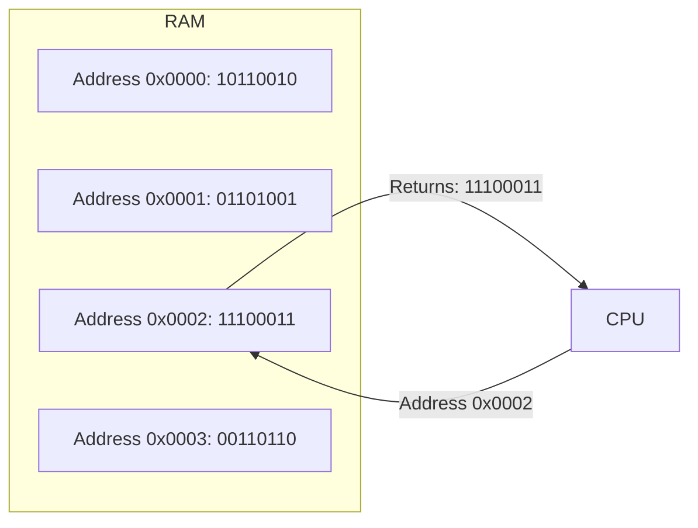

A 64-bit CPU can address up to 2⁶⁴ bytes — that's 18.4 exabytes (though current hardware limits this to much less). For deeper detail on how addresses are translated from virtual to physical, see [Section 6.3 on Virtual Memory](#63-virtual-memory).

#### Reading and Writing Memory

**Read Operation:**
1. CPU places address on the address bus
2. CPU sends "read" signal on the control bus
3. RAM retrieves data at that address
4. RAM places data on the data bus
5. CPU reads the data

**Write Operation:**
1. CPU places address on the address bus
2. CPU places data on the data bus
3. CPU sends "write" signal on the control bus
4. RAM stores data at that address

#### DRAM vs SRAM

| Feature | DRAM | SRAM |
|---------|------|------|
| Full Name | Dynamic RAM | Static RAM |
| Storage Mechanism | Capacitor (holds charge) | Flip-flop (6 transistors) |
| Speed | Slower (~50ns) | Faster (~10ns) |
| Density | Higher (1 transistor per bit) | Lower (6 transistors per bit) |
| Cost | Cheaper | More expensive |
| Power Usage | Needs periodic refresh | No refresh needed |
| Used For | Main RAM | Cache (L1, L2, L3) |

> [!NOTE]
> **Why DRAM needs refreshing**: A DRAM cell stores data as a charge in a tiny capacitor. Capacitors leak charge over time (milliseconds), so they must be read and rewritten thousands of times per second — this is the "refresh" cycle.

#### RAM vs Cache

| Feature | RAM | Cache |
|---------|-----|-------|
| Location | On motherboard | Inside CPU |
| Size | 4–256 GB | 4–64 MB total |
| Speed | ~100–200 CPU cycles | ~3–40 CPU cycles |
| Technology | DRAM | SRAM |
| Cost per GB | ~$3–10 | ~$1000+ (if sold separately) |
| Volatile | Yes | Yes |

### Real-World Analogy

A programmer's desk:
- **CPU** = The programmer
- **Registers** = What's in their hands right now
- **Cache** = Papers spread on the desk
- **RAM** = The filing cabinet next to the desk
- **SSD/HDD** = The library across town
- **Network Storage** = A library in another country

The programmer works fastest with things in their hands, slower with papers on the desk, much slower with the filing cabinet, and extremely slow with the library.

---

## 2.3 The Motherboard

The motherboard is the **central circuit board** that connects every component of the computer. It's not a processing device — it's a **communication backbone**.

### Key Components

```
┌─────────────────────────────────────────────────────┐
│                   MOTHERBOARD                         │
│                                                       │
│  ┌──────────┐           ┌──────────┐                  │
│  │  CPU     │           │  RAM     │                  │
│  │  Socket  │───┐   ┌───│  Slots   │                  │
│  └──────────┘   │   │   └──────────┘                  │
│                 │   │                                 │
│  ┌──────────┐   └───┴───┐  ┌──────────┐              │
│  │  Chipset │←─────────→│  │  PCIe    │              │
│  │          │           │  │  Slots   │              │
│  └──────────┘           │  └──────────┘              │
│       │                 │       │                     │
│       │                 │       │                     │
│  ┌──────────┐           │  ┌──────────┐              │
│  │  Storage │←─────────→│  │  I/O     │              │
│  │  Ports   │           │  │  Ports   │              │
│  └──────────┘           │  └──────────┘              │
│                         │                            │
│  ┌──────────┐           │  ┌──────────┐              │
│  │  BIOS    │           │  │  Network │              │
│  │  Chip    │           │  │  Card    │              │
│  └──────────┘           │  └──────────┘              │
│                                                       │
└─────────────────────────────────────────────────────┘
```

#### CPU Socket

The CPU socket is the physical connector that holds the CPU and provides electrical connections between the CPU and the motherboard. Modern sockets use **LGA (Land Grid Array)** — flat contact pads on the CPU that touch pins in the socket — or **PGA (Pin Grid Array)** — pins are on the CPU, holes in the socket.

Key socket details:
- **Pin count**: Determines compatibility (e.g., LGA-1700 for Intel 12th/13th Gen)
- **Alignment**: A triangle marking on the CPU and socket ensures correct orientation
- **Retention mechanism**: A lever arm secures the CPU with precise pressure
- **Power delivery**: The socket routes power from the voltage regulator module to the CPU

#### Power Delivery

Power delivery on a motherboard involves several stages:

1. **Power Supply (PSU)**: Converts AC wall power to DC at multiple voltages (+3.3V, +5V, +12V)
2. **Voltage Regulator Module (VRM)**: Converts the 12V PSU output to the lower voltage required by the CPU (typically 1.0–1.4V)
3. **Phases**: Multiple VRM phases (e.g., 12+2) work together — more phases means cleaner power delivery and better overclocking headroom
4. **Capacitors and chokes**: Smooth out voltage ripple before delivering to the CPU
5. **Power connectors**: The 24-pin ATX main connector and 4/8-pin EPS12V CPU power connectors

> [!TIP]
> **VRM quality matters**: Cheap VRMs overheat under sustained load, causing the CPU to throttle (reduce speed). High-end motherboards have heatsinks on their VRMs to dissipate this heat.

#### Memory Slots

**DIMM slots** (Dual Inline Memory Module) hold RAM sticks. Key characteristics:

- **Dual-channel**: Two slots form one channel. Populating two slots (e.g., slots A2 and B2) doubles memory bandwidth
- **Quad-channel**: High-end platforms (HEDT, server) support four memory channels
- **Color coding**: Motherboards often color-code which slots to populate first for optimal performance
- **Keying**: DDR3, DDR4, and DDR5 slots are physically different — you cannot insert the wrong type
- **Locking tabs**: Clips on both ends secure the RAM module

#### Chipset

The chipset is the **traffic controller** for data moving between the CPU, RAM, storage, and peripherals. Modern chipsets are divided into two parts:

- **Northbridge** (historically): Connected directly to the CPU, handled RAM and graphics
- **Southbridge** (historically): Handled I/O, storage, USB, audio

In modern CPUs (Intel Core i/AMD Ryzen), the Northbridge functions are **integrated into the CPU itself**. The chipset handles only I/O functions. For more on how the CPU communicates with these components, see [Section 2.4 on Buses](#24-buses).

#### BIOS/UEFI

**BIOS** (Basic Input/Output System) or its modern replacement **UEFI** (Unified Extensible Firmware Interface) is the **first software that runs when you turn on the computer**. See [Section 4.6 on the Boot Process](#46-boot-process) for the full startup sequence.

It initializes hardware, performs a Power-On Self-Test (POST), and loads the bootloader from disk.

#### Expansion Slots (PCIe)

**PCI Express (PCIe)** slots connect high-speed peripherals:
- GPU (graphics card)
- NVMe SSDs
- Network cards
- Capture cards
- Sound cards

PCIe lanes are point-to-point connections. A x16 slot has 16 lanes of high-speed serial communication.

---

## 2.4 Buses

### Intuitive Explanation

Buses are the **wires that carry data** between components. If the CPU is the brain and RAM is the memory, buses are the nervous system.

### Technical Explanation

There are three primary buses:

#### Data Bus

- **Carries** the actual data being transferred
- **Bidirectional** (data flows both ways)
- **Width**: 64 bits in modern systems (8 bytes at a time)
- Analogy: A highway with 64 lanes, each carrying one bit

#### Address Bus

- **Carries** memory addresses (where to read/write)
- **Unidirectional** (CPU → memory or device)
- **Width**: Determines how much memory the CPU can address
  - 32-bit address bus → 2³² = 4 GB addressable
  - 48-bit address bus → 2⁴⁸ = 256 TB addressable

#### Control Bus

- **Carries** control signals (read, write, interrupt, clock)
- **Bidirectional** (CPU sends commands, devices send status)
- Signals include: Read, Write, Interrupt Request, Clock, Reset, Bus Grant

### How Data Moves Between CPU and RAM

```
┌───────┐         ┌───────┐         ┌──────────┐
│       │────2───→│Address│───3────→│          │
│       │  Addr   │  Bus  │  Addr   │          │
│       │         └───────┘         │          │
│  CPU  │         ┌───────┐         │   RAM    │
│       │←──1────│Control│←──4────│          │
│       │  Read   │  Bus  │  Ready  │          │
│       │         └───────┘         │          │
│       │         ┌───────┐         │          │
│       │←──5────│  Data │←──6────│          │
│       │  Data   │  Bus  │  Data   │          │
└───────┘         └───────┘         └──────────┘
```

1. CPU asserts READ on control bus
2. CPU places address on address bus
3. RAM decodes address and retrieves data
4. RAM signals READY on control bus
5. RAM places data on data bus
6. CPU reads data from data bus

> [!TIP]
> **Front-Side Bus (FSB)** was historically the bus connecting CPU to Northbridge. Modern CPUs use **Direct Media Interface (DMI)** or **Infinity Fabric** (AMD) instead.

---

## 2.5 I/O Devices

### Intuitive Explanation

I/O (Input/Output) devices are how the computer communicates with the outside world. Input devices (keyboard, mouse, microphone) send data TO the computer. Output devices (monitor, speakers, printer) receive data FROM the computer.

### Key Devices

| Device | Type | Speed | Interface |
|--------|------|-------|-----------|
| Keyboard | Input | Very slow | USB, PS/2 |
| Mouse | Input | Slow | USB, Bluetooth |
| SSD | Storage | Very fast (~3–14 GB/s) | NVMe/PCIe, SATA |
| HDD | Storage | Moderate (~200 MB/s) | SATA |
| GPU | Output/Compute | Very fast | PCIe x16 |
| Network Card | I/O | Fast (1–100 Gbps) | PCIe, integrated |
| USB | Bus/Hub | Varies (480 Mbps – 40 Gbps) | USB controller |

### Interrupts

An **interrupt** is a signal to the CPU that an event needs attention. Instead of the CPU constantly checking if a key has been pressed (polling), the keyboard sends an interrupt when a key is pressed. Interrupts are central to the end-to-end workflow described in [Section 9](#9-putting-everything-together).

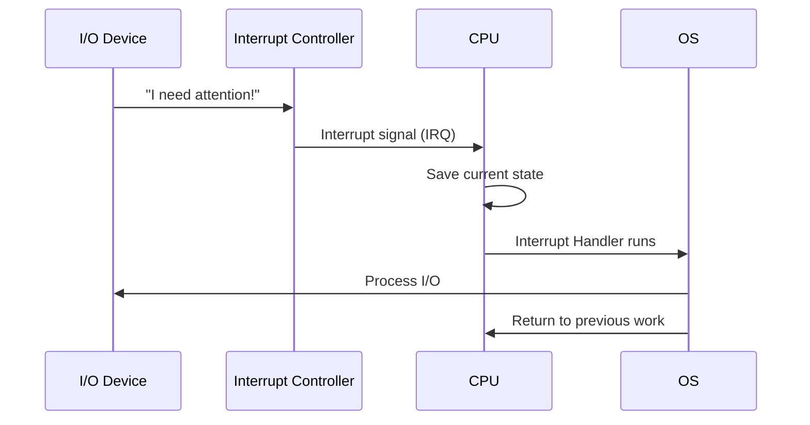

**Types of interrupts:**
- **Hardware interrupts**: From devices (key press, network packet received)
- **Software interrupts**: From programs (system calls, division by zero)
- **Maskable interrupts**: Can be ignored by the CPU
- **Non-maskable interrupts (NMI)**: Cannot be ignored (e.g., power failure)

### DMA (Direct Memory Access)

**Without DMA:** The CPU must copy every byte from the device to RAM itself — wasting time that could be spent on other work.

**With DMA:** A DMA controller handles the data transfer directly between the device and RAM, freeing the CPU.

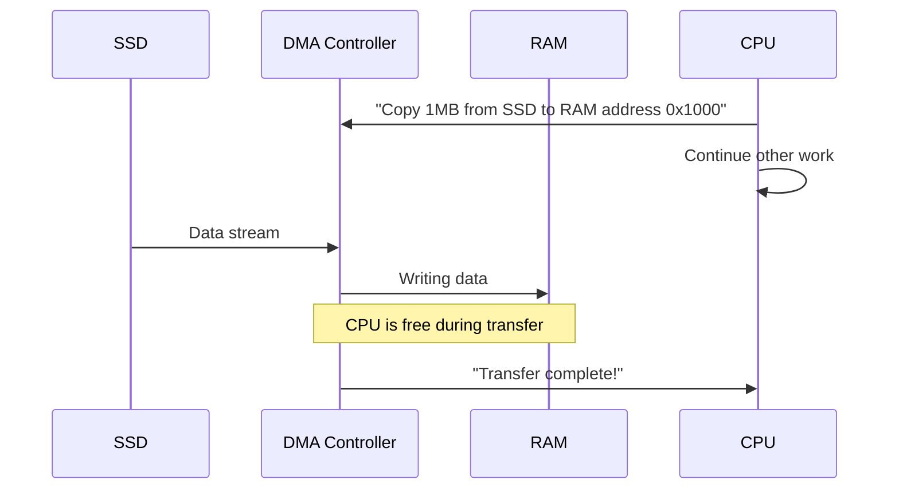

> [!NOTE]
> **Why DMA matters**: Without DMA, the CPU would spend ~100% of its time copying data during large I/O operations. With DMA, the CPU spends ~0% of its time — a massive efficiency gain.

### Mouse

A mouse is a **pointing device** that reports its relative position (movement deltas) to the computer.

**How it works:**
1. **Optical mice**: A small camera takes thousands of images per second of the surface below. A DSP chip compares successive images to determine movement direction and speed.
2. **Laser mice**: Same principle but with a laser for better surface tracking.
3. The mouse sends **HID (Human Interface Device)** reports over USB or Bluetooth: delta-X, delta-Y, scroll wheel, button states
4. The OS composits these movements into cursor position on screen

> [!NOTE]
> **Polling rate**: Measured in Hz (typically 125–1000 Hz). A 1000 Hz mouse reports its position every 1 ms — essential for competitive gaming.

### Keyboard

A keyboard sends **scancodes** (not characters!) when keys are pressed and released.

- **Make scancode**: Sent when a key is pressed
- **Break scancode**: Sent when a key is released (allows detecting held keys)
- **Key rollover**: How many simultaneous key presses the keyboard can report (N-key rollover = all keys)
- The OS translates scancodes to characters using a **keyboard layout** (QWERTY, AZERTY, Dvorak)

### SSD (Solid State Drive)

An SSD uses **NAND flash memory** to store data persistently — no moving parts.

**How it works:**
- Data is stored in **floating-gate transistors** (cells) that trap electrons
- Cells are organized into **pages** (4–16 KB) and **blocks** (64–256 pages)
- **Reads** are fast (~10–50 µs) at the page level
- **Writes** require erasing entire blocks first (slow, ~1–3 ms)
- **Wear leveling**: The SSD controller spreads writes across all blocks evenly to prevent any one block from wearing out
- **TRIM command**: The OS tells the SSD which pages are no longer in use, allowing internal garbage collection

| Interface | Max Speed | Form Factor |
|-----------|-----------|-------------|
| SATA III | ~550 MB/s | 2.5-inch |
| NVMe (PCIe 3.0 ×4) | ~3.5 GB/s | M.2 |
| NVMe (PCIe 4.0 ×4) | ~7.0 GB/s | M.2 |
| NVMe (PCIe 5.0 ×4) | ~14 GB/s | M.2 |

> [!TIP]
> **SSD vs HDD for OS**: Running your OS on an SSD vs. HDD is the single biggest performance upgrade you can make to an old computer. Boot times drop from minutes to seconds.

### HDD (Hard Disk Drive)

An HDD stores data on **magnetic platters** that spin at high speed. A read/write head on an arm accesses the data.

**How it works:**
- **Platters**: Aluminum or glass disks coated with magnetic material, spinning at 5400–15000 RPM
- **Heads**: Float nanometers above the platter surface on a cushion of air
- **Tracks, sectors, cylinders**: Data is organized in concentric circles (tracks) divided into sectors (typically 512 bytes or 4 KB)
- **Seek time**: Time for the head to move to the right track (~4–15 ms)
- **Rotational latency**: Time for the platter to spin to the right sector (half a rotation on average)

> [!CAUTION]
> **HDD vulnerability**: HDDs are mechanical and fragile. Drops, vibrations, and shocks can cause the head to touch the platter (a "head crash"), destroying data. SSDs are far more rugged.

### USB (Universal Serial Bus)

USB is a **standardized connector and protocol** for connecting peripherals. It replaced dozens of proprietary connectors (serial, parallel, PS/2, game port, etc.).

**Architecture:**
- **Host controller**: In the chipset, manages all USB traffic
- **Hubs**: Allow daisy-chaining multiple devices
- **Devices**: Peripherals (keyboard, mouse, storage, etc.)
- **Endpoints**: Individual data channels within a device

| USB Generation | Max Speed | Year |
|----------------|-----------|------|
| USB 1.1 | 12 Mbps | 1998 |
| USB 2.0 | 480 Mbps | 2000 |
| USB 3.0 | 5 Gbps | 2008 |
| USB 3.1 Gen 2 | 10 Gbps | 2013 |
| USB 3.2 Gen 2×2 | 20 Gbps | 2019 |
| USB4 | 40 Gbps | 2019 |

**Key advantage**: USB is **hot-pluggable** — you can connect/disconnect devices without powering down. It also provides power (up to 100W with USB-C PD).

### Network Card (NIC)

A Network Interface Card (NIC) connects a computer to a network. It implements the physical and data link layers of the networking stack.

**Key functions:**
- **Frame assembly**: Wraps IP packets in Ethernet frames (with MAC addresses)
- **CRC checking**: Verifies data integrity
- **MAC address**: A unique 48-bit hardware address assigned to each NIC
- **Interrupt coalescing**: Groups multiple received packets into one interrupt to reduce CPU load
- **TCP offload**: Some NICs handle TCP/IP processing in hardware

| Network Standard | Max Speed | Medium |
|-----------------|-----------|--------|
| Ethernet | 1–400 Gbps | Copper/fiber |
| Wi-Fi 6 (802.11ax) | ~9.6 Gbps | Radio |
| Wi-Fi 7 (802.11be) | ~46 Gbps | Radio |
| Bluetooth 5 | ~2 Mbps | Radio |

### GPU (Graphics Processing Unit)

GPUs are **specialized processors** designed for massively parallel work. While a CPU has 4–16 powerful cores, a GPU has thousands of simpler cores.

| Feature | CPU | GPU |
|---------|-----|-----|
| Cores | 4–16 | 1,000–10,000+ |
| Core complexity | Complex | Simple |
| Best at | Sequential tasks | Parallel tasks |
| Clock speed | 3–5 GHz | 1–2 GHz |
| Memory | Shared with system | Dedicated VRAM |
| Cache | Large (L1/L2/L3) | Small per core |

---

#### Summary

- RAM is volatile memory that stores actively used data
- Memory addresses allow the CPU to access any byte directly
- DRAM is dense but slow; SRAM is fast but expensive (used for cache)
- The motherboard connects and coordinates all components
- Buses (data, address, control) move information between components
- Interrupts allow devices to signal the CPU when needed
- DMA offloads data copying from the CPU

#### Key Terms

| Term | Definition |
|------|------------|
| **DRAM** | Dynamic RAM — main memory, needs refresh |
| **SRAM** | Static RAM — cache memory, no refresh needed |
| **PCIe** | Peripheral Component Interconnect Express — high-speed expansion bus |
| **BIOS/UEFI** | Firmware that initializes hardware on boot |
| **Interrupt** | Signal that pauses the CPU to handle an event |
| **DMA** | Direct Memory Access — transfers data without CPU involvement |
| **GPU** | Graphics Processing Unit — parallel processor for graphics/compute |

#### Mini Quiz

1. Why is RAM called "random access"?
2. What's the difference between DRAM and SRAM?
3. What are the three main buses in a computer?
4. How does DMA improve performance?
5. What is the purpose of an interrupt?

#### Frequently Asked Questions

**Q: Can I mix different RAM speeds?**
A: Yes, but all sticks will run at the speed of the slowest one. It's always better to use matched pairs.

**Q: What happens if I run out of RAM?**
A: The OS starts using swap space on disk as "virtual memory." Performance drops dramatically because disk is ~1000× slower than RAM.

**Q: Why do I need separate graphics card memory (VRAM)?**
A: GPUs need their own high-speed memory because they access data very differently from CPUs — wide parallel reads rather than sequential.

#### Common Interview Questions

1. "Explain the difference between DRAM and SRAM."
2. "How does a memory address get translated by the CPU?"
3. "What is the role of the memory controller?"
4. "Why does adding more RAM speed up a computer?"

#### Practical Exercises

1. Check your computer's current RAM usage in Task Manager (Windows) or `htop` (Linux)
2. Open several large applications and observe how RAM usage changes
3. Research the difference between DDR4 and DDR5 memory

## Further Reading

- *Computer Architecture: A Quantitative Approach* by Hennessy & Patterson
- Ulrich Drepper's *What Every Programmer Should Know About Memory*
- [How RAM Works (YouTube)](https://www.youtube.com/watch?v=eWg9lMh_-_k)

---

# 3. Binary and Hexadecimal

## 3.1 Understanding Binary

### Intuitive Explanation

Computers use **binary** — a number system with only two digits: **0 and 1**. Why? Because transistors, the building blocks of computers, are switches that can only be in two states:
- **ON** (representing 1) — current flows
- **OFF** (representing 0) — no current flows

This two-state system is extremely reliable. It's very easy to tell if a switch is on or off. If computers used ten states (like decimal digits 0–9), the hardware would be incredibly complex and unreliable.

### Bits, Bytes, and Nibbles

| Unit | Size | Example |
|------|------|---------|
| **Bit** | 1 binary digit | `0` or `1` |
| **Nibble** | 4 bits | `1010` |
| **Byte** | 8 bits | `01101011` |
| **Kilobyte (KB)** | 1024 bytes | 1024 characters of text |
| **Megabyte (MB)** | 1024 KB | ~1 minute of MP3 audio |
| **Gigabyte (GB)** | 1024 MB | ~1 hour of HD video |
| **Terabyte (TB)** | 1024 GB | ~300,000 photos |

> [!NOTE]
> **Technical Note**: In computing, prefixes like "kilo-" traditionally mean 2¹⁰ (1024), not 10³ (1000). A kilobyte is 1,024 bytes. Hard drive manufacturers often use decimal (1000) to make drives seem larger — a "1 TB" drive is actually 931 GB in binary terms.

### Binary Numbers

Binary is a **base-2** number system. Each position represents a power of 2.

```
Position:    7   6   5   4   3   2   1   0
Power:      2⁷  2⁶  2⁵  2⁴  2³  2²  2¹  2⁰
Decimal:    128  64  32  16   8   4   2   1
```

Example: `10110110` in binary:

```
1 × 128 = 128
0 ×  64 =   0
1 ×  32 =  32
1 ×  16 =  16
0 ×   8 =   0
1 ×   4 =   4
1 ×   2 =   2
0 ×   1 =   0
         ─────
  Total = 182
```

### Converting Binary to Decimal

**Method**: Multiply each bit by its place value (power of 2) and sum.

```
Binary:  1  0  1  1  0  1  0  1
         ×  ×  ×  ×  ×  ×  ×  ×
         128 64 32 16  8  4  2  1
         │  │  │  │  │  │  │  │
         └──┴──┴──┴──┴──┴──┴──┴→ 128 + 0 + 32 + 16 + 0 + 4 + 0 + 1 = 181
```

### Converting Decimal to Binary

**Method**: Repeatedly divide by 2, reading remainders from bottom to top.

Convert 156 to binary:

```
156 ÷ 2 = 78 remainder 0
 78 ÷ 2 = 39 remainder 0
 39 ÷ 2 = 19 remainder 1
 19 ÷ 2 =  9 remainder 1
  9 ÷ 2 =  4 remainder 1
  4 ÷ 2 =  2 remainder 0
  2 ÷ 2 =  1 remainder 0
  1 ÷ 2 =  0 remainder 1
                   ↑ Read upward: 10011100
```

> [!TIP]
> **Quick check**: 10011100 = 128 + 0 + 0 + 16 + 8 + 4 + 0 + 0 = 156 ✓

## 3.2 Hexadecimal

### Intuitive Explanation

Binary is perfect for computers but terrible for humans. Writing `1011001110101101` is error-prone and hard to read.

**Hexadecimal (hex)** is a base-16 system that serves as a **compact shorthand for binary**. Each hex digit represents exactly 4 bits (a nibble).

```
Binary:  1011 0011 1010 1101
Hex:       B    3    A    D
```

That's 16 binary digits reduced to 4 hex digits — much more readable!

### Hex Digits

Hex uses 16 digits: 0–9 and A–F.

| Decimal | Binary | Hex |
|---------|--------|-----|
| 0 | 0000 | 0 |
| 1 | 0001 | 1 |
| 2 | 0010 | 2 |
| 3 | 0011 | 3 |
| 4 | 0100 | 4 |
| 5 | 0101 | 5 |
| 6 | 0110 | 6 |
| 7 | 0111 | 7 |
| 8 | 1000 | 8 |
| 9 | 1001 | 9 |
| 10 | 1010 | A |
| 11 | 1011 | B |
| 12 | 1100 | C |
| 13 | 1101 | D |
| 14 | 1110 | E |
| 15 | 1111 | F |

### Why Programmers Use Hex

1. **Memory addresses**: A 64-bit memory address like `0x7FFD2E3A1B40` is much shorter than the binary equivalent
2. **Color codes**: Web colors like `#FF3366` use hex for RGB values
3. **Memory dumps**: Debugging tools show memory in hex
4. **Bit flags**: Permission bits (rwx) are often displayed in hex

### Converting Hex to Decimal

```
Hex:  2A3F

2 × 16³ = 2 × 4096 =  8192
A × 16² = 10 × 256 = 2560
3 × 16¹ = 3 ×  16 =    48
F × 16⁰ = 15 ×   1 =    15
                    ───────
                  Total: 10815
```

### Converting Decimal to Hex

**Method**: Repeatedly divide by 16, reading remainders.

Convert 10815 to hex:

```
10815 ÷ 16 = 675 remainder 15 (F)
  675 ÷ 16 =  42 remainder  3 (3)
   42 ÷ 16 =   2 remainder 10 (A)
    2 ÷ 16 =   0 remainder  2 (2)
                   ↑ Read upward: 2A3F
```

## 3.3 Bitwise Operations

Bitwise operations manipulate individual bits in a number. These are fundamental to low-level programming.

### AND (`&`)

Both bits must be 1.

```
  10110110  (182)
& 11101101  (237)
──────────
  10100100  (164)
```

Used for: **Masking** — extracting specific bits.

### OR (`|`)

At least one bit must be 1.

```
  10110110  (182)
| 11101101  (237)
──────────
  11111111  (255)
```

Used for: **Setting** specific bits to 1.

### XOR (`^`)

Bits must be different.

```
  10110110  (182)
^ 11101101  (237)
──────────
  01011011  (91)
```

Used for: Toggling bits, cryptography, swap operation.

### NOT (`~`)

Flip all bits.

```
~ 10110110  (182)
──────────
  01001001  (73)
```

### Shift Left (`<<`)

Move bits left, filling with zeros on the right.

```
00001011  (11) << 2 = 00101100  (44)
```

Effect: Multiply by 2^n (11 × 2² = 44).

### Shift Right (`>>`)

Move bits right.

```
00001011  (11) >> 2 = 00000010  (2)
```

Effect: Integer division by 2^n (11 ÷ 2² = 2).

> [!TIP]
> **Compiler optimization**: Compilers translate multiplication/division by powers of 2 into bit shifts because shifting is much faster than actual multiplication.

### Practical Examples

```python
# Check if a number is odd
is_odd = (x & 1) == 1      # Checks the least significant bit

# Set bit 3 to 1
x = x | (1 << 3)

# Clear bit 3 to 0
x = x & ~(1 << 3)

# Toggle bit 3
x = x ^ (1 << 3)

# Check if bit 3 is set
is_set = (x & (1 << 3)) != 0

# Swap two numbers without a temporary variable
a = a ^ b
b = a ^ b
a = a ^ b
```

---

#### Summary

- Binary (base 2) uses only 0 and 1 — the natural language of computers
- A bit is one binary digit; a byte is 8 bits; a nibble is 4 bits
- Hexadecimal (base 16) is a human-readable shorthand for binary
- Bitwise operations directly manipulate bits for performance

#### Key Terms

| Term | Definition |
|------|------------|
| **Bit** | Binary digit — 0 or 1 |
| **Byte** | 8 bits |
| **Nibble** | 4 bits |
| **Binary** | Base-2 number system |
| **Hexadecimal** | Base-16 number system |
| **Bitmask** | Pattern of bits used to select or modify specific bits |
| **Bitwise** | Operations that work on individual bits |

#### Practice Exercises

1. Convert binary `11011011` to decimal
2. Convert decimal `234` to binary
3. Convert hex `FF3A` to decimal
4. Convert decimal `4096` to hex
5. What is `01101100 & 10110011`? (binary AND)
6. What is `1100 << 2`? (left shift)
7. Write a function that counts the number of 1 bits in a number (popcount)

#### Mini Quiz

1. How many bits are in a byte?
2. How many hex digits represent one byte?
3. What is the decimal value of hex `FF`?
4. What bitwise operation is used to check if a bit is set?
5. What effect does left-shifting by 1 have on a number?

#### Frequently Asked Questions

**Q: Why do programmers use hex instead of just using larger binary numbers?**
A: Hex is much more compact and less error-prone. A 64-bit number in binary requires 64 digits; in hex, only 16. Each hex digit maps cleanly to 4 bits.

**Q: What's the fastest way to convert between binary and hex?**
A: Group binary digits into sets of 4 (nibbles) and convert each nibble to its hex equivalent. Memorizing the 16 hex values is easier than it seems.

**Q: Is there a base-8 system like hex?**
A: Yes! **Octal (base-8)** was common in older Unix systems. Each octal digit represents 3 bits. You may still see it in Linux file permissions (`chmod 755`).

#### Common Interview Questions

1. "Convert the decimal number 255 to binary without using a calculator."
2. "Explain what a bitmask is and give an example."
3. "How would you check if a number is a power of 2 using bitwise operations?" (Hint: `x & (x-1) == 0`)
4. "What is two's complement and why do computers use it?"

#### Practical Exercises

1. Write a script that prints the binary representation of numbers 1–20
2. Implement a popcount function (count 1 bits) in your preferred language
3. Use `printf("%x", 255)` in C or `hex(255)` in Python to verify your hex conversions

## Further Reading

- *Code: The Hidden Language of Computer Hardware and Software* by Charles Petzold — chapters on binary and logic
- [Binary Calculator](https://www.calculator.net/binary-calculator.html) — interactive conversion practice
- [Two's Complement](https://en.wikipedia.org/wiki/Two%27s_complement) — how signed integers work

---

# 4. Operating Systems

## 4.1 What an Operating System Does

### Intuitive Explanation

An operating system (OS) is **software that manages computer hardware and provides services for applications**. Without an OS, every program would need to know exactly how to talk to every piece of hardware — a nightmare. Recall the abstraction stack we saw in the [Introduction](#1-introduction) — the OS sits between applications and hardware, providing that critical layer.

Think of the OS as a **hotel manager**:
- **Hardware** = The hotel building, rooms, electricity, plumbing
- **OS** = The manager who allocates rooms, handles guests, manages resources
- **Applications** = The guests who just want to use the facilities without knowing how the boiler works

### Why Operating Systems Exist

Before operating systems (1950s–60s), programmers had to:
- Write code to control every piece of hardware directly
- Manually load programs using switches and paper tape
- Handle all resource allocation in their program
- Know the exact hardware configuration

Operating systems solved these problems by providing:
1. **Abstraction** — Hide hardware complexity behind simple APIs
2. **Resource Management** — Fairly allocate CPU, memory, and I/O
3. **Multitasking** — Run multiple programs simultaneously
4. **Protection** — Prevent programs from interfering with each other
5. **Portability** — Applications can run on different hardware

## 4.2 Kernel and User Space

### Architecture

```
┌─────────────────────────────────────────┐
│            User Space                    │
│  ┌──────────┐  ┌──────────┐             │
│  │ App 1    │  │ App 2    │   App 3     │
│  │ (Browser)│  │ (Editor) │   (Game)    │
│  └────┬─────┘  └────┬─────┘             │
│       │              │                   │
├───────┴──────────────┴───────────────────┤
│              System Calls                 │
│         (open, read, write, fork)         │
├──────────────────────────────────────────┤
│             Kernel Space                  │
│  ┌────────────────────────────────────┐   │
│  │   Process Scheduler                │   │
│  │   Memory Manager                   │   │
│  │   Filesystem                       │   │
│  │   Device Drivers                   │   │
│  │   Network Stack                    │   │
│  │   System Call Interface            │   │
│  └────────────────────────────────────┘   │
├──────────────────────────────────────────┤
│              Hardware                     │
│  (CPU, RAM, Disk, Network, GPU, USB)      │
└──────────────────────────────────────────┘
```

#### Kernel

The **kernel** is the core of the OS — it has complete control over everything. It runs in a privileged mode called **kernel mode** (also called supervisor mode or ring 0).

The kernel handles:
- **Process management**: Creating, scheduling, terminating processes
- **Memory management**: Virtual memory, paging, allocation
- **Filesystem management**: Reading and writing files
- **Device management**: Communicating with hardware through drivers
- **Networking**: Sending and receiving network packets
- **Security**: Enforcing permissions and access control

#### User Space

Everything outside the kernel runs in **user mode** (ring 3 on x86). Applications have **restricted access** to hardware and memory. If an application in user space crashes, the entire system doesn't come down.

> [!CAUTION]
> **Common Misconception**: "The kernel is Linux." Actually, Linux is **just the kernel**. What people call "Linux" is usually GNU/Linux — the kernel plus GNU user-space tools. The kernel alone can't do much without a shell, compilers, libraries, and utilities.

### Kernel vs User Space

| Feature | Kernel Space (Ring 0) | User Space (Ring 3) |
|---------|----------------------|--------------------|
| **Privilege** | Full hardware access | Restricted, must use system calls |
| **Memory access** | All physical memory | Only own virtual address space |
| **CPU instructions** | All instructions allowed | Limited subset (no HLT, no I/O) |
| **Crash impact** | System crash (kernel panic/BSOD) | Only the crashing process dies |
| **Code location** | Kernel code, drivers | Applications, libraries |
| **Execution** | On behalf of system calls, interrupts | Normal program execution |
| **Development** | Harder (debugging requires reboot/VM) | Normal development tools |

> [!TIP]
> **Why the separation matters**: The kernel/user split is the **foundation of OS security and stability**. Users can run untrusted code because it cannot damage hardware or access other processes' memory. Every major OS (Linux, Windows, macOS) uses this separation.

## 4.3 System Calls

A **system call** is how user-space programs request services from the kernel.

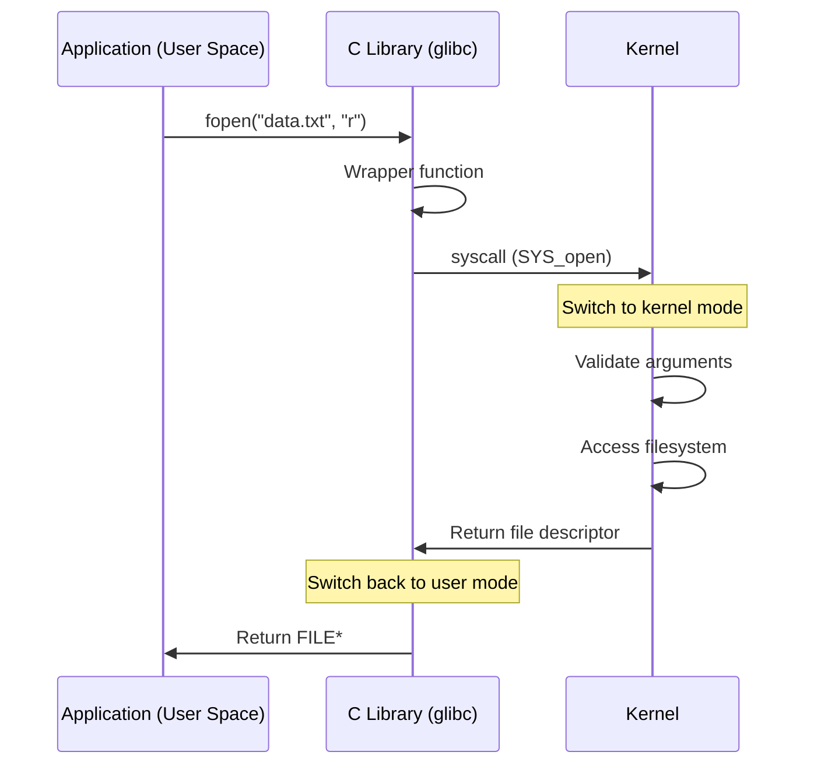

Common system calls:

| System Call | Purpose |
|-------------|---------|
| `open()` | Open a file |
| `read()` | Read from a file descriptor |
| `write()` | Write to a file descriptor |
| `fork()` | Create a new process |
| `exec()` | Replace current process with a new program |
| `mmap()` | Map files or devices into memory |
| `sbrk()` / `brk()` | Change heap size (allocate memory) |
| `socket()` | Create a network socket |
| `ioctl()` | Control device parameters |

> [!NOTE]
> **Performance Cost**: System calls are expensive. Switching between user mode and kernel mode takes hundreds of CPU cycles. This is why reading one byte at a time from a file is much slower than reading in large chunks.

## 4.4 Drivers

A **device driver** is a kernel module that knows how to communicate with a specific piece of hardware. Drivers provide a **uniform interface** to the OS while hiding hardware-specific details.

```
Application
     │
     ▼
 Kernel (VFS — Virtual File System)
     │
     ▼
 Device Driver (ATA, NVMe, USB-storage)
     │
     ▼
 Hardware (SSD, HDD, USB drive)
```

## 4.5 Scheduling

Scheduling is the **decision about which process runs next** on the CPU. The scheduler must balance:
- **Fairness**: Every process gets CPU time
- **Efficiency**: Minimize idle time
- **Responsiveness**: Interactive tasks respond quickly
- **Throughput**: Complete as many tasks as possible

Common scheduling algorithms:

| Algorithm | Description | Pros | Cons |
|-----------|-------------|------|------|
| **First-Come, First-Served** | Run processes in order | Simple | Short jobs wait behind long ones |
| **Round Robin** | Each process gets a time slice (quantum) | Fair, responsive | Poor for batch jobs |
| **Priority Scheduling** | Higher priority runs first | Important tasks go fast | Starvation possible |
| **Completely Fair (CFS)** | Linux's scheduler, uses red-black tree | Fair, efficient | Complex |

## 4.6 Boot Process

When you press the power button:

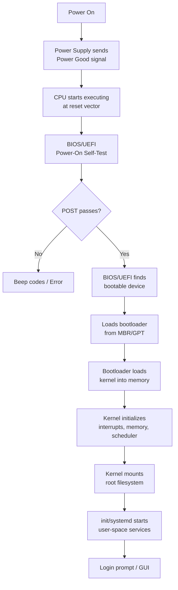

## 4.7 Linux, Windows, and macOS

| Feature | Linux | Windows | macOS |
|---------|-------|---------|-------|
| **Kernel type** | Monolithic | Hybrid | Hybrid (XNU) |
| **User interface** | CLI + many DEs | Windows Shell | Aqua |
| **Package manager** | apt, dnf, pacman | MSI, winget | Homebrew (.app) |
| **Filesystem** | ext4, XFS, Btrfs | NTFS | APFS |
| **Target market** | Servers, embedded | Desktop, enterprise | Desktop, creative |
| **Source** | Open source | Closed source | Open source core |
| **Default shell** | Bash / Zsh | PowerShell / CMD | Zsh |

> [!NOTE]
> **Kernel Types Explained**: A **monolithic kernel** (Linux) runs all OS services in kernel space for speed. A **microkernel** runs only essentials in kernel space, with other services in user space (more stable, slightly slower). A **hybrid kernel** (Windows, macOS) combines aspects of both.

---

#### Summary

- The OS manages hardware, provides abstractions, and enforces security
- The kernel runs in privileged kernel mode; applications run in restricted user mode
- System calls are the interface between user space and kernel space
- Device drivers abstract hardware differences
- The scheduler decides which process runs on the CPU at any moment
- The boot process takes the system from power-off to fully operational

#### Key Terms

| Term | Definition |
|------|------------|
| **Kernel** | Core OS component, runs in privileged mode |
| **User Space** | Where applications run, restricted access |
| **System Call** | Request from user space to kernel |
| **Driver** | Kernel module that controls hardware |
| **Scheduler** | Decides which process runs next |
| **Bootloader** | Small program that loads the OS kernel |
| **Ring 0 / Ring 3** | Privilege levels on x86 (kernel vs user) |

#### Mini Quiz

1. What is the purpose of a system call?
2. Name two differences between kernel mode and user mode.
3. What does the bootloader do?
4. What is the main advantage of a driver abstraction?
5. What does a scheduler decide?

#### Frequently Asked Questions

**Q: Can I write my own operating system?**
A: Yes! Linux From Scratch teaches you to build a custom Linux system. Writing a simple kernel for ARM or RISC-V is a common university project.

**Q: Why does Windows crash more than Linux?**
A: This is largely due to third-party drivers running in kernel space on Windows vs. Linux's stricter driver model. Also, Windows runs a wider variety of hardware with varying driver quality.

**Q: What determines the scheduler time quantum?**
A: A trade-off. Too short = too many context switches (overhead). Too long = poor responsiveness. Typical values are 1–100 milliseconds.

#### Common Interview Questions

1. "Explain the boot process from power-on to login prompt."
2. "What's the difference between a monolithic kernel and a microkernel?"
3. "How does a system call transition from user mode to kernel mode?"
4. "What is the difference between preemptive and cooperative multitasking?"

#### Practical Exercises

1. Run `strace` on Linux (or `Process Monitor` on Windows) to see system calls made by a simple command like `ls`
2. Try Linux From Scratch or explore `/proc` on Linux to see how the kernel represents processes
3. Compare Ubuntu, Windows, and macOS in a VM using VirtualBox

## Further Reading

- *Modern Operating Systems* by Andrew Tanenbaum — the classic OS textbook
- *Linux Kernel Development* by Robert Love — deep dive into the Linux kernel
- [OSDev Wiki](https://wiki.osdev.org/) — community resource for OS development

---

# 5. Processes

## 5.1 What is a Process?

### Intuitive Explanation

A **process** is a **running instance of a program**. The program is the **recipe** (stored on disk as a file). The process is the **actual cooking** (happening in memory, using the CPU). The OS manages processes through the scheduler described in [Section 4.5](#45-scheduling).

You can have the same program running as multiple processes. For example, opening three browser windows creates three processes running the same browser program.

### Program vs Process

| Feature | Program | Process |
|---------|---------|---------|
| **Nature** | Passive | Active |
| **Location** | Stored on disk | Loaded in memory |
| **Lifetime** | Permanent (until deleted) | Temporary (created and destroyed) |
| **Resources** | None | CPU time, memory, open files |
| **State** | Static file | Dynamic (constantly changing) |
| **Identifier** | Filename | Process ID (PID) |

> [!TIP]
> **Mental Model**: A program is sheet music. A process is the orchestra playing it. The same sheet music can be played by different orchestras at the same time.

## 5.2 Process Lifecycle

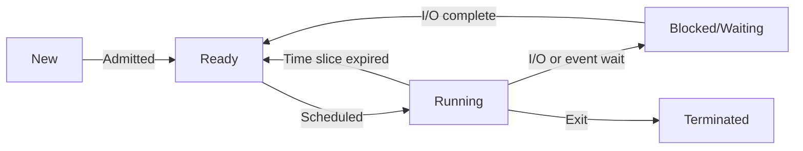

### Process States

1. **New**: The process is being created
2. **Ready**: The process is loaded and ready to run, waiting for the CPU
3. **Running**: The CPU is currently executing this process
4. **Blocked/Waiting**: The process is waiting for something (I/O, event, resource)
5. **Terminated**: The process has finished executing

## 5.3 Process Control Block (PCB)

The OS maintains a **PCB** for every process. It's a data structure that contains all information needed to manage the process.

```
┌───────────────────────────────┐
│      Process Control Block     │
├───────────────────────────────┤
│  Process ID (PID)             │
│  Parent Process ID (PPID)     │
│  Program Counter (PC)         │
│  CPU Registers                │
│  Memory Management Info       │
│  Open File Descriptors        │
│  I/O Status                   │
│  CPU Scheduling Info          │
│  Accounting Info (CPU time)   │
│  Process State                │
│  Priority                     │
└───────────────────────────────┘
```

When the OS switches between processes, it:
1. Saves the current process's state into its PCB
2. Loads the next process's state from its PCB
3. Resumes execution

## 5.4 Context Switching

A **context switch** is the process of saving and restoring the state of a CPU so that multiple processes can share a single CPU.

```
Process A running         Process B running
     │                         │
     │──────── Context ───────→│
     │         Switch          │
     │◀─────── Context ────────│
     │         Switch          │
     
     └───────── Time ──────────→
```

**What happens during a context switch:**
1. CPU receives a timer interrupt (or voluntary yield)
2. Kernel saves A's registers, PC, and stack pointer into A's PCB
3. Kernel invalidates TLB (memory translation cache)
4. Kernel loads B's PCB
5. Kernel restores B's registers, PC, and stack pointer
6. CPU resumes executing B

> [!WARNING]
> **Performance Cost**: Context switching is expensive — typically 1–10 microseconds. A major source of overhead is **cache pollution**: after switching, the new process's data isn't in the cache, causing many initial cache misses.

## 5.5 Threads

A **thread** is the **smallest unit of execution** within a process. A process can have multiple threads, all sharing the same memory space.

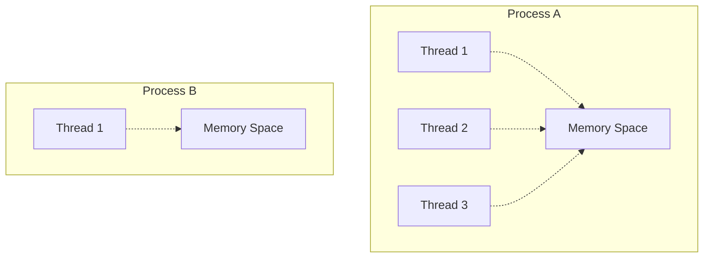

### Process vs Thread

| Feature | Process | Thread |
|---------|---------|--------|
| **Memory** | Own address space | Shares with process |
| **Creation** | Slow (copy memory) | Fast |
| **Context switch** | Slow (TLB flush) | Fast (no TLB flush) |
| **IPC** | Must use OS facilities | Direct memory access |
| **Isolation** | Fully isolated | Not isolated (can crash process) |
| **Resource overhead** | High | Low |

### Multithreading

Multithreading allows a program to do multiple things simultaneously within the same process:

- **Web server**: One thread for each client request
- **UI application**: UI thread stays responsive while worker threads handle computation
- **Database**: Multiple queries executing concurrently

**Challenges of multithreading:**
- **Race conditions**: Two threads access shared data simultaneously
- **Deadlocks**: Threads waiting for each other forever
- **Synchronization**: Must use locks, mutexes, semaphores

## 5.6 Inter-Process Communication (IPC)

Processes are isolated from each other. IPC provides mechanisms for processes to communicate.

| Method | Description | Speed |
|--------|-------------|-------|
| **Pipe** | One-way byte stream (parent→child) | Fast |
| **Named Pipe** | One-way, unrelated processes | Fast |
| **Socket** | Network or local communication | Medium |
| **Shared Memory** | Direct memory sharing | Fastest |
| **Message Queue** | Structured messages | Medium |
| **Signal** | Simple notification | Fast |
| **Semaphore** | Synchronization primitive | Fast |

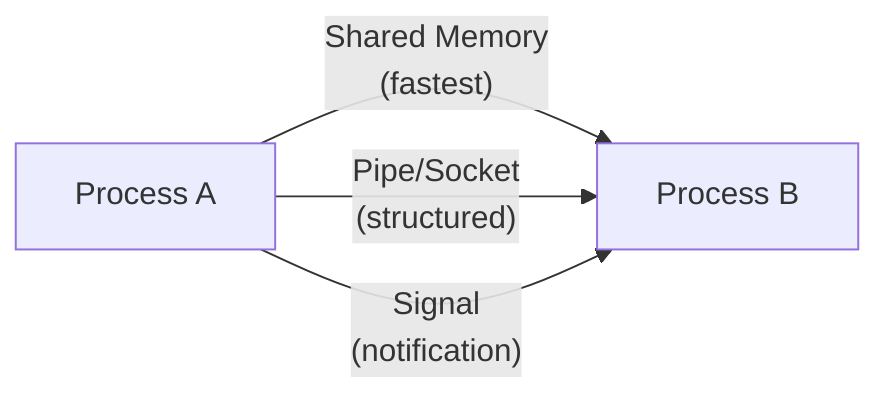

## 5.7 Zombies and Orphans

### Zombie Process

A **zombie** is a process that has terminated but whose exit status hasn't been collected by its parent. The process is dead but its PCB remains in the process table.

```mermaid
flowchart LR
    A[Child runs] --> B[Child exits]
    B --> C[Zombie]
    C -->|Parent calls wait()| D[PCB removed]
    C -->|Parent doesn't wait| E[Zombie remains]
```

**Why zombies are bad**: Each zombie holds a slot in the process table, which has a limited size. Too many zombies can prevent new processes from being created.

### Orphan Process

An **orphan** is a process whose parent has terminated. Orphans are adopted by `init` (PID 1 on Linux), which calls `wait()` to collect their status.

```
Parent exits → Child becomes orphan → init adopts → init wait()s → clean exit
```

---

#### Summary

- A process is a running instance of a program with its own memory space
- The OS manages processes through Process Control Blocks
- Context switching allows the CPU to share time between multiple processes
- Threads are lightweight execution units within a process
- IPC mechanisms allow processes to communicate
- Zombies and orphans are edge cases in process lifecycle management

#### Key Terms

| Term | Definition |
|------|------------|
| **Process** | Running instance of a program |
| **PCB** | Process Control Block — data structure for process management |
| **Context Switch** | Switching CPU from one process to another |
| **Thread** | Lightweight unit of execution within a process |
| **IPC** | Inter-Process Communication |
| **Zombie** | Terminated process awaiting parent's acknowledgment |
| **Orphan** | Process whose parent has terminated |
| **Race Condition** | Bug caused by timing-dependent concurrent access |

#### Common Interview Questions

1. "What's the difference between a process and a thread?"
2. "Explain what happens during a context switch."
3. "What is a race condition? How do you prevent it?"
4. "How does the Linux kernel represent a process internally?"
5. "What happens to a child process when its parent dies?"

#### Mini Quiz

1. What is a PID?
2. Name three process states.
3. What information does a PCB contain?
4. What's the main overhead of context switching?
5. Why are threads cheaper than processes?

#### Frequently Asked Questions

**Q: How many processes can a system run?**
A: Limited by the process table size (usually a few thousand to tens of thousands). Each process has a PID, and the PID space is finite (typically 0–32767 or 0–2²²).

**Q: What is the difference between a process and a program?**
A: A program is a passive file on disk. A process is an active execution of that file in memory with its own resources (CPU time, memory, file handles).

**Q: Can a process have more than one PID?**
A: No. PID is unique per process. However, threads within a process share the same PID as their parent process.

#### Common Interview Questions

1. "What's the difference between a process and a thread?"
2. "Explain what happens during a context switch in detail."
3. "What is a race condition and how do you fix it?"
4. "How does inter-process communication work on Linux?"

#### Practical Exercises

1. Run `ps aux` on Linux (or Task Manager on Windows) and observe running processes
2. Write a simple program that forks and explore the parent-child relationship
3. Use `strace -p <PID>` to trace system calls of a running process

## Further Reading

- *Operating Systems: Three Easy Pieces* (OSTEP) — free online book with excellent process management chapters
- *The Linux Programming Interface* by Michael Kerrisk — comprehensive Linux systems programming reference
- [Process Management in Linux](https://www.kernel.org/doc/html/latest/scheduler/) — kernel documentation

---

# 6. Memory Management

## 6.1 The Stack

### Intuitive Explanation

The **stack** is a region of memory that works like a **stack of plates**: you can only add or remove from the top. The stack pointer register (mentioned in [Section 2.1 on Registers](#registers)) tracks the current top of the stack. It's used for:
- **Function call management** — tracking where to return when a function completes
- **Local variables** — variables that exist only within a function

### How the Stack Works

Each function call creates a **stack frame** (also called an activation record).

```
     High Addresses
     ┌──────────────────────┐
     │      Main's frame    │
     │   local variables    │
     ├──────────────────────┤
     │  Function A's frame  │
     │  local variables     │
     │  return address      │
     ├──────────────────────┤
     │  Function B's frame  │  ← Stack Pointer (SP)
     │  local variables     │
     │  return address      │
     └──────────────────────┘
     Low Addresses
```

When a function is called:
1. Push return address onto stack
2. Push function arguments
3. Allocate space for local variables
4. Adjust stack pointer

When a function returns:
1. Read return address
2. Deallocate local variables
3. Restore previous frame's base pointer
4. Jump to return address

### Stack Frame Layout (x86-64)

```
┌─────────────────────────┐  ← Base Pointer (RBP)
│   Saved previous RBP    │
├─────────────────────────┤
│   Return address        │
├─────────────────────────┤
│   Function arguments    │  (if passed on stack)
├─────────────────────────┤
│   Local variables       │
├─────────────────────────┤
│   Saved registers       │
│   (callee-saved)        │
├─────────────────────────┤
│   Temporary space       │
└─────────────────────────┘  ← Stack Pointer (RSP)
```

### Recursion and Stack Overflow

**Recursion** — a function calling itself — is a natural stack user:

```python
def factorial(n):
    if n <= 1:
        return 1
    return n * factorial(n - 1)
```

Each recursive call creates a new stack frame. If recursion is too deep, the stack grows beyond its allocated size, causing a **stack overflow**.

> [!WARNING]
> **Stack Overflow**: In C/C++, stack overflow crashes the program. In managed languages (Python, Java), it throws an exception. Stack size is typically 1–8 MB per thread.

## 6.2 The Heap

### Intuitive Explanation

The **heap** is a region of memory for **dynamic allocation** — memory whose lifetime you control explicitly. Unlike the stack, heap memory must be managed by the programmer (or a garbage collector).

### Dynamic Allocation

```c
// C: Manual memory management
int* arr = (int*)malloc(10 * sizeof(int));  // Allocate on heap
// ... use arr ...
free(arr);                                    // Free when done
```

```python
# Python: Automatic memory management (garbage collection)
arr = [0] * 10   # Allocated on heap automatically
# ... use arr ...
# Freed automatically when no longer referenced
```

| Feature | Stack | Heap |
|---------|-------|------|
| **Allocation** | Automatic (push/pop) | Explicit (malloc/free) |
| **Deallocation** | Automatic (function return) | Explicit or garbage collected |
| **Speed** | Very fast (~1 cycle) | Slower (10–100 cycles) |
| **Size** | Limited (1–8 MB per thread) | Large (up to available RAM) |
| **Lifetime** | Tied to function scope | Until explicitly freed |
| **Fragmentation** | None | Possible (external fragmentation) |
| **Usage** | Local variables, function calls | Dynamic data structures |

### malloc and free (C)

```c
// malloc allocates uninitialized memory
void* ptr = malloc(1024);    // 1024 bytes on heap
if (ptr == NULL) {
    // Handle allocation failure
}

// calloc allocates zero-initialized memory
void* ptr2 = calloc(256, 4);  // 256 elements × 4 bytes, all zeros

// realloc resizes an allocation
ptr = realloc(ptr, 2048);     // Resize to 2048 bytes

// free returns memory to the heap
free(ptr);
free(ptr2);
```

### new and delete (C++)

```cpp
// new allocates and calls constructor
MyClass* obj = new MyClass(params);
int* arr = new int[100];

// delete calls destructor and frees
delete obj;
delete[] arr;
```

### Garbage Collection

Garbage collection (GC) **automatically frees memory** that is no longer reachable. Common GC strategies:

| Strategy | Description | Example |
|----------|-------------|---------|
| **Reference Counting** | Track how many references point to each object | Python, Swift |
| **Mark-and-Sweep** | Trace all reachable objects from roots, sweep unreachable | Java, Go |
| **Generational** | Assume young objects die faster, scan them more often | Java (HotSpot) |
| **Copying Collection** | Copy live objects to new space, discard old space | Early Lisp |

> [!CAUTION]
> **Common Misconception**: "Garbage collection makes memory leaks impossible." GC prevents some leaks but not all. If you hold an unnecessary reference (e.g., in a global cache), the object can never be collected — this is a logical memory leak.

## 6.3 Virtual Memory

### Intuitive Explanation

**Virtual memory** gives every process its own private address space. A process thinks it has exclusive access to memory from address 0 up to 2⁶⁴ (on 64-bit systems). In reality, the OS maps these virtual addresses to physical addresses.

**Why virtual memory?**
1. **Isolation**: One process can't see another's memory
2. **Simplification**: Each process thinks it has continuous memory
3. **Efficiency**: Can map more virtual memory than physical RAM exists (using disk)
4. **Shared memory**: Different virtual addresses can map to the same physical page

### Virtual vs Physical Addresses

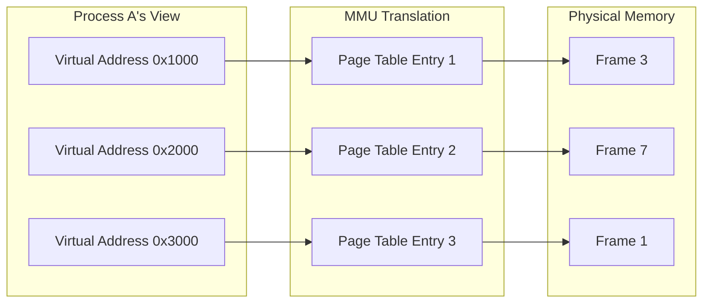

## 6.4 Paging

### Pages and Frames

**Paging** divides memory into fixed-size blocks:
- **Pages**: Virtual memory blocks (typically 4 KB)
- **Frames**: Physical memory blocks (same size as pages)

```
Virtual Address Space (Process)     Physical Memory
┌──── 4 KB page ────┐             ┌──── 4 KB frame ──┐
│  Virtual Page 0    │────────────→│  Frame 5          │
├────────────────────┤             ├───────────────────┤
│  Virtual Page 1    │────────────→│  Frame 2          │
├────────────────────┤             ├───────────────────┤
│  Virtual Page 2    │              (not in RAM)
├────────────────────┤             ├───────────────────┤
│  Virtual Page 3    │────────────→│  Frame 8          │
└────────────────────┘             └───────────────────┘
```

### Page Tables

A **page table** is a data structure that maps virtual pages to physical frames.

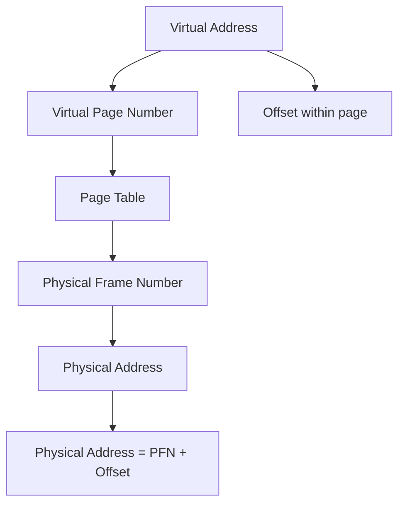

For a 4 KB page size:
- Virtual address bits [11:0] = offset within page
- Virtual address bits [63:12] = virtual page number

### Multi-Level Page Tables

On 64-bit systems, a single-level page table would be enormous (millions of entries per process). Multi-level page tables are tree structures that save memory.

```
Virtual Address:  [  Level 0  |  Level 1  |  Level 2  |  Level 3  |  Offset  ]
                    (9 bits)    (9 bits)    (9 bits)    (9 bits)    (12 bits)

Page table traversal:
Level 0 Table → Level 1 Table → Level 2 Table → Level 3 Table → Physical Frame
```

### TLB (Translation Lookaside Buffer)

The TLB is a **hardware cache for page table entries** — similar to how the CPU cache works for data. Without the TLB, every memory access would require multiple memory accesses just to translate the address.

```
CPU → TLB hit? → Yes → Physical address directly
       │
       No
       │
       ▼
  Walk page table (4 memory accesses)
       │
       ▼
  Store result in TLB for next time
```

> [!TIP]
> **TLB is essential**: Without a TLB, every memory access would require 3–5 additional memory accesses for address translation. Most programs have a TLB hit rate of >99% thanks to **spatial locality** (accessing nearby memory addresses).

### Page Faults

A **page fault** occurs when a process accesses a page that is not currently in physical memory.

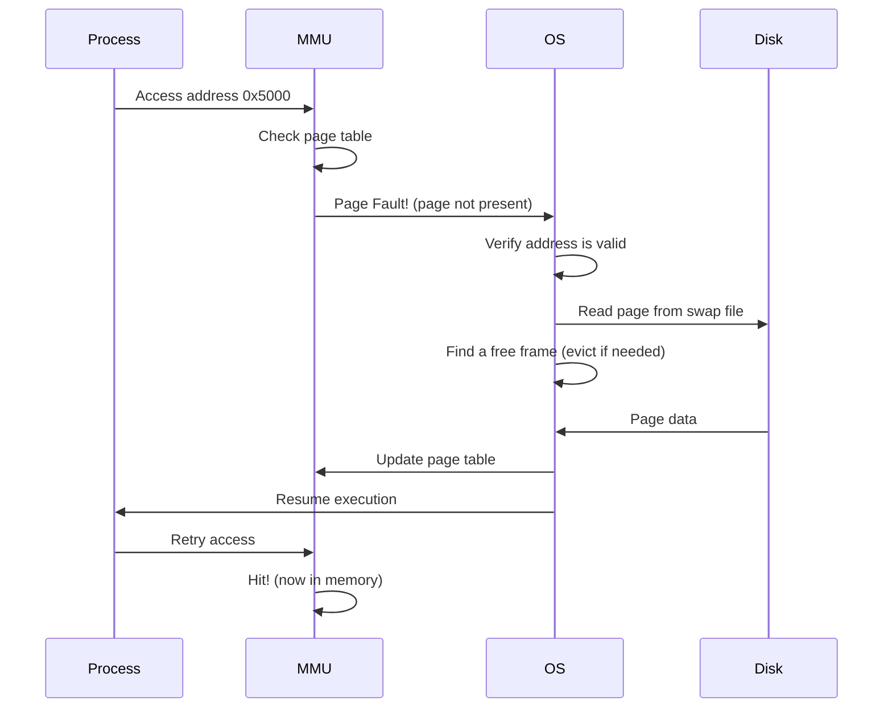

**Types of page faults:**
- **Minor fault**: Page is in memory but not in the process's page table (shared pages)
- **Major fault**: Page must be read from disk (very slow)
- **Invalid fault**: Process accessed an invalid address (causes segmentation fault)

### Swapping

**Swapping** moves entire processes between RAM and disk to free up physical memory. Combined with paging, it creates the illusion of near-infinite memory.

> [!NOTE]
> **Swapping vs Paging**: In modern systems, these terms are often used interchangeably. Technically, swapping moves whole processes, while paging moves individual pages (but "swapping" now commonly refers to page-level swapping).

---

#### Summary

- The stack is automatic, fast, and used for function call management
- The heap is for dynamic allocation with explicit lifetime control
- Virtual memory gives each process its own address space
- Paging maps virtual pages to physical frames
- The TLB caches address translations
- Page faults handle pages not in memory

#### Key Terms

| Term | Definition |
|------|------------|
| **Stack** | LIFO memory region for function calls and local variables |
| **Heap** | Dynamic memory region for arbitrary allocation |
| **Stack Frame** | Data structure representing one function call on the stack |
| **Virtual Memory** | Abstraction giving each process its own address space |
| **Page** | Fixed-size block of virtual memory |
| **Frame** | Fixed-size block of physical memory |
| **Page Table** | Data structure mapping virtual pages to physical frames |
| **TLB** | Translation Lookaside Buffer — cache for page table entries |
| **Page Fault** | Accessing a page not currently in physical RAM |
| **Garbage Collection** | Automatic reclamation of unreachable memory |

#### Common Interview Questions

1. "Explain the difference between stack and heap allocation."
2. "How does virtual memory work?"
3. "What happens when you access a null pointer?"
4. "Describe the paging mechanism in detail."
5. "What is a TLB miss, and why does it matter?"

#### Mini Quiz

1. What data structure does each function call create on the stack?
2. What is external fragmentation and which memory region suffers from it?
3. How does virtual memory improve security?
4. What causes a page fault?
5. What is the purpose of the TLB?

#### Frequently Asked Questions

**Q: What happens when a program runs out of stack space?**
A: A **stack overflow** occurs. In C/C++, this usually causes a segmentation fault (crash). In managed languages (Python, Java), it throws an exception like `RecursionError`.

**Q: Is heap memory slower than stack memory?**
A: Yes. Heap allocation requires finding a free block (possibly searching a free list), while stack allocation is just moving the stack pointer. Heap also suffers from fragmentation.

**Q: What is memory-mapped I/O?**
A: A technique where device registers are mapped into the memory address space. Reading/writing those memory addresses communicates directly with the device — no special I/O instructions needed.

#### Common Interview Questions

1. "Explain the difference between stack and heap allocation with examples."
2. "How does virtual memory work? Walk through an address translation."
3. "What is a page fault? What's the difference between a minor and major fault?"
4. "How does garbage collection work in Java/Python? What are its trade-offs?"

#### Practical Exercises

1. Write a deliberately recursive function (e.g., infinite recursion) and observe the stack overflow
2. In C, use `malloc` and `free` to manage heap memory; intentionally leak memory and observe with Valgrind
3. Research: How much virtual memory does your system make available vs. physical RAM?

## Further Reading

- *Operating Systems: Three Easy Pieces* — chapters on memory virtualization
- *What Every Programmer Should Know About Memory* by Ulrich Drepper
- [malloc Internals](https://sourceware.org/glibc/wiki/MallocInternals) — how heap allocation really works

---

# 7. Filesystems

## 7.1 Why Filesystems Exist

Without a filesystem, a storage device (SSD/HDD) is just a giant array of bytes. You could read and write blocks, but you'd have no way to:
- Organize data into named files
- Group files into directories
- Track file sizes, creation times, and permissions
- Find files without knowing their exact location

A **filesystem** imposes structure on raw storage, providing the familiar file-and-directory abstraction.

## 7.2 Files and Directories

### Files

A file is a **named sequence of bytes** stored on a persistent medium. Files have:
- **Name**: Human-readable identifier
- **Metadata**: Size, timestamps, permissions, ownership
- **Data**: The actual content

### Directories

A directory (or folder) is a **special file that maps names to inodes**. It contains entries like:

```
Filename       Inode Number
"report.txt" → 45201
"photo.jpg"  → 89234
"videos/"    → 33107
```

> [!NOTE]
> **Directories are files**: On most filesystems, directories are implemented as regular files whose data is a table of name→inode mappings. This is why directories have a size — they contain data like any other file.

## 7.3 Inodes

An **inode** (index node) is a data structure that stores all metadata about a file **except its name**. Every file has one inode.

```
┌───────────────────────────────────┐
│          Inode #45201              │
├───────────────────────────────────┤
│  File type: Regular               │
│  Permissions: rw-r--r--           │
│  Owner: alice (UID 1000)          │
│  Group: staff (GID 100)           │
│  Size: 16384 bytes                 │
│  Created: 2024-01-15 10:30:00     │
│  Modified: 2024-01-15 14:22:00    │
│  Accessed: 2024-01-15 14:30:00    │
│  Link count: 2                     │
│  Block pointers:                   │
│    Direct: [b1, b2, b3, ...]      │
│    Indirect: [b_ptr → more blocks]│
│    Double indirect: [d_ptr → ...] │
└───────────────────────────────────┘
```

Inodes contain **block pointers** that point to the actual data blocks on disk. For large files, indirect block pointers are used (pointers to blocks that contain more pointers).

## 7.4 Metadata

Filesystem metadata includes:

| Field | Description |
|-------|-------------|
| **File size** | Total bytes in the file |
| **Timestamps** | atime (access), mtime (modify), ctime (status change) |
| **Permissions** | Read/write/execute for owner, group, others |
| **Ownership** | User ID (UID) and Group ID (GID) |
| **Link count** | Number of directory entries pointing to this inode |
| **File type** | Regular file, directory, symlink, device, etc. |

## 7.5 Hard Links and Symbolic Links

### Hard Links

A **hard link** is an additional directory entry pointing to the same inode.

```
Directory entries:          Inode:
"document.txt" ──┐
                 ├──→  Inode #12345 (file data)
"backup.txt"   ──┘
```

- All hard links to a file are **indistinguishable** — there is no "original"
- Deleting one hard link decreases the link count; the file data is only deleted when the link count reaches 0
- Hard links **cannot** span across different filesystems
- Hard links **cannot** point to directories (prevents loops)

### Symbolic Links (Symlinks)

A **symlink** is a special file that contains a **path to another file**.

```
"shortcut.txt" ──→ "/home/user/documents/real_file.txt"
```

- Symlinks can point to directories
- Symlinks can cross filesystem boundaries
- If the target is deleted, the symlink becomes a **broken link** (dangling)
- Symlinks have their own inode

## 7.6 Mounting

**Mounting** is the process of making a filesystem available at a specific directory in the directory tree.

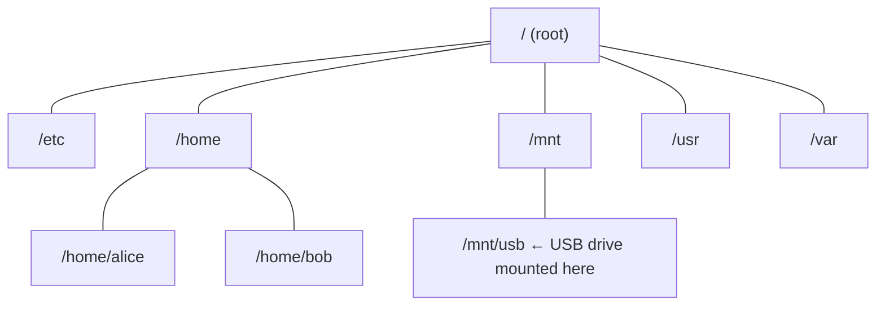

Before a USB drive can be used, it must be mounted:
```
mount /dev/sdb1 /mnt/usb
```

After mounting, the contents of the USB drive are accessible under `/mnt/usb/`.

## 7.7 Permissions and Ownership

Unix/Linux permissions use a **9-bit system** organized as three triads:

```
         Owner   Group   Others
         ─────   ─────   ─────
r w x    r w x   r w x   r - x
│ │ │    │ │ │   │ │ │   │ │ │
│ │ └── Execute   1 = executable
│ └──── Write     1 = writable
└────── Read      1 = readable

Binary:   111    101    101
Octal:     7      5      5
Symbolic:  rwx    r-x    r-x
```

Common permission values:

| Octal | Symbolic | Description |
|-------|----------|-------------|
| 777 | rwxrwxrwx | Everyone can do everything (dangerous) |
| 755 | rwxr-xr-x | Owner = full; others = read+execute (common for programs) |
| 644 | rw-r--r-- | Owner = read+write; others = read (common for files) |
| 600 | rw------- | Only owner can read/write (private files) |
| 000 | --------- | No access (locked) |

## 7.8 FAT32

### Overview

FAT32 (File Allocation Table, 32-bit) is a **simple, widely compatible** filesystem dating from 1996. It's used on USB drives, SD cards, and older Windows systems.

### Layout

```
┌──────────────────────────────────────────────┐
│  Boot Sector (Reserved Area)                   │
├──────────────────────────────────────────────┤
│  File Allocation Table (FAT) #1               │
├──────────────────────────────────────────────┤
│  File Allocation Table (FAT) #2 (backup)      │
├──────────────────────────────────────────────┤
│  Root Directory Region                        │
├──────────────────────────────────────────────┤
│  Data Region (clusters)                       │
└──────────────────────────────────────────────┘
```

The FAT is essentially a **linked list** of clusters. Each file's first cluster is stored in its directory entry; subsequent clusters are found by following the chain in the FAT.

### Advantages
- Universal compatibility (Windows, macOS, Linux, cameras, game consoles)
- Simple implementation
- Low overhead

### Limitations
- **Maximum file size**: 4 GB (minus 1 byte)
- **Maximum partition size**: 8 TB (with 32 KB clusters)
- **No journaling**: Sudden power loss can corrupt data
- **No permissions**: No file ownership or access control
- **No compression, encryption**, or other modern features

## 7.9 NTFS

### Overview

NTFS (New Technology Filesystem) is the **primary filesystem for Windows** since NT 3.1 (1993). It's a journaling filesystem with advanced features.

### Key Features

- **Journaling**: Tracks pending changes to survive crashes
- **Security**: Full ACL (Access Control List) permissions
- **Compression**: Transparent file compression
- **Encryption**: EFS (Encrypting File System)
- **Quotas**: Per-user disk space limits
- **Hard links, symlinks, junctions**
- **Alternate data streams**: Multiple data streams per file
- **Sparse files**: Files with large empty regions don't consume actual space

### Master File Table (MFT)

NTFS stores all file metadata in the **MFT**, a relational database of file records.

```
┌──────────────────────────────────┐
│  MFT Record for "report.docx"    │
├──────────────────────────────────┤
│  Standard Information            │
│  (permissions, timestamps)       │
├──────────────────────────────────┤
│  File Name                       │
│  "report.docx"                   │
├──────────────────────────────────┤
│  Security Descriptor             │
│  (ACL, ownership)               │
├──────────────────────────────────┤
│  Data (or extents for large      │
│  files)                          │
└──────────────────────────────────┘
```

Small files can fit entirely within their MFT record (resident data). Larger files use extents pointing to clusters.

## 7.10 ext4

### Overview

ext4 (Fourth Extended Filesystem) is the **default filesystem for most Linux distributions**. It's the evolution of ext2/ext3.

### Inodes

ext4 stores inodes in **inode tables** within block groups. Each inode is 256 bytes (configurable).

```
ext4 Block Group:
┌───────────────────────────────┐
│  Superblock (backup)          │
├───────────────────────────────┤
│  Group Descriptors            │
├───────────────────────────────┤
│  Block Bitmap                 │
│  (which blocks are used/free) │
├───────────────────────────────┤
│  Inode Bitmap                 │
│  (which inodes are used/free)│
├───────────────────────────────┤
│  Inode Table                  │
│  (actual inode data)          │
├───────────────────────────────┤
│  Data Blocks                  │
│  (actual file contents)       │
└───────────────────────────────┘
```

### Journaling

ext4 uses **journaling** to prevent filesystem corruption:

1. Write intended changes to the journal
2. Commit the journal entry
3. Write actual changes to the filesystem
4. Remove the journal entry

If the system crashes during step 3, replay the journal on reboot to complete or roll back the change.

### Key Features

- **Extents**: Contiguous block ranges (better for large files)
- **Delayed allocation**: Delay writing to disk to improve locality
- **Online defragmentation**: Defragment without unmounting
- **Large files**: Up to 16 TB (with 4 KB blocks)
- **Large volumes**: Up to 1 EB

## 7.11 Filesystem Comparison

| Feature | FAT32 | NTFS | ext4 |
|---------|-------|------|------|
| **Max file size** | 4 GB | 16 EB | 16 TB |
| **Max volume size** | 8 TB | 256 TB | 1 EB |
| **Journaling** | No | Yes | Yes |
| **Permissions** | None | ACL-based | POSIX (rwx) |
| **Compression** | No | Yes | No |
| **Encryption** | No | Yes (EFS) | Yes (eCryptfs) |
| **Hard links** | No | Yes | Yes |
| **Symbolic links** | No | Yes | Yes |
| **Case-sensitive** | No | Yes (optional) | Yes |
| **Defragmentation** | Needs it | Needs it | Less needed |
| **OS support** | Everything | Windows (read-only elsewhere) | Linux (others via drivers) |

---

#### Summary

- Filesystems organize raw storage into files and directories
- Inodes store file metadata and block pointers
- Directory entries are name→inode mappings
- Hard links share an inode; symlinks are path references
- Permissions use a three-triad (owner/group/others) model
- FAT32 is simple and compatible but limited
- NTFS is Windows-native with advanced features
- ext4 is the standard Linux filesystem

#### Key Terms

| Term | Definition |
|------|------------|
| **Inode** | Data structure containing file metadata |
| **File Allocation Table** | FAT system tracking cluster chains |
| **MFT** | Master File Table — NTFS's central metadata store |
| **Journaling** | Logging changes before applying them (crash recovery) |
| **Extent** | Contiguous range of blocks (improves large file perf) |
| **Hard Link** | Additional directory entry to an existing inode |
| **Symlink** | Special file pointing to another file path |
| **Cluster** | Minimum allocatable unit (multiple sectors) |

#### Mini Quiz

1. What does an inode store that the file's directory entry does not?
2. What's the main limitation of FAT32?
3. What is journaling and why is it important?
4. How does a hard link differ from a symbolic link?
5. What permission octal gives the owner read/write/execute and everyone else read/execute?

#### Frequently Asked Questions

**Q: What happens when you delete a file that's open by a process?**
A: On Unix/Linux, the file's directory entry is removed, but the inode and data remain until the process closes the file descriptor. The file is truly deleted only when the link count reaches 0 and the file is closed.

**Q: Why does Linux support so many filesystems?**
A: Different filesystems optimize for different scenarios: ext4 for general use, XFS for large files, Btrfs/ZFS for data integrity, FAT32 for compatibility, etc.

**Q: What is the maximum filename length?**
A: It varies by filesystem: FAT32 limits to 255 characters, NTFS to 255, ext4 to 255. The total path length has additional limits (e.g., 4096 characters on Linux).

#### Common Interview Questions

1. "Explain the difference between a hard link and a symbolic link."
2. "What is an inode and what information does it contain?"
3. "How does journaling protect against filesystem corruption?"
4. "Explain Linux file permissions (rwx) and what octal 755 means."

#### Practical Exercises

1. Use `ls -li` to see inode numbers on Linux
2. Create a hard link (`ln file1 file2`) and a symbolic link (`ln -s file1 file2`) — observe the differences
3. Use `stat` command to examine file metadata
4. Mount a USB drive (FAT32) and a Linux partition (ext4) and compare features

## Further Reading

- *The Design and Implementation of the FreeBSD Operating System* — chapters on filesystems
- [Linux ext4 Documentation](https://www.kernel.org/doc/html/latest/filesystems/ext4/index.html)
- [FAT32 Specification](https://www.microsoft.com/en-us/download/details.aspx?id=52369)

---

# 8. Virtualization

## 8.1 Why Virtualization Exists

Virtualization solves several fundamental problems:

1. **Resource utilization**: Most servers ran at 5–15% utilization. Virtualization lets one physical machine run many virtual servers.
2. **Isolation**: Problems in one virtual machine don't affect others.
3. **Hardware independence**: Move a VM to any physical machine easily.
4. **Snapshots and rollback**: Save VM state and restore instantly.
5. **Development and testing**: Run different OS versions simultaneously.

## 8.2 Hypervisors

A **hypervisor** (also called Virtual Machine Monitor or VMM) creates and manages virtual machines.

### Type 1 Hypervisor (Bare Metal)

Runs directly on the physical hardware. No host OS layer.

```
┌─────────────────────────────────────┐
│       Virtual Machines               │
│  ┌─────────┐  ┌─────────┐          │
│  │  VM 1   │  │  VM 2   │          │
│  │ Linux   │  │ Windows │          │
│  └────┬────┘  └────┬────┘          │
├───────┴────────────┴────────────────┤
│         Type 1 Hypervisor            │
│         (VMware ESXi, Xen, KVM)      │
├─────────────────────────────────────┤
│            Physical Hardware          │
└─────────────────────────────────────┘
```

**Examples**: VMware ESXi, Microsoft Hyper-V, Xen, KVM

**Advantages**: High performance, direct hardware access, low overhead

### Type 2 Hypervisor (Hosted)

Runs as an application on top of a host operating system.

```
┌─────────────────────────────────────┐
│  ┌─────────┐  ┌─────────┐          │
│  │  VM 1   │  │  VM 2   │          │
│  │ Linux   │  │ Windows │          │
│  └────┬────┘  └────┬────┘          │
│       └──────┬──────┘              │
│         Type 2 Hypervisor           │
│         (VirtualBox, VMware WS)     │
├─────────────────────────────────────┤
│           Host Operating System      │
├─────────────────────────────────────┤
│            Physical Hardware          │
└─────────────────────────────────────┘
```

**Examples**: Oracle VirtualBox, VMware Workstation, Parallels

**Advantages**: Easy to install, good for development/testing

### Type 1 vs Type 2

| Feature | Type 1 (Bare Metal) | Type 2 (Hosted) |
|---------|---------------------|-----------------|
| **Performance** | Near-native | Some overhead |
| **Hardware access** | Direct | Through host OS |
| **Use case** | Production servers | Development, testing |
| **Installation** | Complex (replaces OS) | Simple (like any app) |
| **Security** | Smaller attack surface | Larger attack surface |
| **Resource overhead** | Minimal | Moderate |

## 8.3 Virtual Machines

A **virtual machine (VM)** is a complete emulation of a physical computer, including:
- Virtual CPU (vCPU)
- Virtual memory
- Virtual storage (virtual disk)
- Virtual network interfaces
- Virtual BIOS/UEFI

### Isolation

Each VM is fully isolated:
- One VM cannot read another VM's memory
- One VM cannot access another VM's disk without network
- A crash in one VM doesn't affect others
- A security breach in one VM doesn't spread

### Guest OS

Each VM runs its own **guest operating system**, which can be different from the host OS. You can run Linux VMs on a Windows host and vice versa.

### Resource Allocation

Resources are allocated to VMs by the hypervisor:
- **CPU**: Schedules vCPUs on physical CPUs (overcommitting is common)
- **Memory**: Static or dynamic allocation (balloon driver adjusts VM memory)
- **Disk**: Virtual disk files stored on physical storage
- **Network**: Virtual switches connect VMs

### Advantages of VMs

1. **Full isolation** between workloads
2. **Different OSes** on the same hardware
3. **Snapshots** for quick backup and rollback
4. **Live migration** — move a running VM between physical hosts
5. **Hardware independence** — VMs don't care about underlying hardware

### Disadvantages of VMs

1. **Performance overhead**: ~5–20% compared to bare metal
2. **Resource waste**: Each VM runs a full OS (OS license, RAM, disk)
3. **Boot time**: Booting a full OS takes minutes
4. **Size**: VM disk images can be gigabytes

## 8.4 Containers

### Intuitive Explanation

If VMs are **apartments in a building** (each with its own foundation, walls, and plumbing), containers are **rooms in a shared house** (same foundation, same plumbing, partitioned by doors).

Containers share the **host OS kernel** but have their own:
- Filesystem (isolated)
- Network stack (isolated)
- Process tree (isolated)
- User IDs (isolated)

### Linux Namespaces

Namespaces provide **process isolation** by giving each container its own view of the system:

| Namespace | What it isolates |
|-----------|------------------|
| **PID** | Process IDs — container sees only its own processes |
| **Network** | Network interfaces, IP addresses, routing |
| **Mount** | Filesystem mount points |
| **UTS** | Hostname and domain name |
| **IPC** | System V IPC, POSIX message queues |
| **User** | User and group IDs |
| **Cgroup** | Resource limits (hybrid with cgroups) |

### cgroups (Control Groups)

cgroups **limit and account for** resource usage by process groups:

- **CPU**: Limit CPU shares, cores
- **Memory**: Limit RAM usage (soft and hard limits)
- **Disk I/O**: Limit read/write bandwidth
- **Network**: Limit network bandwidth
- **Devices**: Control access to devices

### Images and Layers

A **container image** is a stack of **read-only layers**.

```
┌───────────────────────────┐
│  Layer 5: App code        │  ← Writable container layer
│  Python application       │
├───────────────────────────┤
│  Layer 4: Dependencies    │
│  pip install flask        │
├───────────────────────────┤
│  Layer 3: Python runtime  │
│  Python 3.11 installation│
├───────────────────────────┤
│  Layer 2: OS base         │
│  Ubuntu 22.04             │
├───────────────────────────┤
│  Layer 1: Kernel (shared) │  ← Host kernel, not in image
└───────────────────────────┘
```

Layers are **shared and cached**. If you have 10 containers running the same base Ubuntu image, the Ubuntu layer is stored once on disk.

### Docker Architecture

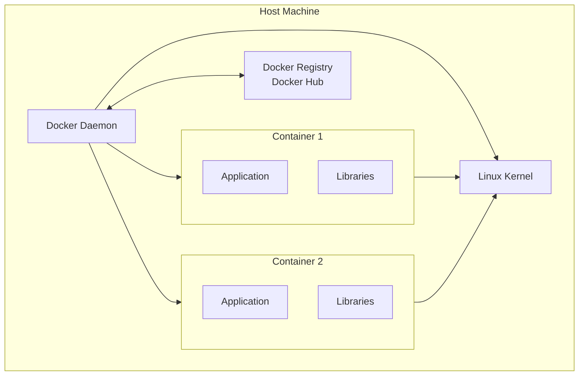

## 8.5 VM vs Container Comparison

| Feature | Virtual Machine | Container |
|---------|----------------|-----------|
| **Isolation** | Full (own kernel) | Process-level (shared kernel) |
| **OS requirement** | Full OS per VM | Shared host kernel |
| **Boot time** | Minutes | Milliseconds |
| **Size** | GB (full OS) | MB (app + deps) |
| **Performance** | Near-native (~5–20% overhead) | Near-native (minimal overhead) |
| **Startup time** | 30–60 seconds | <1 second |
| **Guest kernel** | Any OS | Same as host (Linux on Linux) |
| **Snapshot** | Full machine state | Container state |
| **Live migration** | Yes | More complex |
| **Portability** | Any hypervisor | Any container runtime |
| **Security** | Stronger isolation | Weaker (shared kernel) |

> [!CAUTION]
> **Common Misconception**: "Containers are lightweight VMs." They're fundamentally different. VMs virtualize hardware; containers virtualize the OS. Containers share the host kernel, which is both their advantage (speed, efficiency) and their limitation (can't run a different OS, weaker isolation).

---

#### Summary

- Hypervisors (Type 1/2) create and manage VMs
- VMs provide full hardware virtualization with strong isolation
- Containers use namespaces and cgroups for lightweight process isolation
- Container images use layered filesystems for efficient storage
- VMs are better for isolation and different OSes; containers are better for speed and density

#### Key Terms

| Term | Definition |
|------|------------|
| **Hypervisor** | Software that creates and runs VMs |
| **Virtual Machine** | Complete emulation of a physical computer |
| **Container** | Lightweight, isolated environment sharing the host kernel |
| **Namespace** | Linux feature isolating kernel resources per container |
| **cgroup** | Control group — limits and tracks resource usage |
| **Guest OS** | OS running inside a VM |
| **Image** | Read-only template for creating containers |
| **Layer** | Filesystem layer in a container image |

#### Mini Quiz

1. What's the main difference between Type 1 and Type 2 hypervisors?
2. Why are containers faster to start than VMs?
3. What Linux features make containers possible?
4. Can a container run a different OS than the host? Why?
5. What is a container layer?

#### Frequently Asked Questions

**Q: Do containers provide the same security as VMs?**
A: No. Containers share the host kernel, so a kernel vulnerability can break container isolation. VMs provide stronger isolation because each has its own kernel.

**Q: Can I run Docker on Windows without a VM?**
A: Docker for Windows uses a lightweight Hyper-V VM to run a Linux kernel, since Docker containers require a Linux kernel. Native Windows containers exist but are less common.

**Q: What is "orchestration" in container contexts?**
A: Managing many containers across multiple machines — starting, stopping, scaling, networking. Kubernetes is the dominant container orchestration platform.

#### Common Interview Questions

1. "Explain the difference between Type 1 and Type 2 hypervisors."
2. "How do containers achieve isolation without a full VM?"
3. "What are Linux namespaces and cgroups?"
4. "Compare VMs and containers — when would you use each?"

#### Practical Exercises

1. Install VirtualBox and create a Linux VM on your machine
2. Install Docker and run `docker run hello-world` — observe the layers
3. Use `docker stats` to see container resource usage
4. Research: What is the overhead (in %) of running on AWS EC2 vs. bare metal?

## Further Reading

- *Understanding the Linux Kernel* by Bovet & Cesati — chapters on process and memory management
- [Docker Documentation](https://docs.docker.com/) — official reference
- [KVM Documentation](https://www.linux-kvm.org/page/Documents) — Linux's Type 1 hypervisor

---

# 9. Putting Everything Together

## End-to-End Workflow: Pressing a Key

Now let's trace a complete journey — from pressing a key to seeing a character appear on screen — involving every component we've discussed.

### Step-by-Step Trace

> **The Setup**: You're editing a document in a text editor. You press the 'A' key.

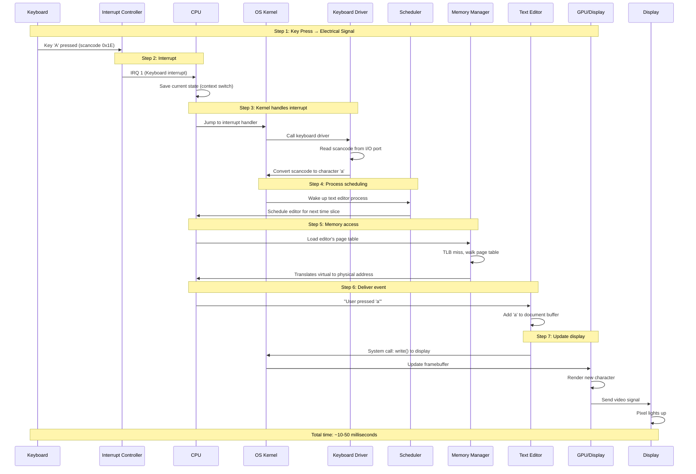

### Detailed Breakdown

#### Step 1: Electrical Signal (Hardware)

1. You press the 'A' key on the keyboard
2. A mechanical or capacitive switch closes, completing an electrical circuit
3. The keyboard controller detects which key was pressed
4. It sends a **scancode** (a number identifying the key) over USB or PS/2

#### Step 2: Interrupt (CPU + Interrupt Controller)

1. The keyboard controller asserts an interrupt request line
2. The **Interrupt Controller (APIC/IOAPIC)** receives the signal
3. It checks the interrupt priority
4. If higher than the current priority, it forwards to the CPU
5. The CPU receives the interrupt signal on a dedicated pin

#### Step 3: CPU Context Switch (CPU + Kernel)

1. The CPU **completes the current instruction** (instructions are atomic)
2. It saves the **Program Counter (PC)** and **CPU registers** to the stack
3. It looks up the **Interrupt Descriptor Table (IDT)** to find the handler address
4. It **switches from user mode to kernel mode** (ring 3 → ring 0)
5. It jumps to the interrupt handler code in the kernel

#### Step 4: Kernel Processing (Kernel + Drivers)

1. The kernel's interrupt handler runs
2. It calls the **keyboard driver**
3. The driver reads the scancode from the keyboard's I/O port
4. It looks up the scancode in a **keyboard layout table** (QWERTY, AZERTY, etc.)
5. It determines: key 'a' was pressed (not released)
6. It checks modifier keys (Shift, Ctrl, etc.)
7. It places a **key event** (`'a'` pressed) into the **input event queue**

#### Step 5: Process Scheduling (Scheduler)

1. The kernel schedules the **bottom half** (tasklet/workqueue) to process the event
2. It identifies that the **text editor process** should receive this event
3. The scheduler marks the text editor as **runnable**
4. The next time the scheduler runs, it may context-switch to the editor

#### Step 6: Memory Access (Memory Manager)

1. The scheduler calls `switch_mm()` to change memory context
2. The **MMU** reloads the page table base register (CR3 on x86)
3. The **TLB** is flushed (or invalidated for the old process's entries)
4. As the editor runs, it accesses memory:
   - Instruction fetch → TLB check → page table walk (if miss) → cache check → RAM access
   - Data read (document buffer) → same path
   - Stack operations → same path

#### Step 7: Application Processing

1. The text editor reads the keyboard event from its input buffer
2. It determines the cursor position
3. It inserts 'a' into the document's character buffer
4. It marks the display area as "dirty" (needs redraw)
5. It calls a GUI function to update the text on screen

#### Step 8: Display Update (GPU + Display)

1. The editor calls the **GUI system** (X11, Wayland, Win32)
2. The GUI calls the **display driver**
3. The display driver updates the **framebuffer** in GPU memory
4. The GPU reads the framebuffer and converts it to a **video signal**
5. The monitor receives the signal and lights up the appropriate pixels

### Additional Background Processes

While this was happening, the OS was also:

- **Managing cache**: As you read/write files, the **page cache** in RAM stores recently accessed disk data
- **Swapping**: If RAM is full, the **swap daemon (kswapd)** may be paging out memory to disk
- **Driver-level I/O**: If the file is on disk, a **DMA transfer** copies data from disk to the page cache
- **File system operations**: Writing the document triggers filesystem journal writes

> [!TIP]
> **Scale of complexity**: The simple act of pressing a key involves:
> - ~10 hardware components (keyboard, USB controller, interrupt controller, CPU cores, cache, MMU, TLB, RAM, GPU, display)
> - ~50,000 lines of OS kernel code (interrupt handling, scheduling, memory management, drivers)
> - ~1,000,000 lines of system library code (GUI toolkit, input handling)
> - ~100,000 lines of application code
>
> And the entire operation completes in about **5–20 milliseconds**.

---

#### Summary

- Every user action triggers a cascade through hardware and software
- Interrupts allow devices to get the CPU's attention efficiently
- Process scheduling shares the CPU between multiple programs
- Virtual memory with paging ensures isolation and efficient memory use
- Multiple layers of abstraction translate high-level events to low-level operations
- Modern systems handle millions of such cascades every second

---

# 10. Complete Glossary

> All technical terms introduced in this document, listed alphabetically.

| Term | Definition |
|------|------------|
| **Abstraction** | Hiding complex details behind a simpler interface |
| **Accumulator** | Register that stores intermediate arithmetic results |
| **Address Bus** | Carries memory addresses from CPU to memory/devices |
| **Address Space** | The range of memory addresses a process can access |
| **ALU** | Arithmetic Logic Unit — performs calculations in the CPU |
| **APIC** | Advanced Programmable Interrupt Controller |
| **ASCII** | American Standard Code for Information Interchange — character encoding |
| **Base Pointer** | Register pointing to the current stack frame |
| **Binary** | Base-2 number system using only 0 and 1 |
| **BIOS** | Basic Input/Output System — firmware that initializes hardware |
| **Bit** | Binary digit — the smallest unit of data (0 or 1) |
| **Bitmask** | Pattern of bits used to select or modify specific bits |
| **Bootloader** | Small program that loads the OS kernel into memory |
| **Branch Prediction** | CPU guessing branch outcomes to avoid pipeline stalls |
| **Byte** | 8 bits |
| **Cache** | Small, fast memory storing copies of frequently accessed data |
| **Cache Hit** | Successfully finding data in cache |
| **Cache Miss** | Data not in cache, must fetch from slower memory |
| **cgroup** | Control Group — limits and tracks resource usage |
| **Chipset** | Chipset controlling data flow between components |
| **Clock Speed** | Frequency of CPU oscillator (Hz) |
| **Cluster** | Minimum allocatable unit on a filesystem (multiple sectors) |
| **Compiler** | Translates high-level code into machine code |
| **Container** | Lightweight, isolated environment sharing host kernel |
| **Context Switch** | Saving/restoring CPU state between processes |
| **Control Bus** | Carries control signals (read, write, interrupt) |
| **Control Unit** | CPU component that decodes instructions and coordinates components |
| **Core** | Independent processing unit within a CPU |
| **CPU** | Central Processing Unit — the primary processor |
| **Data Bus** | Carries data between CPU, memory, and devices |
| **Deadlock** | Two or more processes waiting for each other indefinitely |
| **DMA** | Direct Memory Access — transfers data without CPU involvement |
| **DRAM** | Dynamic RAM — main memory, needs periodic refresh |
| **Driver** | Kernel module that controls a hardware device |
| **Extent** | Contiguous range of blocks on a filesystem |
| **FAT** | File Allocation Table — simple filesystem structure |
| **Fetch-Decode-Execute** | The fundamental CPU instruction cycle |
| **File Descriptor** | Integer handle used to refer to open files |
| **Frame** | Fixed-size block of physical memory (same size as page) |
| **Framebuffer** | Memory buffer containing pixel data for display |
| **Garbage Collection** | Automatic reclamation of unused heap memory |
| **GPU** | Graphics Processing Unit — parallel processor |
| **Guest OS** | Operating system running inside a virtual machine |
| **Hard Link** | Additional directory entry pointing to an existing inode |
| **Heap** | Memory region for dynamic allocation |
| **Hexadecimal** | Base-16 number system (0-9 and A-F) |
| **Hypervisor** | Software that creates and runs virtual machines |
| **IDT** | Interrupt Descriptor Table — maps interrupts to handlers |
| **Inode** | Data structure containing file metadata |
| **Instruction Register** | Register holding the currently executing instruction |
| **Interrupt** | Signal pausing the CPU to handle an event |
| **IPC** | Inter-Process Communication |
| **ISA** | Instruction Set Architecture |
| **Journaling** | Logging changes before applying for crash recovery |
| **Kernel** | Core OS component running in privileged mode |
| **Kernel Mode** | Privileged execution mode with full hardware access |
| **L1/L2/L3 Cache** | Levels of CPU cache (fastest to slowest) |
| **Machine Code** | Binary instructions that a CPU can execute directly |
| **MFT** | Master File Table — NTFS's central metadata store |
| **MMU** | Memory Management Unit — handles address translation |
| **Namespace** | Linux feature for isolating kernel resources per container |
| **Nibble** | 4 bits (half a byte) |
| **Orphan** | Process whose parent has terminated |
| **Page** | Fixed-size block of virtual memory |
| **Page Fault** | Accessing a page not currently in physical RAM |
| **Page Table** | Data structure mapping virtual pages to physical frames |
| **PCB** | Process Control Block — data structure for process management |
| **PCIe** | PCI Express — high-speed expansion bus |
| **Pipeline** | Overlapping execution of multiple instructions |
| **Process** | Running instance of a program |
| **Program Counter** | Register holding address of next instruction |
| **Race Condition** | Bug caused by timing-dependent concurrent access |
| **RAM** | Random Access Memory — main system memory |
| **Register** | Ultra-fast storage location inside the CPU |
| **Scheduler** | Component deciding which process runs next |
| **Scancode** | Number identifying which key on a keyboard was pressed |
| **SRAM** | Static RAM — used for cache, no refresh needed |
| **Stack** | LIFO memory region for function calls and local variables |
| **Stack Frame** | Data structure for one function call on the stack |
| **Stack Pointer** | Register pointing to top of the stack |
| **Superscalar** | Executing multiple instructions per clock cycle |
| **Symlink** | Special file containing a path to another file |
| **System Call** | Request from user space to kernel |
| **Thread** | Lightweight unit of execution within a process |
| **TLB** | Translation Lookaside Buffer — cache for page table entries |
| **UEFI** | Unified Extensible Firmware Interface (modern BIOS replacement) |
| **User Mode** | Restricted execution mode for applications |
| **User Space** | Where applications run (ring 3) |
| **Virtual Machine** | Complete emulation of a physical computer |
| **Virtual Memory** | Abstraction giving each process its own address space |
| **Zombie** | Terminated process awaiting parent's acknowledgment |

---

> **End of Document**
>
> *From Sand to Software: A Complete Guide to Computer Architecture & Operating Systems*
>
> Written as a first-principles reference for students, programmers, and systems engineers.
> Use this document as a study guide, interview prep resource, or long-term reference.
