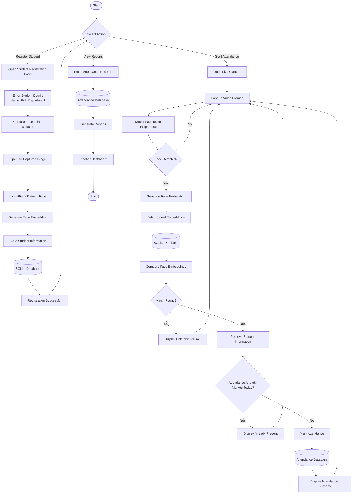

# Smart Attendance System with Facial Recognition

## 📌 Project Overview

A web-based Smart Attendance System that automatically marks student attendance using facial recognition.

The system consists of:

- AI-powered Face Recognition
- FastAPI Backend
- Next.js Dashboard
- SQLite (MVP) / PostgreSQL (Production)
- JWT Authentication
- Attendance Reports

---

# 🎯 MVP Goals

By the end of the MVP, the system should be able to:

- Register students
- Capture student face
- Generate and store face embeddings
- Recognize students through webcam
- Mark attendance automatically
- Prevent duplicate attendance for the same day
- Display attendance records

---

# 🏗 System Architecture

```
                  Camera
                     │
                     ▼
              OpenCV Capture
                     │
                     ▼
            Face Detection
              (InsightFace)
                     │
                     ▼
          Generate Face Embedding
                     │
                     ▼
        Compare Stored Embeddings
                     │
          ┌──────────┴──────────┐
          │                     │
      Match Found           Unknown
          │                     │
          ▼                     ▼
 Check Today's Attendance    Ignore
          │
          ▼
Already Marked Today?
      │
 ┌────┴─────┐
 │          │
Yes        No
 │          │
 ▼          ▼
Ignore   Save Attendance
              │
              ▼
          SQLite Database
              │
              ▼
     Teacher Dashboard (Next.js)
```

---

# 🛠 Final Tech Stack

## Frontend

| Technology | Purpose |
|------------|----------|
| Next.js 15 | Dashboard |
| React | UI |
| Tailwind CSS v4 | Styling |
| shadcn/ui | Components |
| TanStack Query | API Calls |
| React Hook Form | Forms |
| Zod | Validation |

---

## Backend

| Technology | Purpose |
|------------|----------|
| FastAPI | REST API |
| SQLAlchemy 2.0 | ORM |
| Pydantic v2 | Validation |
| JWT | Authentication |
| Uvicorn | ASGI Server |

---

## AI / Computer Vision

| Technology | Purpose |
|------------|----------|
| OpenCV | Camera Handling |
| InsightFace | Face Recognition |
| ONNX Runtime | Run AI Models |
| NumPy | Matrix Operations |

---

## Database

### MVP

SQLite

### Production

PostgreSQL

---

## Authentication

- JWT
- bcrypt Password Hashing

Roles:

- Admin
- Teacher

---

# 📂 Project Structure

```
smart-attendance/

backend/
│
├── app/
│   ├── api/
│   ├── ai/
│   │   ├── detector.py
│   │   ├── recognizer.py
│   │   ├── embedding.py
│   │   └── matcher.py
│   │
│   ├── core/
│   ├── database/
│   ├── middleware/
│   ├── models/
│   ├── repositories/
│   ├── schemas/
│   ├── services/
│   ├── utils/
│   └── main.py
│
├── uploads/
│
├── requirements.txt
│
└── README.md

frontend/
│
├── app/
├── components/
├── hooks/
├── services/
├── lib/
├── types/
└── public/

docs/

README.md
```

---

# 🧠 AI Pipeline

```
Camera

↓

Capture Frame

↓

Detect Face

↓

Crop Face

↓

Generate Embedding

↓

Compare Embeddings

↓

Recognized?

↓

Attendance Service

↓

Database
```

---

# 📋 Database Schema

## Users

| Field | Type |
|--------|------|
| id | Integer |
| username | String |
| password_hash | String |
| role | Enum |

---

## Students

| Field | Type |
|--------|------|
| id | Integer |
| name | String |
| roll_number | String |
| department | String |
| photo_path | String |
| created_at | DateTime |

---

## Embeddings

| Field | Type |
|--------|------|
| id | Integer |
| student_id | FK |
| embedding | Vector |

---

## Attendance

| Field | Type |
|--------|------|
| id | Integer |
| student_id | FK |
| date | Date |
| time | Time |
| status | Present/Absent |

---

# 🔗 REST API

## Authentication

POST /login

---

## Students

POST /students/register

GET /students

GET /students/{id}

DELETE /students/{id}

---

## Recognition

POST /recognize

---

## Attendance

POST /attendance

GET /attendance

GET /attendance/today

---

## Reports

GET /reports

---

# 🔄 Recognition Flow

```
Teacher Opens Camera

↓

Capture Frame

↓

Detect Face

↓

Generate Embedding

↓

Compare Database

↓

Known?

├── No
│      ↓
│    Ignore
│
└── Yes
       ↓
Check Today's Attendance

↓

Already Present?

├── Yes
│      ↓
│    Ignore
│
└── No
       ↓
Save Attendance
```

---

# 📦 Python Dependencies

## Backend

```
fastapi
uvicorn
sqlalchemy
pydantic
python-jose
passlib
bcrypt
python-multipart
```

---

## AI

```
opencv-python
insightface
onnxruntime
numpy
```

---

## Database

```
aiosqlite
```

Production:

```
asyncpg
```

---

# 📅 MVP Development Roadmap

## Phase 1

### OpenCV Basics

Learn

- Webcam
- Images
- Video
- Drawing
- Face Detection

Mini Project

- Camera Viewer

---

## Phase 2

### Face Recognition

Learn

- InsightFace
- Embeddings
- Cosine Similarity

Mini Project

Recognize Yourself

---

## Phase 3

### Student Registration

Features

- Name
- Roll
- Department
- Capture Face
- Save Embedding

---

## Phase 4

### Backend

Build

- Student CRUD
- Recognition API
- Attendance API

---

## Phase 5

### Database

Create

- Users
- Students
- Embeddings
- Attendance

---

## Phase 6

### Frontend Dashboard

Pages

- Login
- Dashboard
- Register Student
- Student List
- Attendance
- Live Camera

---

## Phase 7

### Integration

Connect

Frontend

↓

FastAPI

↓

Recognition Engine

↓

Database

---

## Phase 8

### Testing

Test Cases

- Unknown Face
- Known Face
- Multiple Students
- Duplicate Attendance
- Camera Failure

---

# 🚫 Features Excluded From MVP

- Anti Spoofing
- Blink Detection
- Liveness Detection
- Multiple Cameras
- Email Notifications
- Mobile Application
- Docker
- Cloud Deployment
- Analytics Dashboard
- Face Mask Detection
- QR Backup

---

# 🚀 Future Improvements

## AI

- Anti Spoofing
- Blink Detection
- Head Pose Detection
- Face Mask Detection

---

## Backend

- RBAC
- Audit Logs
- Attendance Analytics

---

## Frontend

- Charts
- Reports
- Export PDF
- Export Excel

---

## Deployment

- Docker
- Docker Compose
- PostgreSQL
- Nginx
- GitHub Actions
- Azure / AWS

---

# 📚 Learning Resources

## OpenCV

- Murtaza's Workshop
- freeCodeCamp OpenCV

---

## Face Recognition

- InsightFace Documentation
- Nicholas Renotte

---

## FastAPI

- Tech With Tim
- FastAPI Official Docs

---

## Next.js

- Next.js Documentation

---

## SQLAlchemy

- SQLAlchemy Official Documentation

---

# 🏆 Final Tech Stack Summary

| Layer | Technology |
|---------|------------|
| Frontend | Next.js 15 |
| UI | React |
| Styling | Tailwind CSS |
| Components | shadcn/ui |
| Forms | React Hook Form |
| Validation | Zod |
| API State | TanStack Query |
| Backend | FastAPI |
| ORM | SQLAlchemy |
| Authentication | JWT |
| Password Hashing | bcrypt |
| AI | OpenCV |
| Face Recognition | InsightFace |
| AI Runtime | ONNX Runtime |
| Database (MVP) | SQLite |
| Database (Production) | PostgreSQL |
| Version Control | Git + GitHub |
| Deployment | Docker + Nginx + PostgreSQL |

---

# 🎯 Portfolio Value

This project demonstrates experience with:

- Artificial Intelligence
- Computer Vision
- Face Recognition
- FastAPI
- Next.js
- React
- Authentication
- Database Design
- REST API Development
- Full Stack Development
- Software Architecture
- AI Integration
- Clean Project Structure

# Flowchart
[[Smart_Attendance.png]]
