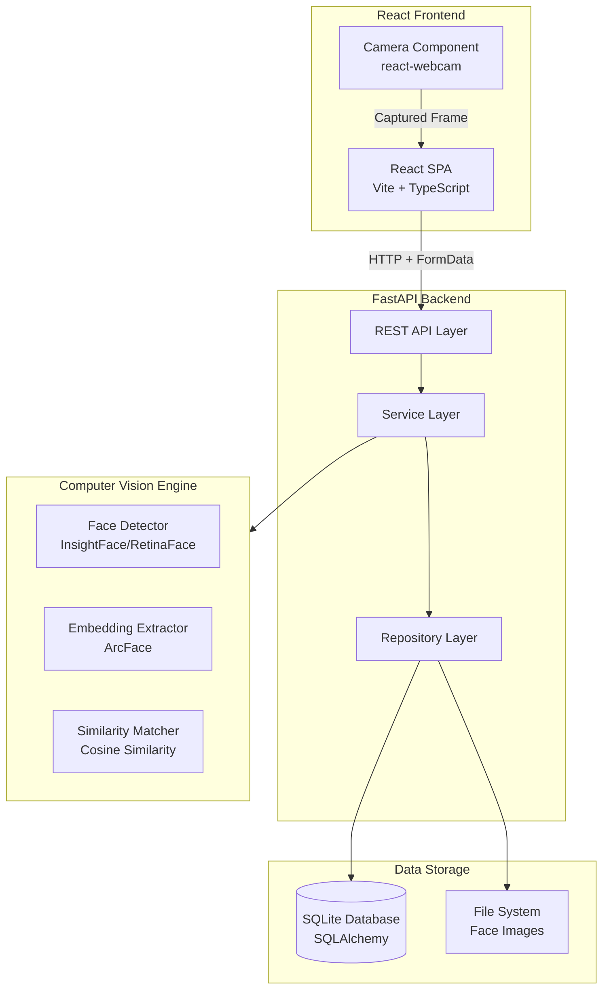
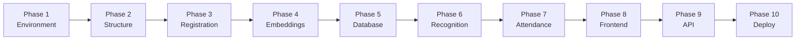
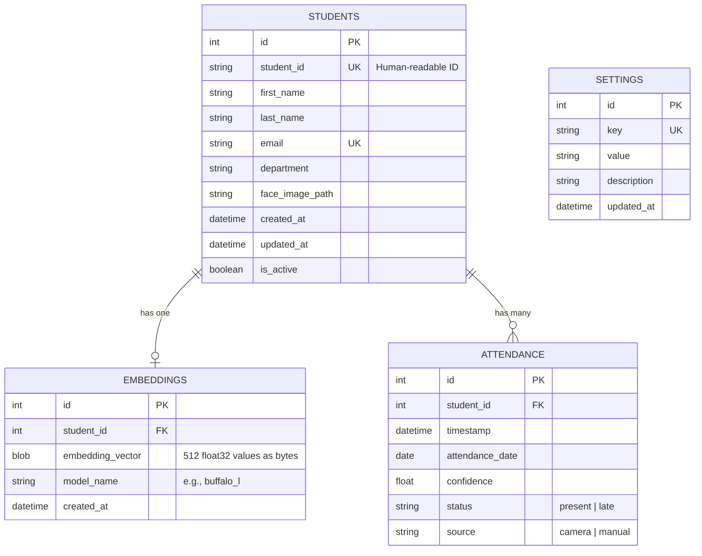
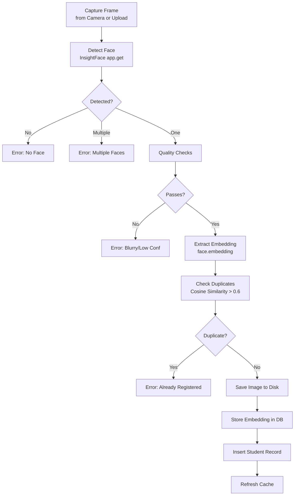
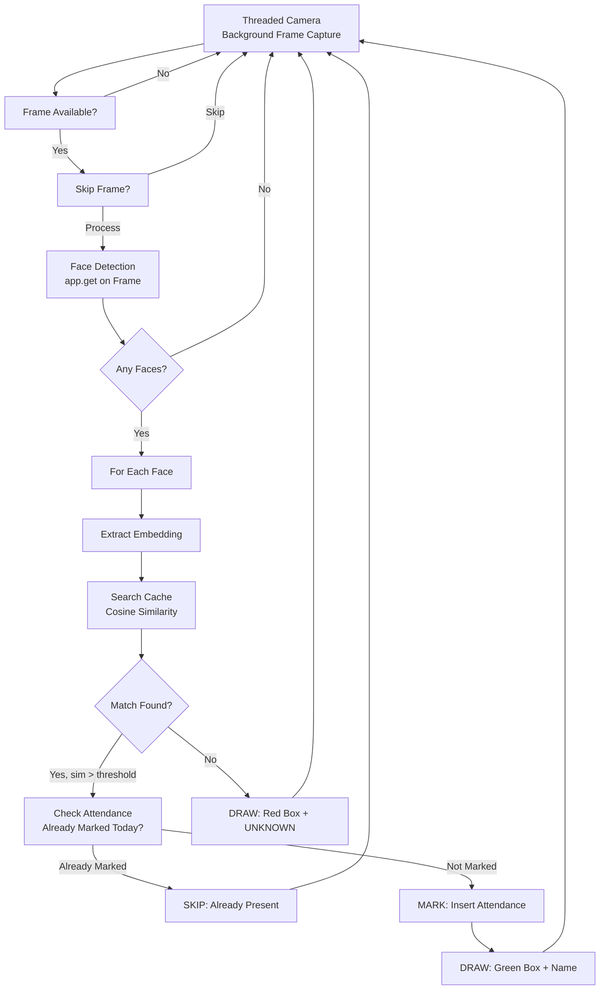

# AI-Powered Face Recognition Attendance System

> **Complete MVP Development Guide**  
> *From zero to working deployment — a senior engineer walks you through every step*

---

**Estimated Development Time**: 40–60 hours (spread over 10 phases)  
**Skill Level**: Intermediate Python developer, beginner in Computer Vision  
**Skills You Will Learn**:

- Face detection and recognition with InsightFace (ArcFace)
- Real-time webcam processing with OpenCV
- Building REST APIs with FastAPI
- Database design with SQLAlchemy and SQLite
- React frontend development with live camera capture
- Production deployment with Docker

---

## Table of Contents

1. [Introduction](#1-introduction)
2. [MVP Scope](#2-mvp-scope)
3. [Development Roadmap](#3-development-roadmap)
4. [Folder Structure](#4-folder-structure)
5. [Database Design](#5-database-design)
6. [API Design](#6-api-design)
7. [Face Recognition Pipeline](#7-face-recognition-pipeline)
8. [Development Guide](#8-development-guide)
9. [Git Workflow](#9-git-workflow)
10. [Testing Strategy](#10-testing-strategy)
11. [UI Pages](#11-ui-pages)
12. [Computer Vision Module](#12-computer-vision-module)
13. [Security](#13-security)
14. [Performance](#14-performance)
15. [Deployment](#15-deployment)
16. [Final MVP Checklist](#16-final-mvp-checklist)
17. [Future Improvements](#17-future-improvements)
18. [Learning Resources](#18-learning-resources)

---

## 1. Introduction

### Project Overview

You're building an **AI-powered attendance system** that automatically recognizes students via webcam and logs their attendance — no roll calls, no sign-in sheets, no proxy attendance.

The system works like this:

1. A student stands in front of a webcam
2. The system detects their face and extracts a mathematical "fingerprint" (embedding)
3. It compares this fingerprint against every enrolled student in the database
4. If a match is found with enough confidence, attendance is logged with a timestamp
5. If no match exists, the face is flagged as "Unknown"

### Architecture



### Features at a Glance

| Feature | Description |
|---|---|
| Student Registration | Capture face and register student in database |
| Live Recognition | Real-time face recognition via webcam |
| Automatic Attendance | Mark attendance on recognition |
| Duplicate Prevention | One attendance per student per day |
| Unknown Face Detection | Flag unrecognized faces |
| Attendance History | View and export attendance records |
| Manual Override | Mark attendance when recognition fails |
| REST API | Full API for frontend and third-party integration |

### Screenshots (Placeholder)

```
[Screenshot: Student Registration Page]
- Camera preview on the left
- Registration form on the right
- "Capture & Register" button

[Screenshot: Live Recognition View]
- Webcam feed with bounding boxes
- Green box = recognized student with name
- Red box = "UNKNOWN"
- Attendance status overlay

[Screenshot: Attendance Dashboard]
- Today's summary cards (Present, Late, Absent)
- Table of today's records
- Export CSV button
```

---

## 2. MVP Scope

### Must Have (Core Functionality)

- [ ] Student registration with face capture
- [ ] Face embedding generation and storage
- [ ] Real-time face recognition from webcam
- [ ] Automatic attendance marking
- [ ] Duplicate attendance prevention (once per day)
- [ ] REST API for all operations
- [ ] SQLite database with SQLAlchemy
- [ ] Basic frontend for registration and attendance view

### Should Have (Important but Not Blocking)

- [ ] Unknown face detection and logging
- [ ] Manual attendance override
- [ ] Attendance CSV export
- [ ] Student list with search
- [ ] Soft-delete for students
- [ ] Configurable similarity threshold

### Nice to Have (Post-MVP Polish)

- [ ] Attendance dashboard with charts
- [ ] Late/on-time status detection
- [ ] Multiple camera support
- [ ] Recognition cooldown period
- [ ] Email notifications for absent students

### Future Features (Not in MVP)

- GPU-accelerated inference (CUDA)
- FAISS vector search for large-scale deployments
- PostgreSQL migration
- Role-based authentication (admin, teacher, student)
- Anti-spoofing / liveness detection
- Mobile app
- Cloud deployment
- Analytics and reporting dashboard

---

## 3. Development Roadmap

The project is divided into **10 phases**. Complete each phase before moving to the next. Each phase builds on the previous one.



| Phase | Name | Est. Hours | Depends On |
|---|---|---|---|
| 1 | Environment Setup | 2–3 | None |
| 2 | Project Structure | 3–4 | Phase 1 |
| 3 | Face Registration | 6–8 | Phase 2 |
| 4 | Embedding Generation | 4–6 | Phase 3 |
| 5 | Database Layer | 5–7 | Phase 4 |
| 6 | Recognition Engine | 8–10 | Phase 5 |
| 7 | Attendance Module | 4–6 | Phase 6 |
| 8 | Frontend (React) | 8–12 | Phase 7 |
| 9 | API Integration | 4–6 | Phase 8 |
| 10 | Deployment | 3–5 | Phase 9 |

---

## 4. Folder Structure

### Complete Project Tree

```
smart-attendance/
├── backend/
│   ├── app/
│   │   ├── __init__.py
│   │   ├── main.py                    # FastAPI entry point
│   │   ├── config.py                  # Settings + environment variables
│   │   ├── database.py                # SQLAlchemy engine + session
│   │   ├── models/
│   │   │   ├── __init__.py
│   │   │   ├── student.py             # Student ORM model
│   │   │   ├── attendance.py          # Attendance ORM model
│   │   │   ├── embedding.py           # Embedding ORM model
│   │   │   └── settings.py            # Settings ORM model
│   │   ├── schemas/
│   │   │   ├── __init__.py
│   │   │   ├── student.py             # Pydantic schemas for students
│   │   │   ├── attendance.py          # Pydantic schemas for attendance
│   │   │   └── recognition.py         # Pydantic schemas for recognition
│   │   ├── repositories/
│   │   │   ├── __init__.py
│   │   │   ├── student_repo.py        # Student CRUD operations
│   │   │   ├── attendance_repo.py     # Attendance CRUD operations
│   │   │   └── embedding_repo.py      # Embedding CRUD operations
│   │   ├── services/
│   │   │   ├── __init__.py
│   │   │   ├── registration_service.py # Registration workflow
│   │   │   ├── recognition_service.py  # Face recognition logic
│   │   │   └── attendance_service.py   # Attendance business rules
│   │   ├── api/
│   │   │   ├── __init__.py
│   │   │   ├── students.py            # /api/v1/students endpoints
│   │   │   ├── attendance.py          # /api/v1/attendance endpoints
│   │   │   ├── recognition.py         # /api/v1/recognition endpoints
│   │   │   └── settings.py            # /api/v1/settings endpoints
│   │   ├── recognition/
│   │   │   ├── __init__.py
│   │   │   ├── engine.py              # InsightFace model wrapper
│   │   │   ├── matcher.py             # Cosine similarity search
│   │   │   └── cache.py               # Embedding cache
│   │   ├── camera/
│   │   │   ├── __init__.py
│   │   │   ├── capture.py             # Camera frame capture
│   │   │   └── threaded.py            # Threaded camera stream
│   │   └── utils/
│   │       ├── __init__.py
│   │       ├── image_utils.py         # Image quality checks
│   │       └── validators.py          # Custom validators
│   ├── data/
│   │   ├── attendance.db              # SQLite database
│   │   ├── faces/                     # Captured face images
│   │   └── exports/                   # CSV export directory
│   ├── logs/
│   │   └── app.log                    # Application logs
│   ├── requirements.txt
│   ├── .env
│   ├── Dockerfile
│   └── run.py                         # Startup script
│
├── frontend/
│   ├── public/
│   ├── src/
│   │   ├── App.tsx                    # Root component + routes
│   │   ├── main.tsx                   # Entry point
│   │   ├── api/
│   │   │   └── client.ts              # Axios/fetch wrapper
│   │   ├── components/
│   │   │   ├── Camera.tsx             # Webcam capture component
│   │   │   ├── StudentForm.tsx        # Registration form
│   │   │   ├── AttendanceTable.tsx    # Attendance records table
│   │   │   ├── DashboardCards.tsx     # Summary cards
│   │   │   └── UnknownFaces.tsx       # Unknown face events
│   │   ├── pages/
│   │   │   ├── Dashboard.tsx          # Attendance overview page
│   │   │   ├── Register.tsx           # Student registration page
│   │   │   ├── Students.tsx           # Student list page
│   │   │   ├── Attendance.tsx         # Attendance history page
│   │   │   ├── Settings.tsx           # System settings page
│   │   │   └── UnknownFacesPage.tsx   # Unknown face log page
│   │   ├── hooks/
│   │   │   ├── useCamera.ts           # Camera access hook
│   │   │   └── useAttendance.ts       # Attendance data hook
│   │   ├── types/
│   │   │   └── index.ts               # TypeScript interfaces
│   │   └── styles/
│   │       └── App.css                # Global styles
│   ├── index.html
│   ├── package.json
│   ├── vite.config.ts
│   ├── tsconfig.json
│   └── Dockerfile
│
├── docker-compose.yml
├── .gitignore
└── README.md
```

### File Responsibilities

| File | Purpose |
|---|---|
| `backend/app/main.py` | FastAPI app instance, CORS middleware, router registration, startup events |
| `backend/app/config.py` | Pydantic `BaseSettings` loading from `.env` |
| `backend/app/database.py` | SQLAlchemy engine, `SessionLocal` factory, `get_db` dependency |
| `backend/app/models/*.py` | SQLAlchemy ORM classes mapping to database tables |
| `backend/app/schemas/*.py` | Pydantic models for request validation and response serialization |
| `backend/app/repositories/*.py` | Data access layer — pure CRUD, no business logic |
| `backend/app/services/*.py` | Business logic — orchestrates repositories and recognition engine |
| `backend/app/api/*.py` | FastAPI routers — HTTP concerns only, delegates to services |
| `backend/app/recognition/*.py` | InsightFace model wrapper, embedding cache, similarity search |
| `backend/app/camera/*.py` | OpenCV camera handling — frame capture and threaded streaming |
| `backend/app/utils/*.py` | Shared utilities — image quality checks, validation helpers |
| `frontend/src/api/client.ts` | Centralized HTTP client with base URL configuration |
| `frontend/src/components/Camera.tsx` | `react-webcam` wrapper with capture and upload logic |
| `frontend/src/App.tsx` | React Router setup, navigation layout |

---

## 5. Database Design

### Entity-Relationship Diagram



### Students Table

```sql
CREATE TABLE students (
    id              INTEGER PRIMARY KEY AUTOINCREMENT,
    student_id      VARCHAR(50) UNIQUE NOT NULL,
    first_name      VARCHAR(100) NOT NULL,
    last_name       VARCHAR(100) NOT NULL,
    email           VARCHAR(255) UNIQUE NOT NULL,
    department      VARCHAR(100),
    face_image_path VARCHAR(500),
    is_active       BOOLEAN DEFAULT 1,
    created_at      DATETIME DEFAULT CURRENT_TIMESTAMP,
    updated_at      DATETIME DEFAULT CURRENT_TIMESTAMP
);

CREATE INDEX idx_students_active ON students(is_active);
CREATE INDEX idx_students_dept ON students(department);
```

> [!TIP]
> `student_id` is a **human-readable** identifier like `STU-2024-001`. It is separate from the auto-increment `id`. Institutions can use their own numbering system.

### Embeddings Table

```sql
CREATE TABLE embeddings (
    id                INTEGER PRIMARY KEY AUTOINCREMENT,
    student_id        INTEGER NOT NULL REFERENCES students(id) ON DELETE CASCADE,
    embedding_vector  BLOB NOT NULL,       -- 512 float32 values = 2048 bytes
    model_name        VARCHAR(50) NOT NULL, -- e.g., 'buffalo_l'
    created_at        DATETIME DEFAULT CURRENT_TIMESTAMP
);

CREATE INDEX idx_embeddings_student ON embeddings(student_id);
CREATE UNIQUE INDEX idx_embeddings_one_per_student ON embeddings(student_id);
```

> [!WARNING]
> The `embedding_vector` is stored as raw bytes (2048 bytes for 512 float32 values). Use `numpy.tobytes()` to convert before storage and `numpy.frombuffer()` to reconstruct after retrieval. Never store embeddings as strings or JSON — that is 10x slower and uses 3x more space.

### Attendance Table

```sql
CREATE TABLE attendance (
    id               INTEGER PRIMARY KEY AUTOINCREMENT,
    student_id       INTEGER NOT NULL REFERENCES students(id) ON DELETE CASCADE,
    timestamp        DATETIME NOT NULL,
    attendance_date  DATE NOT NULL,
    confidence       FLOAT NOT NULL,
    status           VARCHAR(20) DEFAULT 'present',
    source           VARCHAR(20) DEFAULT 'camera'
);

CREATE INDEX idx_attendance_student_date ON attendance(student_id, attendance_date);
CREATE INDEX idx_attendance_date ON attendance(attendance_date);
CREATE UNIQUE INDEX idx_attendance_one_per_day ON attendance(student_id, attendance_date);
```

> [!NOTE]
> The `attendance_date` column is a **denormalized** copy of `timestamp` cast to a date. This makes daily queries significantly faster because we can index this column directly. The `UNIQUE` constraint on `(student_id, attendance_date)` enforces the "one attendance per day" rule at the database level — your application code checks it too, but the DB constraint is the safety net.

### Settings Table

```sql
CREATE TABLE settings (
    id          INTEGER PRIMARY KEY AUTOINCREMENT,
    key         VARCHAR(100) UNIQUE NOT NULL,
    value       TEXT NOT NULL,
    description TEXT,
    updated_at  DATETIME DEFAULT CURRENT_TIMESTAMP
);

-- Default settings
INSERT INTO settings (key, value, description) VALUES
    ('similarity_threshold', '0.40', 'Cosine similarity threshold for face recognition'),
    ('frame_skip', '3', 'Process every Nth frame during recognition'),
    ('camera_index', '0', 'Camera device index'),
    ('recognition_cooldown', '300', 'Seconds before same student can be re-recognized'),
    ('late_cutoff_time', '08:30', 'Time after which attendance is marked as late');
```

### Relationships

| Relationship | Type | Rule |
|---|---|---|
| Student → Embedding | One-to-One | Each student has exactly one active embedding. Re-registration replaces it. |
| Student → Attendance | One-to-Many | Each student has many attendance records (one per day). |
| Settings | Standalone | Key-value configuration, no foreign keys. |

---

## 6. API Design

### Base URL

All endpoints are prefixed with `/api/v1`.

Base URL (development): `http://localhost:8000/api/v1`

### Endpoint Summary

| Method | Endpoint | Purpose | Request Format |
|---|---|---|---|
| POST | `/students` | Register new student | `multipart/form-data` |
| GET | `/students` | List all active students | Query params |
| GET | `/students/{id}` | Get student by ID | Path param |
| DELETE | `/students/{id}` | Soft-delete student | Path param |
| POST | `/attendance/mark` | Manual attendance | JSON body |
| GET | `/attendance` | List attendance records | Query params |
| GET | `/attendance/today` | Today's summary | — |
| GET | `/attendance/export` | Export as CSV | Query params |
| POST | `/recognition/frame` | Recognize face from image | `multipart/form-data` |
| GET | `/settings` | Get all settings | — |
| PUT | `/settings` | Update settings | JSON body |

### Endpoint Specifications

#### `POST /api/v1/students`

Register a new student with face data.

**Request** (`multipart/form-data`):

| Field | Type | Required | Constraints |
|---|---|---|---|
| `student_id` | string | Yes | 3-50 chars, pattern: `^[A-Z0-9-]+$` |
| `first_name` | string | Yes | 1-100 chars |
| `last_name` | string | Yes | 1-100 chars |
| `email` | string | Yes | Valid email format |
| `department` | string | No | Max 100 chars |
| `face_image` | file | Yes | JPG or PNG, max 10MB |

**Success Response** (201):

```json
{
    "id": 1,
    "student_id": "STU-2024-001",
    "first_name": "John",
    "last_name": "Doe",
    "email": "john.doe@example.com",
    "embedding_confidence": 0.95,
    "message": "Student registered successfully"
}
```

**Error Responses**:

| Status | Error Code | When |
|---|---|---|
| 400 | `NO_FACE_DETECTED` | No face found in uploaded image |
| 400 | `MULTIPLE_FACES` | More than one face detected |
| 400 | `BLURRED_FACE` | Face image is too blurry |
| 400 | `LOW_CONFIDENCE` | Face detection confidence too low |
| 409 | `DUPLICATE_STUDENT_ID` | `student_id` already exists in database |
| 409 | `DUPLICATE_FACE` | Face matches already registered student |
| 422 | `VALIDATION_ERROR` | Invalid input data |

**Error Response Body**:

```json
{
    "error": "NO_FACE_DETECTED",
    "message": "No face was detected in the uploaded image. Please ensure your face is clearly visible.",
    "status_code": 400
}
```

#### `GET /api/v1/students`

**Query Parameters**:

| Parameter | Type | Default | Description |
|---|---|---|---|
| `skip` | int | 0 | Pagination offset |
| `limit` | int | 100 | Max records per page |
| `department` | string | — | Filter by department |

**Response** (200):

```json
{
    "total": 150,
    "items": [
        {
            "id": 1,
            "student_id": "STU-2024-001",
            "first_name": "John",
            "last_name": "Doe",
            "email": "john.doe@example.com",
            "department": "Computer Science",
            "is_active": true,
            "created_at": "2024-01-15T10:30:00"
        }
    ]
}
```

#### `POST /api/v1/attendance/mark`

Manually mark attendance for a student.

**Request** (JSON):

```json
{
    "student_id": "STU-2024-001",
    "status": "present",
    "reason": "Student was present but camera failed to recognize"
}
```

**Response** (201):

```json
{
    "id": 42,
    "student_id": "STU-2024-001",
    "status": "present",
    "timestamp": "2024-01-15T09:15:00",
    "message": "Attendance marked successfully"
}
```

#### `GET /api/v1/attendance`

**Query Parameters**:

| Parameter | Type | Default | Description |
|---|---|---|---|
| `date_from` | date | today - 7 days | Start date |
| `date_to` | date | today | End date |
| `student_id` | string | — | Filter by student |
| `status` | string | — | Filter by status |
| `skip` | int | 0 | Offset |
| `limit` | int | 100 | Max records |

**Response** (200):

```json
{
    "total": 45,
    "items": [
        {
            "id": 42,
            "student_id": "STU-2024-001",
            "name": "John Doe",
            "date": "2024-01-15",
            "timestamp": "2024-01-15T09:15:00",
            "status": "present",
            "confidence": 0.87,
            "source": "camera"
        }
    ]
}
```

#### `GET /api/v1/attendance/today`

**Response** (200):

```json
{
    "date": "2024-01-15",
    "total_students": 150,
    "present": 120,
    "late": 8,
    "absent": 22,
    "present_percentage": 80.0,
    "records": [
        {
            "student_id": "STU-2024-001",
            "name": "John Doe",
            "timestamp": "09:15:00",
            "status": "present"
        }
    ]
}
```

#### `GET /api/v1/attendance/export`

Downloads attendance data as CSV.

**Query Parameters**: Same as `GET /api/v1/attendance`.

**Response**: CSV file with `Content-Type: text/csv`.

```csv
Student ID,Name,Date,Timestamp,Status,Confidence,Source
STU-2024-001,John Doe,2024-01-15,2024-01-15T09:15:00,present,0.87,camera
```

#### `POST /api/v1/recognition/frame`

Recognize a face from an uploaded image frame.

**Request** (`multipart/form-data`):

| Field | Type | Required | Description |
|---|---|---|---|
| `image` | file | Yes | Image file (JPG/PNG) |

**Response — Recognized** (200):

```json
{
    "recognized": true,
    "student": {
        "student_id": "STU-2024-001",
        "name": "John Doe",
        "department": "Computer Science"
    },
    "confidence": 0.87,
    "attendance_marked": true
}
```

**Response — Unknown** (200):

```json
{
    "recognized": false,
    "student": null,
    "confidence": 0.0,
    "attendance_marked": false
}
```

### FastAPI Router Registration

```python
# backend/app/main.py structure
from fastapi import FastAPI
from app.api import students, attendance, recognition, settings

app = FastAPI(title="Smart Attendance System", version="1.0.0")

app.include_router(students.router, prefix="/api/v1")
app.include_router(attendance.router, prefix="/api/v1")
app.include_router(recognition.router, prefix="/api/v1")
app.include_router(settings.router, prefix="/api/v1")
```

---

## 7. Face Recognition Pipeline

### Registration Pipeline



### Recognition Pipeline



### Embedding Generation

```python
# This is the core function — understand it deeply
def generate_embedding(image_bytes: bytes) -> np.ndarray:
    """
    Converts a raw image into a 512-dimensional face embedding.
    
    Steps:
    1. Decode bytes to numpy array (OpenCV BGR format)
    2. Run InsightFace detection + recognition pipeline
    3. Return the first face's embedding
    
    Returns:
        np.ndarray of shape (512,) with float32 values
    """
    # Step 1: Convert bytes to OpenCV image
    nparr = np.frombuffer(image_bytes, np.uint8)
    img = cv2.imdecode(nparr, cv2.IMREAD_COLOR)
    
    # Step 2: Run the InsightFace pipeline
    faces = face_app.get(img)
    
    # Step 3: Validate results
    if len(faces) == 0:
        raise NoFaceDetectedError()
    if len(faces) > 1:
        raise MultipleFacesError()
    
    # Step 4: Return embedding
    return faces[0].embedding  # numpy array, shape (512,), float32
```

### Matching Algorithm

```python
def cosine_similarity(a: np.ndarray, b: np.ndarray) -> float:
    """
    Compute similarity between two L2-normalized embeddings.
    
    Since both vectors are unit-length (L2-normalized),
    cosine similarity = dot product.
    
    Result range: -1 (opposite) to 1 (identical).
    For face embeddings, scores above 0.4 indicate a likely match.
    """
    return float(np.dot(a, b))

def find_best_match(
    query: np.ndarray, 
    gallery: list[dict], 
    threshold: float = 0.40
) -> Optional[dict]:
    """
    Linear scan over all stored embeddings.
    
    Args:
        query: Shape (512,) — the face to identify
        gallery: List of {student_id, name, embedding_vector (bytes)}
        threshold: Minimum similarity to consider a match
    
    Returns:
        Match info dict or None
    """
    best_sim, best_match = -1.0, None
    
    for entry in gallery:
        stored_emb = np.frombuffer(entry['embedding_bytes'], dtype=np.float32)
        sim = cosine_similarity(query, stored_emb)
        
        if sim > best_sim:
            best_sim = sim
            best_match = entry
    
    if best_sim >= threshold:
        return {
            'student_id': best_match['student_id'],
            'name': best_match['name'],
            'similarity': best_sim
        }
    return None
```

### Threshold Tuning

The threshold is the **single most important knob** in the system. Here is how to tune it:

| Threshold | Behavior | Use Case |
|---|---|---|
| 0.30 | Catches almost everyone, but also false matches | Demos only |
| 0.35 | Tolerant, good for well-lit classrooms | Recommended start |
| 0.40 | Balanced — minimal false positives | Office/secure environments |
| 0.45 | Strict — some legitimate students rejected | High security |
| 0.50+ | Extremely strict — frequent false rejections | 1:1 verification only |

**How to find your optimal threshold**:

1. Register 20 students
2. Capture 5 images of each student in different lighting
3. For each image, compute similarity scores against all stored embeddings
4. Separate scores into "genuine" (same person) and "impostor" (different people)
5. Plot the overlap — your threshold goes in the gap between distributions

```python
def find_optimal_threshold(genuine: list, impostor: list):
    """Brute-force search for best threshold."""
    for t in [x/100 for x in range(25, 55)]:
        tp = sum(1 for s in genuine if s >= t)
        fn = len(genuine) - tp
        fp = sum(1 for s in impostor if s >= t)
        tn = len(impostor) - fp
        
        far = fp / (fp + tn) if (fp + tn) else 0  # False positive rate
        frr = fn / (fn + tp) if (fn + tp) else 0  # False negative rate
        acc = (tp + tn) / (len(genuine) + len(impostor))
        
        print(f"T={t:.2f} | FAR={far:.3f} | FRR={frr:.3f} | ACC={acc:.3f}")
```

---

## 8. Development Guide

This is the main section. Follow these milestones in order. Each milestone tells you exactly what files to create, what code to write, how to test it, and when to commit.

---

### Milestone 1: Environment Setup

**Goal**: Get Python, Node.js, and all dependencies installed. Verify everything works.

**Files to create**: `backend/requirements.txt`, `backend/.env`, `frontend/package.json`

#### Step 1.1 — Install Python 3.10+

```bash
python --version  # Must be 3.10 or higher
```

#### Step 1.2 — Create and activate virtual environment

```bash
cd smart-attendance/backend
python -m venv venv

# Windows:
venv\Scripts\activate
# macOS/Linux:
source venv/bin/activate
```

#### Step 1.3 — Create `requirements.txt`

```txt
# Web Framework
fastapi==0.109.0
uvicorn[standard]==0.27.0

# Validation
pydantic==2.5.3
pydantic-settings==2.1.0

# Database
sqlalchemy==2.0.25

# Computer Vision
insightface==0.7.3
onnxruntime==1.16.3
opencv-python==4.9.0.80

# Numerical
numpy==1.26.3

# File Uploads
python-multipart==0.0.6
```

> [!TIP]
> These versions were current at the time of writing. If you're reading this months later, try removing version pins (`insightface` instead of `insightface==0.7.3`) and install the latest. If something breaks, pin back to these tested versions.

```bash
pip install -r requirements.txt
```

#### Step 1.4 — Verify InsightFace installation

```bash
python -c "import insightface; print('InsightFace version:', insightface.__version__)"
python -c "import cv2; print('OpenCV version:', cv2.__version__)"
```

Expected output:
```
InsightFace version: 0.7.3
OpenCV version: 4.9.0
```

#### Step 1.5 — Create `.env`

```bash
touch backend/.env
```

Add these contents:

```env
DATABASE_URL=sqlite:///./data/attendance.db
MODEL_NAME=buffalo_l
SIMILARITY_THRESHOLD=0.40
CAMERA_INDEX=0
FRAME_SKIP=3
LOG_LEVEL=INFO
```

#### Step 1.6 — Set up Node.js for frontend

```bash
cd ../frontend
npm create vite@latest . -- --template react-ts
npm install
npm install react-router-dom axios react-webcam
```

#### Step 1.7 — Verify Git

```bash
git init
git add .
git commit -m "chore: initial project setup with Python and Node.js dependencies"
```

**✅ Deliverables**:
- Python virtual environment with all packages installed
- Node.js project with Vite + React + TypeScript
- InsightFace model downloaded on first import
- `.env` file with configuration

**✅ Checklist**:
- [x] `pip install -r requirements.txt` completes without errors
- [x] `python -c "import insightface"` works
- [ ] `npm install` completes without errors
- [ ] `npm run dev` starts Vite dev server

**▶ What to do next**: Move to Milestone 2 — Project Structure

---

### Milestone 2: Project Structure

**Goal**: Create the full folder tree and a "Hello World" FastAPI server.

**Files to create**: All folders, `main.py`, `config.py`, `database.py`

#### Step 2.1 — Create directory structure

```bash
# From the backend/ directory
mkdir -p app/models app/schemas app/repositories app/services app/api app/recognition app/camera app/utils
mkdir -p data/faces data/exports logs

# Create __init__.py files
for dir in app/models app/schemas app/repositories app/services app/api app/recognition app/camera app/utils; do
    touch "$dir/__init__.py"
done

touch app/__init__.py
```

#### Step 2.2 — Create `app/config.py`

```python
from pydantic_settings import BaseSettings
from typing import Tuple

class Settings(BaseSettings):
    # Database
    database_url: str = "sqlite:///./data/attendance.db"
    
    # Model
    model_name: str = "buffalo_l"
    ctx_id: int = -1  # -1 = CPU, 0 = first GPU
    det_size: Tuple[int, int] = (640, 640)
    
    # Recognition
    similarity_threshold: float = 0.40
    
    # Camera
    camera_index: int = 0
    frame_width: int = 640
    frame_height: int = 480
    frame_skip: int = 3
    
    # Attendance
    recognition_cooldown_seconds: int = 300
    late_cutoff_time: str = "08:30"
    
    # Logging
    log_level: str = "INFO"
    
    class Config:
        env_file = ".env"

settings = Settings()
```

> [!TIP]
> `pydantic-settings` automatically loads from `.env` files. No manual parsing needed.

#### Step 2.3 — Create `app/database.py`

```python
from sqlalchemy import create_engine
from sqlalchemy.orm import sessionmaker, declarative_base

from app.config import settings

engine = create_engine(
    settings.database_url,
    connect_args={"check_same_thread": False}  # Required for SQLite
)

SessionLocal = sessionmaker(autocommit=False, autoflush=False, bind=engine)
Base = declarative_base()

def get_db():
    """FastAPI dependency that provides a database session."""
    db = SessionLocal()
    try:
        yield db
    finally:
        db.close()
```

> [!WARNING]
> The `check_same_thread=False` parameter is **required for SQLite** when using FastAPI with multiple threads. Without it, you'll get `RuntimeError: SQLite objects created in a thread can only be used in that same thread`.

#### Step 2.4 — Create `app/main.py`

```python
from fastapi import FastAPI
from fastapi.middleware.cors import CORSMiddleware
from app.database import engine, Base

app = FastAPI(title="Smart Attendance System", version="1.0.0")

# CORS — allow React dev server
app.add_middleware(
    CORSMiddleware,
    allow_origins=["http://localhost:5173", "http://localhost:3000"],
    allow_credentials=True,
    allow_methods=["*"],
    allow_headers=["*"],
)

@app.on_event("startup")
def on_startup():
    """Create database tables on application start."""
    Base.metadata.create_all(bind=engine)
    print("✅ Database tables created")

@app.get("/health")
def health_check():
    return {"status": "ok", "version": "1.0.0"}
```

#### Step 2.5 — Create `run.py`

```python
"""Entry point for running the application."""
import uvicorn

if __name__ == "__main__":
    uvicorn.run(
        "app.main:app",
        host="0.0.0.0",
        port=8000,
        reload=True,
        log_level="info"
    )
```

#### Step 2.6 — Test the server

```bash
cd backend
python run.py
```

Open `http://localhost:8000/health` in your browser. You should see:
```json
{"status": "ok", "version": "1.0.0"}
```

Also check the interactive docs: `http://localhost:8000/docs`

#### Step 2.7 — Commit

```bash
git add .
git commit -m "feat: initialize FastAPI project structure with health endpoint"
```

**✅ Deliverables**:
- FastAPI server running on port 8000
- Health check endpoint returns 200 OK
- Database tables created on startup
- CORS enabled for React dev server
- Interactive API docs at `/docs`

**✅ Checklist**:
- [ ] `python run.py` starts without errors
- [ ] `http://localhost:8000/health` returns `{"status": "ok"}`
- [ ] `http://localhost:8000/docs` shows Swagger UI
- [ ] Database file `data/attendance.db` created (empty tables)

**▶ What to do next**: Move to Milestone 3 — Face Registration

---

### Milestone 3: Face Registration

**Goal**: Accept an uploaded face image via API, detect the face, validate quality, and save the cropped face image to disk.

**Files to create**: `app/recognition/engine.py`, `app/utils/image_utils.py`, `app/api/students.py`, `app/schemas/student.py`, `app/models/student.py`, `app/repositories/student_repo.py`

#### Step 3.1 — Create `app/recognition/engine.py`

This is the **singleton** that wraps InsightFace. It loads the model **once** and reuses it for the application lifetime.

```python
import insightface
from insightface.app import FaceAnalysis
import numpy as np
from functools import lru_cache
from app.config import settings


class FaceEngine:
    """
    Singleton wrapper around InsightFace FaceAnalysis.
    
    Loads the model ONCE at startup. Never create a second instance.
    """
    
    _instance = None
    
    def __new__(cls):
        if cls._instance is None:
            cls._instance = super().__new__(cls)
            cls._instance._initialized = False
        return cls._instance
    
    def __init__(self):
        if self._initialized:
            return
        self._initialized = True
        
        print(f"🔄 Loading InsightFace model: {settings.model_name}")
        self.app = FaceAnalysis(name=settings.model_name)
        self.app.prepare(ctx_id=settings.ctx_id, det_size=settings.det_size)
        print("✅ Model loaded successfully")
    
    def detect_faces(self, image: np.ndarray):
        """
        Detect faces in an image.
        
        Returns:
            List of Face objects from InsightFace
        """
        return self.app.get(image)
    
    def get_embedding(self, image: np.ndarray) -> np.ndarray:
        """
        Detect a single face and return its embedding.
        
        Raises:
            ValueError if zero or multiple faces detected
        """
        faces = self.detect_faces(image)
        
        if len(faces) == 0:
            raise ValueError("No face detected in image")
        if len(faces) > 1:
            raise ValueError(f"Multiple faces detected ({len(faces)}). Please provide a single face.")
        
        return faces[0].embedding


# Module-level singleton — import this everywhere
@lru_cache()
def get_face_engine() -> FaceEngine:
    """Dependency provider — returns the singleton FaceEngine."""
    return FaceEngine()
```

> [!WARNING]
> **Critical**: The model downloads itself on first use (~200MB). This happens only once and is cached in `~/.insightface/models/`. If the download fails, check your internet connection. You can also manually download from the InsightFace GitHub releases.

#### Step 3.2 — Create `app/utils/image_utils.py`

```python
import cv2
import numpy as np

def decode_image(image_bytes: bytes) -> np.ndarray:
    """Convert raw bytes to OpenCV BGR image."""
    nparr = np.frombuffer(image_bytes, np.uint8)
    img = cv2.imdecode(nparr, cv2.IMREAD_COLOR)
    if img is None:
        raise ValueError("Could not decode image. File may be corrupted.")
    return img

def is_blurry(face_region: np.ndarray, threshold: float = 100.0) -> bool:
    """
    Check if a face region is blurry using Laplacian variance.
    
    Lower values = more blur. Threshold of 100 is a good default.
    Below 100 = blurry. Above 100 = sharp.
    """
    gray = cv2.cvtColor(face_region, cv2.COLOR_BGR2GRAY)
    laplacian_var = cv2.Laplacian(gray, cv2.CV_64F).var()
    return laplacian_var < threshold

def crop_face(frame: np.ndarray, bbox: list, margin: float = 0.2) -> np.ndarray:
    """
    Crop face region from frame with margin.
    
    Args:
        frame: Full image
        bbox: [x1, y1, x2, y2] face coordinates
        margin: Extra space around face (20% default)
    """
    x1, y1, x2, y2 = [int(v) for v in bbox]
    h, w = frame.shape[:2]
    
    margin_x = int((x2 - x1) * margin)
    margin_y = int((y2 - y1) * margin)
    
    x1 = max(0, x1 - margin_x)
    y1 = max(0, y1 - margin_y)
    x2 = min(w, x2 + margin_x)
    y2 = min(h, y2 + margin_y)
    
    return frame[y1:y2, x1:x2]
```

#### Step 3.3 — Create `app/models/student.py`

```python
from sqlalchemy import Column, Integer, String, Boolean, DateTime
from sqlalchemy.sql import func
from app.database import Base


class Student(Base):
    __tablename__ = 'students'
    
    id = Column(Integer, primary_key=True, index=True)
    student_id = Column(String(50), unique=True, nullable=False, index=True)
    first_name = Column(String(100), nullable=False)
    last_name = Column(String(100), nullable=False)
    email = Column(String(255), unique=True, nullable=False)
    department = Column(String(100), nullable=True)
    face_image_path = Column(String(500), nullable=True)
    is_active = Column(Boolean, default=True)
    created_at = Column(DateTime, server_default=func.now())
    updated_at = Column(DateTime, server_default=func.now(), onupdate=func.now())
```

#### Step 3.4 — Create `app/schemas/student.py`

```python
from pydantic import BaseModel, EmailStr, Field
from datetime import datetime
from typing import Optional


class StudentCreate(BaseModel):
    student_id: str = Field(
        ..., min_length=3, max_length=50,
        pattern=r'^[A-Z0-9-]+$'
    )
    first_name: str = Field(..., min_length=1, max_length=100)
    last_name: str = Field(..., min_length=1, max_length=100)
    email: EmailStr
    department: Optional[str] = Field(None, max_length=100)

class StudentResponse(BaseModel):
    id: int
    student_id: str
    first_name: str
    last_name: str
    email: str
    department: Optional[str]
    is_active: bool
    created_at: datetime
    
    class Config:
        from_attributes = True
```

> [!TIP]
> `from_attributes = True` (not `orm_mode = True` — that's Pydantic v1 syntax) enables automatic conversion from SQLAlchemy ORM objects.

#### Step 3.5 — Create `app/repositories/student_repo.py`

```python
from sqlalchemy.orm import Session
from app.models.student import Student
from typing import Optional


class StudentRepository:
    def __init__(self, db: Session):
        self.db = db
    
    def create(self, data: dict) -> Student:
        student = Student(**data)
        self.db.add(student)
        self.db.commit()
        self.db.refresh(student)
        return student
    
    def get_by_id(self, id: int) -> Optional[Student]:
        return self.db.query(Student).filter(Student.id == id).first()
    
    def get_by_student_id(self, student_id: str) -> Optional[Student]:
        return self.db.query(Student).filter(
            Student.student_id == student_id
        ).first()
    
    def get_by_email(self, email: str) -> Optional[Student]:
        return self.db.query(Student).filter(Student.email == email).first()
    
    def get_all_active(self, skip: int = 0, limit: int = 100, department: str = None):
        query = self.db.query(Student).filter(Student.is_active == True)
        if department:
            query = query.filter(Student.department == department)
        return query.offset(skip).limit(limit).all()
    
    def count_active(self, department: str = None) -> int:
        query = self.db.query(Student).filter(Student.is_active == True)
        if department:
            query = query.filter(Student.department == department)
        return query.count()
    
    def soft_delete(self, id: int) -> Optional[Student]:
        student = self.get_by_id(id)
        if student:
            student.is_active = False
            self.db.commit()
        return student
```

#### Step 3.6 — Create registration endpoint in `app/api/students.py`

```python
import os
import uuid
import cv2
import numpy as np
from fastapi import APIRouter, Depends, UploadFile, File, Form, HTTPException
from sqlalchemy.orm import Session

from app.database import get_db
from app.config import settings
from app.schemas.student import StudentCreate, StudentResponse
from app.repositories.student_repo import StudentRepository
from app.repositories.embedding_repo import EmbeddingRepository
from app.recognition.engine import get_face_engine, FaceEngine
from app.utils.image_utils import decode_image, is_blurry, crop_face

router = APIRouter(prefix="/api/v1/students", tags=["Students"])


@router.post("", response_model=dict, status_code=201)
async def register_student(
    student_id: str = Form(...),
    first_name: str = Form(...),
    last_name: str = Form(...),
    email: str = Form(...),
    department: str = Form(None),
    face_image: UploadFile = File(...),
    db: Session = Depends(get_db),
    engine: FaceEngine = Depends(get_face_engine)
):
    """
    Register a new student with face image.
    
    1. Validate input
    2. Check for duplicate student_id or email
    3. Decode and detect face
    4. Quality checks (blur, confidence)
    5. Extract embedding (for future duplicate face check)
    6. Save face image to disk
    7. Store in database
    """
    # 1. Validate student data
    student_data = StudentCreate(
        student_id=student_id,
        first_name=first_name,
        last_name=last_name,
        email=email,
        department=department
    )
    
    repo = StudentRepository(db)
    
    # 2. Check duplicates
    if repo.get_by_student_id(student_id):
        raise HTTPException(409, detail={
            "error": "DUPLICATE_STUDENT_ID",
            "message": f"Student ID '{student_id}' already exists"
        })
    
    if repo.get_by_email(email):
        raise HTTPException(409, detail={
            "error": "DUPLICATE_EMAIL",
            "message": f"Email '{email}' is already registered"
        })
    
    # 3. Decode and detect face
    image_bytes = await face_image.read()
    
    if len(image_bytes) == 0:
        raise HTTPException(400, detail={
            "error": "EMPTY_IMAGE",
            "message": "Uploaded file is empty"
        })
    
    try:
        img = decode_image(image_bytes)
    except ValueError as e:
        raise HTTPException(400, detail={
            "error": "CORRUPTED_IMAGE",
            "message": str(e)
        })
    
    faces = engine.detect_faces(img)
    
    if len(faces) == 0:
        raise HTTPException(400, detail={
            "error": "NO_FACE_DETECTED",
            "message": "No face found in the uploaded image"
        })
    
    if len(faces) > 1:
        raise HTTPException(400, detail={
            "error": "MULTIPLE_FACES",
            "message": f"Detected {len(faces)} faces. Please upload a single-face image."
        })
    
    face = faces[0]
    
    # 4. Quality checks
    face_region = crop_face(img, face.bbox)
    
    if is_blurry(face_region):
        raise HTTPException(400, detail={
            "error": "BLURRED_FACE",
            "message": "Face image is too blurry. Please use a sharper image."
        })
    
    if face.det_score < 0.9:
        raise HTTPException(400, detail={
            "error": "LOW_CONFIDENCE",
            "message": f"Face detection confidence too low: {face.det_score:.2f}"
        })
    
    # 5. Save face image to disk
    os.makedirs("data/faces", exist_ok=True)
    filename = f"{student_id}_{uuid.uuid4().hex[:8]}.jpg"
    filepath = os.path.join("data", "faces", filename)
    cv2.imwrite(filepath, face_region)
    
    # 6. Store in database
    db_student = repo.create({
        "student_id": student_data.student_id,
        "first_name": student_data.first_name,
        "last_name": student_data.last_name,
        "email": student_data.email,
        "department": student_data.department,
        "face_image_path": filepath
    })
    
    return {
        "id": db_student.id,
        "student_id": db_student.student_id,
        "first_name": db_student.first_name,
        "last_name": db_student.last_name,
        "email": db_student.email,
        "message": "Student registered successfully"
    }
```

> [!WARNING]
> The `cv2.imwrite` call in step 5 needs the `import cv2` at the top of the file. I omitted it from the pseudocode above — add it when implementing.

#### Step 3.7 — Register the router in `main.py`

Add this line to `app/main.py`:

```python
from app.api import students
app.include_router(students.router)
```

#### Step 3.8 — Test registration

```bash
# Test with a face image
curl -X POST http://localhost:8000/api/v1/students \
  -F "student_id=STU-001" \
  -F "first_name=John" \
  -F "last_name=Doe" \
  -F "email=john@example.com" \
  -F "department=Computer Science" \
  -F "face_image=@/path/to/your/face.jpg"
```

Expected response (201):
```json
{"id":1,"student_id":"STU-001","first_name":"John","last_name":"Doe","email":"john@example.com","message":"Student registered successfully"}
```

Also test error cases:

```bash
# No face
curl -X POST http://localhost:8000/api/v1/students \
  -F "student_id=STU-002" -F "first_name=Test" -F "last_name=User" \
  -F "email=test@example.com" -F "face_image=@/path/to/empty_image.jpg"
# Expected: 400 NO_FACE_DETECTED

# Duplicate
curl -X POST http://localhost:8000/api/v1/students \
  -F "student_id=STU-001" -F "first_name=Jane" -F "last_name=Doe" \
  -F "email=jane@example.com" -F "face_image=@/path/to/face.jpg"
# Expected: 409 DUPLICATE_STUDENT_ID
```

#### Step 3.9 — Common Mistakes

| Mistake | Symptom | Fix |
|---|---|---|
| Forgot `check_same_thread=False` | `RuntimeError: SQLite objects created in a thread...` | Add it to `create_engine()` |
| Model not downloaded | First request takes 60+ seconds | It downloads once. Be patient. |
| Wrong image format | `cv2.imdecode` returns None | Only JPG and PNG are supported |
| Face too small | Detection returns empty | Make sure face fills at least 20% of the image |
| CPU-bound ops in async endpoint | Event loop blocked during inference | For production, use `run_in_threadpool()` from Starlette to offload blocking operations

#### Step 3.10 — Commit

```bash
git add .
git commit -m "feat: implement face registration with quality checks and image storage"
```

**✅ Deliverables**:
- POST `/api/v1/students` endpoint working
- Face detection, blur check, and confidence check implemented
- Face image saved to disk
- Student stored in database
- Duplicate student_id and email rejection
- Error handling for no face, multiple faces, blurry images

**✅ Checklist**:
- [ ] Registration succeeds with a valid face image
- [ ] Registration returns 400 for no face
- [ ] Registration returns 409 for duplicate student_id
- [ ] Registration returns 409 for duplicate email
- [ ] Face image file appears in `data/faces/`
- [ ] Student record appears in `students` table

**▶ What to do next**: Move to Milestone 4 — Embedding Generation

---

### Milestone 4: Embedding Generation

**Goal**: Extract 512-dimensional face embeddings during registration, store them in the database, and prevent duplicate face registrations.

**Files to create**: `app/models/embedding.py`, `app/repositories/embedding_repo.py`

#### Step 4.1 — Create `app/models/embedding.py`

```python
from sqlalchemy import Column, Integer, LargeBinary, String, DateTime, ForeignKey
from sqlalchemy.sql import func
from app.database import Base


class Embedding(Base):
    __tablename__ = 'embeddings'
    
    id = Column(Integer, primary_key=True, index=True)
    student_id = Column(Integer, ForeignKey('students.id', ondelete='CASCADE'), nullable=False)
    embedding_vector = Column(LargeBinary, nullable=False)  # 2048 bytes
    model_name = Column(String(50), nullable=False)
    created_at = Column(DateTime, server_default=func.now())
```

#### Step 4.2 — Create `app/repositories/embedding_repo.py`

```python
from sqlalchemy.orm import Session
from app.models.embedding import Embedding
from typing import Optional


class EmbeddingRepository:
    def __init__(self, db: Session):
        self.db = db
    
    def create(self, student_id: int, embedding_bytes: bytes, model_name: str) -> Embedding:
        emb = Embedding(
            student_id=student_id,
            embedding_vector=embedding_bytes,
            model_name=model_name
        )
        self.db.add(emb)
        self.db.commit()
        self.db.refresh(emb)
        return emb
    
    def get_by_student_id(self, student_id: int) -> Optional[Embedding]:
        return self.db.query(Embedding).filter(
            Embedding.student_id == student_id
        ).first()
    
    def get_all_embeddings(self) -> list[dict]:
        """
        Fetch all embeddings with student info for cache loading.
        
        Returns:
            List of dicts with student_id, name, embedding_bytes
        """
        results = (
            self.db.query(
                Embedding.embedding_vector,
                Embedding.student_id
            )
            .join(Embedding.student)
            .filter(Embedding.student.is_active == True)
            .all()
        )
        
        return [
            {
                'student_id': r.student_id,
                'embedding_bytes': r.embedding_vector
            }
            for r in results
        ]
    
    def delete_by_student_id(self, student_id: int) -> bool:
        count = self.db.query(Embedding).filter(
            Embedding.student_id == student_id
        ).delete()
        self.db.commit()
        return count > 0
```

#### Step 4.3 — Update `app/recognition/engine.py` — add embedding storage helper

Add this method to the `FaceEngine` class:

```python
import numpy as np

def embedding_to_bytes(self, embedding: np.ndarray) -> bytes:
    """Convert numpy embedding to bytes for DB storage."""
    return embedding.astype(np.float32).tobytes()

def embedding_from_bytes(self, data: bytes) -> np.ndarray:
    """Reconstruct numpy embedding from DB bytes."""
    return np.frombuffer(data, dtype=np.float32)
```

#### Step 4.4 — Update registration endpoint to store embedding

Modify the `register_student` function in `app/api/students.py`. After extracting the face embedding and before saving the student, add:

```python
# After face detection and quality checks, add embedding extraction
embedding = engine.get_embedding(img)
embedding_bytes = engine.embedding_to_bytes(embedding)

# Check for duplicate face registration
existing_embeddings = EmbeddingRepository(db).get_all_embeddings()
for existing in existing_embeddings:
    stored_emb = engine.embedding_from_bytes(existing['embedding_bytes'])
    similarity = float(np.dot(embedding, stored_emb))
    
    if similarity > 0.6:  # Stricter threshold for registration
        # Get the existing student's ID to report which student it matches
        existing_student = repo.get_by_id(existing['student_id'])
        raise HTTPException(409, detail={
            "error": "DUPLICATE_FACE",
            "message": f"This face matches existing student: {existing_student.student_id} ({existing_student.first_name} {existing_student.last_name})"
        })

# After saving the student, store the embedding
EmbeddingRepository(db).create(
    student_id=db_student.id,
    embedding_bytes=embedding_bytes,
    model_name=settings.model_name
)
```

Add imports at the top:
```python
import numpy as np
from app.repositories.embedding_repo import EmbeddingRepository
```

#### Step 4.5 — Test embedding storage

```bash
# Register a student
curl -X POST http://localhost:8000/api/v1/students \
  -F "student_id=STU-001" -F "first_name=John" -F "last_name=Doe" \
  -F "email=john@example.com" -F "face_image=@face.jpg"

# Check embedding was stored (check database)
sqlite3 data/attendance.db "SELECT COUNT(*) FROM embeddings;"
# Expected: 1

# Try registering the same face again with different student_id
curl -X POST http://localhost:8000/api/v1/students \
  -F "student_id=STU-002" -F "first_name=Fake" -F "last_name=User" \
  -F "email=fake@example.com" -F "face_image=@face.jpg"
# Expected: 409 DUPLICATE_FACE with message containing "STU-001"
```

#### Step 4.6 — Common Mistakes

| Mistake | Symptom | Fix |
|---|---|---|
| Forgot `astype(np.float32)` | Embedding stored as float64 (double size) | Always cast to float32 before `tobytes()` |
| Wrong dtype on readback | Gibberish similarity values | Use `dtype=np.float32` in `frombuffer()` |
| Missing `ondelete='CASCADE'` | Orphaned embeddings when student deleted | Add cascade in foreign key |

#### Step 4.7 — Commit

```bash
git add .
git commit -m "feat: add embedding generation and duplicate face detection during registration"
```

**✅ Deliverables**:
- Embedding extracted during registration
- Embedding stored as BLOB in `embeddings` table
- Duplicate face detection prevents the same person from registering twice
- Student deleted → embedding cascade deleted

**✅ Checklist**:
- [ ] Embedding stored in database after registration
- [ ] Registering same face twice returns 409 DUPLICATE_FACE
- [ ] Embedding can be reconstructed to numpy array
- [ ] Cosine similarity between same-face embeddings > 0.8

**▶ What to do next**: Move to Milestone 5 — Database Layer

---

### Milestone 5: Database Layer

**Goal**: Complete all CRUD repositories, add attendance model, and implement settings table. Create all remaining database models and repository classes.

**Files to create**: `app/models/attendance.py`, `app/models/settings.py`, `app/repositories/attendance_repo.py`, `app/schemas/attendance.py`, `app/schemas/recognition.py`

#### Step 5.1 — Create `app/models/attendance.py`

```python
from sqlalchemy import Column, Integer, Float, String, DateTime, Date, ForeignKey
from sqlalchemy.sql import func
from app.database import Base


class Attendance(Base):
    __tablename__ = 'attendance'
    
    id = Column(Integer, primary_key=True, index=True)
    student_id = Column(Integer, ForeignKey('students.id', ondelete='CASCADE'), nullable=False)
    timestamp = Column(DateTime, nullable=False, server_default=func.now())
    attendance_date = Column(Date, nullable=False, server_default=func.current_date())
    confidence = Column(Float, nullable=False)
    status = Column(String(20), default='present')
    source = Column(String(20), default='camera')
```

#### Step 5.2 — Create `app/models/settings.py`

```python
from sqlalchemy import Column, Integer, String, Text, DateTime
from sqlalchemy.sql import func
from app.database import Base


class Setting(Base):
    __tablename__ = 'settings'
    
    id = Column(Integer, primary_key=True, index=True)
    key = Column(String(100), unique=True, nullable=False)
    value = Column(Text, nullable=False)
    description = Column(Text, nullable=True)
    updated_at = Column(DateTime, server_default=func.now(), onupdate=func.now())
```

#### Step 5.3 — Create `app/repositories/attendance_repo.py`

```python
from datetime import date, datetime
from sqlalchemy.orm import Session
from sqlalchemy import and_
from app.models.attendance import Attendance
from typing import Optional


class AttendanceRepository:
    def __init__(self, db: Session):
        self.db = db
    
    def create(self, student_id: int, confidence: float, 
               status: str = 'present', source: str = 'camera',
               timestamp: datetime = None) -> Attendance:
        """Create a new attendance record."""
        if timestamp is None:
            timestamp = datetime.now()
        
        record = Attendance(
            student_id=student_id,
            timestamp=timestamp,
            attendance_date=timestamp.date(),
            confidence=confidence,
            status=status,
            source=source
        )
        self.db.add(record)
        self.db.commit()
        self.db.refresh(record)
        return record
    
    def get_today_by_student(self, student_id: int) -> Optional[Attendance]:
        """Get today's attendance for a student (if any)."""
        return self.db.query(Attendance).filter(
            and_(
                Attendance.student_id == student_id,
                Attendance.attendance_date == date.today()
            )
        ).first()
    
    def get_today_all(self) -> list[Attendance]:
        """Get all of today's attendance records."""
        return self.db.query(Attendance).filter(
            Attendance.attendance_date == date.today()
        ).all()
    
    def get_by_date_range(self, date_from: date, date_to: date,
                          skip: int = 0, limit: int = 100,
                          student_id: str = None, status: str = None):
        """Get attendance records with filters and pagination."""
        query = self.db.query(Attendance).filter(
            Attendance.attendance_date.between(date_from, date_to)
        )
        
        if student_id:
            query = query.filter(Attendance.student.has(student_id=student_id))
        if status:
            query = query.filter(Attendance.status == status)
        
        total = query.count()
        records = query.order_by(Attendance.timestamp.desc()).offset(skip).limit(limit).all()
        
        return total, records
    
    def get_today_summary(self) -> dict:
        """Get attendance summary for today."""
        total_students = self.db.query(Attendance.student_id).distinct().count()
        # Note: total_students here is total who attended. For all students, query Student table.
        
        today_records = self.get_today_all()
        present = sum(1 for r in today_records if r.status == 'present')
        late = sum(1 for r in today_records if r.status == 'late')
        
        return {
            "present": present,
            "late": late,
            "total_today": len(today_records)
        }
```

#### Step 5.4 — Create `app/schemas/attendance.py`

```python
from pydantic import BaseModel, Field
from datetime import date, datetime
from typing import Optional


class AttendanceMarkRequest(BaseModel):
    student_id: str = Field(..., min_length=1)
    status: str = Field(default="present", pattern=r'^(present|late)$')
    reason: Optional[str] = Field(None, max_length=500)

class AttendanceRecord(BaseModel):
    id: int
    student_id: str
    name: str
    date: date
    timestamp: datetime
    status: str
    confidence: float
    source: str
    
    class Config:
        from_attributes = True

class AttendanceListResponse(BaseModel):
    total: int
    items: list[AttendanceRecord]

class TodaySummary(BaseModel):
    date: date
    total_students: int
    present: int
    late: int
    absent: int
    present_percentage: float
```

#### Step 5.5 — Create `app/schemas/recognition.py`

```python
from pydantic import BaseModel
from typing import Optional


class RecognitionResult(BaseModel):
    recognized: bool
    student: Optional[dict] = None
    confidence: float
    attendance_marked: bool
```

#### Step 5.6 — Test database operations

```python
# Run this test script to verify all repositories work
from app.database import SessionLocal, engine, Base

# Create tables
Base.metadata.create_all(bind=engine)

# Test session
db = SessionLocal()

# Test student repository
from app.repositories.student_repo import StudentRepository
from app.repositories.embedding_repo import EmbeddingRepository
from app.repositories.attendance_repo import AttendanceRepository

student_repo = StudentRepository(db)
emb_repo = EmbeddingRepository(db)
att_repo = AttendanceRepository(db)

print("All repositories initialized successfully")
db.close()
```

#### Step 5.7 — Commit

```bash
git add .
git commit -m "feat: complete database layer with attendance, settings models and all repositories"
```

**✅ Deliverables**:
- All four ORM models (Student, Embedding, Attendance, Setting)
- All repository classes with full CRUD
- Attendance repository with date range queries and today's summary

**✅ Checklist**:
- [ ] All tables created in database
- [ ] Student repository CRUD works
- [ ] Embedding repository CRUD works
- [ ] Attendance repository CRUD works
- [ ] Today's attendance query returns empty list before any marks

**▶ What to do next**: Move to Milestone 6 — Recognition Engine

---

### Milestone 6: Recognition Engine

**Goal**: Build the real-time face recognition loop. The engine loads all embeddings into cache, captures frames from the camera, detects faces, matches them, and displays the result.

**Files to create**: `app/recognition/matcher.py`, `app/recognition/cache.py`, `app/camera/capture.py`, `app/camera/threaded.py`, `app/recognition/engine.py` (update)

#### Step 6.1 — Create `app/recognition/cache.py`

```python
import numpy as np
from datetime import datetime
from typing import Optional


class EmbeddingCache:
    """
    In-memory cache of all student embeddings.
    
    Loaded once at startup and refreshed periodically.
    Linear search — fast enough for up to ~10,000 students.
    """
    
    def __init__(self, embedding_repo):
        self.embedding_repo = embedding_repo
        self.embeddings: list[dict] = []
        self._last_refresh = None
    
    def refresh(self):
        """Load all embeddings from database into memory."""
        self.embeddings = self.embedding_repo.get_all_embeddings()
        self._last_refresh = datetime.now()
        print(f"🔄 Cache refreshed: {len(self.embeddings)} embeddings loaded")
    
    def search(self, query: np.ndarray, threshold: float = 0.40) -> Optional[dict]:
        """
        Linear search for best match.
        
        Args:
            query: Shape (512,) embedding
            threshold: Minimum similarity to consider a match
        
        Returns:
            dict with student_id, name, similarity or None
        """
        best_sim = -1.0
        best_match = None
        
        for entry in self.embeddings:
            stored = np.frombuffer(entry['embedding_bytes'], dtype=np.float32)
            sim = float(np.dot(query, stored))
            
            if sim > best_sim:
                best_sim = sim
                best_match = entry
        
        if best_sim >= threshold:
            return {
                'student_id': best_match['student_id'],
                'similarity': best_sim
            }
        return None
```

#### Step 6.2 — Create `app/camera/capture.py`

```python
"""
Camera capture utilities for single-frame (registration) mode.
"""
import cv2
import numpy as np


def capture_frame(camera_index: int = 0, resolution: tuple = (640, 480)) -> np.ndarray:
    """
    Capture a single frame from the camera.
    
    Used during registration to capture a face image.
    
    Returns:
        Frame as numpy array (BGR format)
    """
    cap = cv2.VideoCapture(camera_index, cv2.CAP_DSHOW)
    cap.set(cv2.CAP_PROP_FRAME_WIDTH, resolution[0])
    cap.set(cv2.CAP_PROP_FRAME_HEIGHT, resolution[1])
    
    # Discard warm-up frames
    for _ in range(5):
        cap.read()
    
    ret, frame = cap.read()
    cap.release()
    
    if not ret:
        raise RuntimeError(f"Failed to capture frame from camera {camera_index}")
    
    return frame
```

#### Step 6.3 — Create `app/camera/threaded.py`

```python
"""
Threaded camera capture for continuous recognition mode.
Captures frames in a background thread to prevent frame drops.
"""
import cv2
import threading
import time
from typing import Optional
import numpy as np


class ThreadedCamera:
    """
    Captures frames in a daemon thread.
    
    The recognition loop calls get_latest_frame() which returns
    instantly with the most recent frame — no blocking I/O.
    """
    
    def __init__(self, camera_index: int = 0, resolution: tuple = (640, 480)):
        self.camera_index = camera_index
        self.resolution = resolution
        self.cap = None
        self._frame: Optional[np.ndarray] = None
        self._running = False
        self._thread: Optional[threading.Thread] = None
    
    def start(self):
        """Start capture thread."""
        self.cap = cv2.VideoCapture(self.camera_index, cv2.CAP_DSHOW)
        self.cap.set(cv2.CAP_PROP_FRAME_WIDTH, self.resolution[0])
        self.cap.set(cv2.CAP_PROP_FRAME_HEIGHT, self.resolution[1])
        
        if not self.cap.isOpened():
            raise RuntimeError(f"Cannot open camera {self.camera_index}")
        
        self._running = True
        self._thread = threading.Thread(target=self._capture_loop, daemon=True)
        self._thread.start()
        print(f"📷 Camera {self.camera_index} started")
    
    def _capture_loop(self):
        """Background loop — reads frames continuously."""
        while self._running:
            ret, frame = self.cap.read()
            if ret:
                self._frame = frame
            else:
                time.sleep(0.1)
                self._reconnect()
    
    def _reconnect(self):
        """Attempt to reconnect on disconnect."""
        self.cap.release()
        time.sleep(2)
        self.cap = cv2.VideoCapture(self.camera_index, cv2.CAP_DSHOW)
    
    def get_latest_frame(self) -> Optional[np.ndarray]:
        """Get most recent frame. Non-blocking."""
        return self._frame
    
    def stop(self):
        """Stop capture thread and release camera."""
        self._running = False
        if self._thread:
            self._thread.join(timeout=2)
        if self.cap:
            self.cap.release()
        print("📷 Camera stopped")
```

#### Step 6.4 — Create the recognition runner

Create `backend/run_recognition.py` as a standalone script:

```python
"""
Standalone face recognition loop.
Runs the camera, detects faces, matches against database, and displays results.
"""
import cv2
import time
import sys
import os

# Add parent to path so we can import from app
sys.path.insert(0, os.path.dirname(__file__))

from app.camera.threaded import ThreadedCamera
from app.recognition.engine import FaceEngine
from app.recognition.cache import EmbeddingCache
from app.repositories.embedding_repo import EmbeddingRepository
from app.database import SessionLocal

# Threshold — from settings or hardcoded for standalone mode
SIMILARITY_THRESHOLD = 0.40
FRAME_SKIP = 3


def draw_face_box(frame, bbox, name: str, color: tuple, confidence: float = None):
    """Draw bounding box and label on frame."""
    x1, y1, x2, y2 = [int(v) for v in bbox]
    
    # Draw box
    cv2.rectangle(frame, (x1, y1), (x2, y2), color, 2)
    
    # Draw label background
    label = name if confidence is None else f"{name} ({confidence:.2f})"
    (label_w, label_h), _ = cv2.getTextSize(label, cv2.FONT_HERSHEY_SIMPLEX, 0.6, 2)
    cv2.rectangle(frame, (x1, y1 - label_h - 10), (x1 + label_w + 10, y1), color, -1)
    
    # Draw label text
    cv2.putText(frame, label, (x1 + 5, y1 - 5),
                cv2.FONT_HERSHEY_SIMPLEX, 0.6, (255, 255, 255), 2)


def main():
    # Initialize
    print("🚀 Starting Face Recognition System...")
    
    engine = FaceEngine()
    
    db = SessionLocal()
    emb_repo = EmbeddingRepository(db)
    cache = EmbeddingCache(emb_repo)
    cache.refresh()
    db.close()
    
    camera = ThreadedCamera()
    camera.start()
    
    # Allow camera to warm up
    time.sleep(1)
    
    frame_count = 0
    print("✅ System ready. Press 'q' to quit.")
    
    try:
        while True:
            frame = camera.get_latest_frame()
            if frame is None:
                time.sleep(0.01)
                continue
            
            frame_count += 1
            if frame_count % FRAME_SKIP != 0:
                continue
            
            # Detect faces
            faces = engine.detect_faces(frame)
            
            for face in faces:
                embedding = face.embedding
                bbox = face.bbox
                
                # Search for match
                match = cache.search(embedding, SIMILARITY_THRESHOLD)
                
                if match:
                    draw_face_box(
                        frame, bbox, match['student_id'],
                        (0, 255, 0), match['similarity']
                    )
                else:
                    draw_face_box(frame, bbox, "UNKNOWN", (0, 0, 255))
            
            # Show frame
            cv2.imshow("Face Recognition Attendance System", frame)
            
            # Check for quit key
            if cv2.waitKey(1) & 0xFF == ord('q'):
                break
    
    finally:
        camera.stop()
        cv2.destroyAllWindows()
        print("👋 System stopped")


if __name__ == "__main__":
    main()
```

#### Step 6.5 — Test recognition

```bash
# Register at least 2 students first
# Then run:
python run_recognition.py
```

Expected behavior:
- OpenCV window opens showing your webcam feed
- Registered students: green bounding box with their name
- Unregistered people: red bounding box with "UNKNOWN"
- Press 'q' to quit

#### Step 6.6 — Common Mistakes

| Mistake | Symptom | Fix |
|---|---|---|
| Camera index wrong | `Cannot open camera 0` | Try `camera_index=1` for external USB camera |
| Frame too small | No faces detected | Move closer to camera |
| No embeddings in cache | All faces shown as UNKNOWN | Register students first or check `cache.refresh()` |
| OpenCV window not responding | Window freezes on quit | Ensure `cv2.waitKey(1)` is called every frame |

#### Step 6.7 — Commit

```bash
git add .
git commit -m "feat: implement real-time face recognition loop with threaded camera and embedding cache"
```

**✅ Deliverables**:
- Real-time face recognition from webcam
- Green bounding box for recognized students
- Red bounding box for unknown faces
- Threaded camera capture for smooth frame delivery
- Embedding cache pre-loads all students at startup
- Press 'q' to quit

**✅ Checklist**:
- [ ] `run_recognition.py` starts without errors
- [ ] Camera feed appears in OpenCV window
- [ ] Registered student is recognized with green box
- [ ] Unregistered person shows as "UNKNOWN" with red box
- [ ] Pressing 'q' quits cleanly

**▶ What to do next**: Move to Milestone 7 — Attendance Module

---

### Milestone 7: Attendance Module

**Goal**: Automatically mark attendance when a student is recognized, prevent duplicates, support manual marking, and provide CSV export.

**Files to create**: `app/services/attendance_service.py`, `app/api/attendance.py`

#### Step 7.1 — Create `app/services/attendance_service.py`

```python
from datetime import date, datetime, time
from sqlalchemy.orm import Session
from app.repositories.attendance_repo import AttendanceRepository
from app.repositories.student_repo import StudentRepository
from app.config import settings
from enum import Enum


class MarkResult(Enum):
    MARKED = "marked"
    DUPLICATE = "duplicate"
    COOLDOWN = "cooldown"
    BELOW_THRESHOLD = "below_threshold"


class AttendanceService:
    """
    Business logic for attendance operations.
    
    Rules:
    1. One attendance per student per day (database UNIQUE constraint)
    2. Recognition cooldown — prevent rapid re-recognition
    3. Late detection based on configurable cutoff time
    """
    
    def __init__(self, db: Session):
        self.attendance_repo = AttendanceRepository(db)
        self.student_repo = StudentRepository(db)
    
    def mark_if_eligible(self, student_id: int, confidence: float) -> MarkResult:
        """
        Check eligibility and mark attendance.
        
        Called by the recognition engine when a face is matched.
        """
        # 1. Threshold check
        if confidence < settings.similarity_threshold:
            return MarkResult.BELOW_THRESHOLD
        
        # 2. Check today's attendance
        existing = self.attendance_repo.get_today_by_student(student_id)
        
        if existing:
            # 3. Cooldown check
            cooldown = settings.recognition_cooldown_seconds
            elapsed = (datetime.now() - existing.timestamp).total_seconds()
            
            if elapsed < cooldown:
                return MarkResult.COOLDOWN
            
            return MarkResult.DUPLICATE
        
        # 4. Determine status (present or late)
        status = self._determine_status()
        
        # 5. Mark attendance
        self.attendance_repo.create(
            student_id=student_id,
            confidence=confidence,
            status=status,
            source='camera'
        )
        
        return MarkResult.MARKED
    
    def mark_manual(self, student_id: str, status: str = 'present') -> dict:
        """
        Manually mark attendance for a student.
        
        Used when the camera fails but the student was present.
        """
        student = self.student_repo.get_by_student_id(student_id)
        if not student:
            raise ValueError(f"Student not found: {student_id}")
        
        # Check duplicate
        existing = self.attendance_repo.get_today_by_student(student.id)
        if existing:
            return {
                "id": existing.id,
                "student_id": student_id,
                "status": "already_marked",
                "timestamp": existing.timestamp.isoformat()
            }
        
        record = self.attendance_repo.create(
            student_id=student.id,
            confidence=1.0,  # Manual = full confidence
            status=status,
            source='manual'
        )
        
        return {
            "id": record.id,
            "student_id": student_id,
            "status": status,
            "timestamp": record.timestamp.isoformat()
        }
    
    def _determine_status(self) -> str:
        """Return 'present' or 'late' based on configured cutoff time."""
        now = datetime.now()
        cutoff_str = settings.late_cutoff_time
        cutoff = time.fromisoformat(cutoff_str)
        cutoff_dt = datetime.combine(now.date(), cutoff)
        return 'late' if now > cutoff_dt else 'present'
```

#### Step 7.2 — Create `app/api/attendance.py`

```python
import csv
from io import StringIO
from datetime import date, datetime
from fastapi import APIRouter, Depends, HTTPException, Query
from fastapi.responses import StreamingResponse
from sqlalchemy.orm import Session

from app.database import get_db
from app.repositories.attendance_repo import AttendanceRepository
from app.repositories.student_repo import StudentRepository
from app.repositories.embedding_repo import EmbeddingRepository
from app.services.attendance_service import AttendanceService
from app.recognition.engine import get_face_engine

router = APIRouter(prefix="/api/v1/attendance", tags=["Attendance"])


@router.post("/mark")
def mark_attendance(
    student_id: str,
    status: str = "present",
    reason: str = None,
    db: Session = Depends(get_db)
):
    """Manually mark attendance for a student."""
    service = AttendanceService(db)
    
    try:
        result = service.mark_manual(student_id, status)
        return result
    except ValueError as e:
        raise HTTPException(404, detail=str(e))


@router.get("/today")
def get_today_attendance(db: Session = Depends(get_db)):
    """Get today's attendance summary."""
    att_repo = AttendanceRepository(db)
    stu_repo = StudentRepository(db)
    
    records = att_repo.get_today_all()
    total_active = stu_repo.count_active()
    
    # Enrich records with student info
    enriched = []
    for r in records:
        student = stu_repo.get_by_id(r.student_id)
        enriched.append({
            "student_id": student.student_id if student else "UNKNOWN",
            "name": f"{student.first_name} {student.last_name}" if student else "UNKNOWN",
            "timestamp": r.timestamp.strftime("%H:%M:%S"),
            "status": r.status
        })
    
    present = sum(1 for r in records if r.status == 'present')
    late = sum(1 for r in records if r.status == 'late')
    absent = total_active - len(records)
    
    return {
        "date": date.today().isoformat(),
        "total_students": total_active,
        "present": present,
        "late": late,
        "absent": max(0, absent),
        "present_percentage": round((len(records) / total_active * 100), 1) if total_active > 0 else 0,
        "records": enriched
    }


@router.get("")
def list_attendance(
    date_from: date = Query(default=None),
    date_to: date = Query(default=None),
    student_id: str = Query(default=None),
    status: str = Query(default=None),
    skip: int = Query(default=0, ge=0),
    limit: int = Query(default=100, ge=1, le=500),
    db: Session = Depends(get_db)
):
    """List attendance records with filters."""
    if date_from is None:
        from datetime import timedelta
        date_from = date.today() - timedelta(days=7)
    if date_to is None:
        date_to = date.today()
    
    att_repo = AttendanceRepository(db)
    stu_repo = StudentRepository(db)
    
    total, records = att_repo.get_by_date_range(
        date_from, date_to, skip, limit, student_id, status
    )
    
    items = []
    for r in records:
        student = stu_repo.get_by_id(r.student_id)
        items.append({
            "id": r.id,
            "student_id": student.student_id if student else "N/A",
            "name": f"{student.first_name} {student.last_name}" if student else "N/A",
            "date": r.attendance_date.isoformat(),
            "timestamp": r.timestamp.isoformat(),
            "status": r.status,
            "confidence": r.confidence,
            "source": r.source
        })
    
    return {"total": total, "items": items}


@router.get("/export")
def export_attendance(
    date_from: date = Query(default=None),
    date_to: date = Query(default=None),
    db: Session = Depends(get_db)
):
    """Export attendance as CSV."""
    if date_from is None:
        from datetime import timedelta
        date_from = date.today() - timedelta(days=30)
    if date_to is None:
        date_to = date.today()
    
    att_repo = AttendanceRepository(db)
    stu_repo = StudentRepository(db)
    
    _, records = att_repo.get_by_date_range(date_from, date_to, limit=10000)
    
    output = StringIO()
    writer = csv.writer(output)
    writer.writerow(["Student ID", "Name", "Date", "Timestamp", "Status", "Confidence", "Source"])
    
    for r in records:
        student = stu_repo.get_by_id(r.student_id)
        name = f"{student.first_name} {student.last_name}" if student else "N/A"
        sid = student.student_id if student else "N/A"
        writer.writerow([sid, name, r.attendance_date, r.timestamp.isoformat(),
                        r.status, f"{r.confidence:.3f}", r.source])
    
    output.seek(0)
    return StreamingResponse(
        output,
        media_type="text/csv",
        headers={"Content-Disposition": "attachment; filename=attendance_export.csv"}
    )


@router.get("/recognize")
def recognize_and_mark(
    student_id: str,
    confidence: float = 0.0,
    db: Session = Depends(get_db)
):
    """
    Quick endpoint to test attendance marking.
    Used by the recognition engine or for testing.
    """
    service = AttendanceService(db)
    stu_repo = StudentRepository(db)
    
    student = stu_repo.get_by_student_id(student_id)
    if not student:
        raise HTTPException(404, detail="Student not found")
    
    result = service.mark_if_eligible(student.id, confidence)
    
    return {
        "result": result.value,
        "student_id": student_id,
        "confidence": confidence
    }
```

#### Step 7.3 — Register attendance router in `main.py`

```python
from app.api import attendance
app.include_router(attendance.router)
```

#### Step 7.4 — Update recognition loop to mark attendance

Modify `run_recognition.py` to call the attendance service when a face is matched:

```python
# In the recognition loop, inside the "if match:" block:
if match:
    # Mark attendance via service (no HTTP dependency)
    from app.database import SessionLocal
    from app.services.attendance_service import AttendanceService
    
    db = SessionLocal()
    try:
        service = AttendanceService(db)
        mark_result = service.mark_if_eligible(
            student_id=match['student_id'],  
            confidence=match['similarity']
        )
        
        # Show status on frame
        status_text = {
            "marked": "✅",
            "duplicate": "⏰ Already marked",
            "cooldown": "⏳ Cooldown",
        }.get(mark_result.value, "")
        
        label = f"{match['student_id']} {status_text}"
    except Exception as e:
        label = match['student_id']
        print(f"Attendance error: {e}")
    finally:
        db.close()
    
    draw_face_box(frame, face, label, (0, 255, 0), match['similarity'])
```

#### Step 7.5 — Test attendance

```bash
# Register a student first, then test attendance marking
curl -X POST "http://localhost:8000/api/v1/attendance/mark?student_id=STU-001&status=present"

# Check today's attendance
curl http://localhost:8000/api/v1/attendance/today

# Try duplicate
curl -X POST "http://localhost:8000/api/v1/attendance/mark?student_id=STU-001"

# Export
curl http://localhost:8000/api/v1/attendance/export
```

#### Step 7.6 — Commit

```bash
git add .
git commit -m "feat: implement attendance module with auto-marking, manual override, duplicate prevention, and CSV export"
```

**✅ Deliverables**:
- Automatic attendance marking on face recognition
- Duplicate prevention (once per day)
- Manual attendance marking API
- Late/on-time detection
- CSV export endpoint
- Today's attendance summary endpoint

**✅ Checklist**:
- [ ] Face recognized → attendance marked
- [ ] Same face again same day → duplicate prevented
- [ ] Manual mark via API works
- [ ] GET /attendance/today returns correct counts
- [ ] CSV export downloads correctly

**▶ What to do next**: Move to Milestone 8 — Frontend

---

### Milestone 8: Frontend (React)

**Goal**: Build a React frontend with registration page, attendance dashboard, student list, and live camera preview.

**Files to create**: Full React app in `frontend/src/`

#### Step 8.1 — Project setup (already done in Milestone 1)

Verify your frontend is ready:

```bash
cd frontend
npm install react-router-dom axios react-webcam
npm run dev
# Should start at http://localhost:5173
```

#### Step 8.2 — Create `frontend/src/api/client.ts`

```typescript
import axios from 'axios';

const API_BASE = 'http://localhost:8000/api/v1';

const api = axios.create({
  baseURL: API_BASE,
  timeout: 30000,
});

// Add response interceptor for error handling
api.interceptors.response.use(
  (response) => response,
  (error) => {
    const message = error.response?.data?.detail?.message 
      || error.response?.data?.message 
      || error.message 
      || 'An unexpected error occurred';
    return Promise.reject(new Error(message));
  }
);

export default api;
```

#### Step 8.3 — Create `frontend/src/types/index.ts`

```typescript
export interface Student {
  id: number;
  student_id: string;
  first_name: string;
  last_name: string;
  email: string;
  department: string | null;
  is_active: boolean;
  created_at: string;
}

export interface AttendanceRecord {
  id: number;
  student_id: string;
  name: string;
  date: string;
  timestamp: string;
  status: string;
  confidence: number;
  source: string;
}

export interface TodaySummary {
  date: string;
  total_students: number;
  present: number;
  late: number;
  absent: number;
  present_percentage: number;
  records: Array<{
    student_id: string;
    name: string;
    timestamp: string;
    status: string;
  }>;
}

export interface RecognitionResult {
  recognized: boolean;
  student: {
    student_id: string;
    name: string;
    department: string;
  } | null;
  confidence: number;
  attendance_marked: boolean;
}
```

#### Step 8.4 — Create `frontend/src/components/Camera.tsx`

```tsx
import { useRef, useState, useCallback } from 'react';
import Webcam from 'react-webcam';

interface CameraProps {
  onCapture: (blob: Blob) => void;
  disabled?: boolean;
}

export default function Camera({ onCapture, disabled }: CameraProps) {
  const webcamRef = useRef<Webcam>(null);
  const [error, setError] = useState<string | null>(null);

  const capture = useCallback(async () => {
    const imageSrc = webcamRef.current?.getScreenshot();
    if (!imageSrc) return;

    // Convert base64 to blob
    const response = await fetch(imageSrc);
    const blob = await response.blob();
    onCapture(blob);
  }, [onCapture]);

  if (error) {
    return (
      <div className="camera-error">
        <p>⚠️ Camera unavailable</p>
        <p>{error}</p>
      </div>
    );
  }

  return (
    <div className="camera-container">
      <Webcam
        audio={false}
        ref={webcamRef}
        screenshotFormat="image/jpeg"
        width={640}
        height={480}
        onUserMediaError={(err) => setError(err.message)}
        mirrored
      />
      <button onClick={capture} disabled={disabled} className="capture-btn">
        {disabled ? 'Processing...' : '📸 Capture & Register'}
      </button>
    </div>
  );
}
```

#### Step 8.5 — Create `frontend/src/pages/Register.tsx`

```tsx
import { useState, useCallback } from 'react';
import Camera from '../components/Camera';
import api from '../api/client';

export default function Register() {
  const [form, setForm] = useState({
    student_id: '',
    first_name: '',
    last_name: '',
    email: '',
    department: '',
  });
  const [status, setStatus] = useState<'idle' | 'loading' | 'success' | 'error'>('idle');
  const [message, setMessage] = useState('');

  const handleCapture = useCallback(async (blob: Blob) => {
    setStatus('loading');
    setMessage('Registering...');

    try {
      const formData = new FormData();
      formData.append('face_image', blob, 'capture.jpg');
      formData.append('student_id', form.student_id);
      formData.append('first_name', form.first_name);
      formData.append('last_name', form.last_name);
      formData.append('email', form.email);
      if (form.department) formData.append('department', form.department);

      const response = await api.post('/students', formData);
      setStatus('success');
      setMessage(`✅ ${response.data.first_name} registered successfully!`);
      
      // Reset form
      setForm({ student_id: '', first_name: '', last_name: '', email: '', department: '' });
    } catch (err: any) {
      setStatus('error');
      setMessage(`❌ ${err.message}`);
    }
  }, [form]);

  const handleChange = (e: React.ChangeEvent<HTMLInputElement>) => {
    setForm(prev => ({ ...prev, [e.target.name]: e.target.value }));
  };

  return (
    <div className="page">
      <h1>📝 Student Registration</h1>
      
      <div className="register-layout">
        <div className="camera-section">
          <Camera onCapture={handleCapture} disabled={status === 'loading'} />
        </div>
        
        <div className="form-section">
          <input name="student_id" placeholder="Student ID (e.g., STU-001)" 
                 value={form.student_id} onChange={handleChange} required />
          <input name="first_name" placeholder="First Name" 
                 value={form.first_name} onChange={handleChange} required />
          <input name="last_name" placeholder="Last Name" 
                 value={form.last_name} onChange={handleChange} required />
          <input name="email" type="email" placeholder="Email" 
                 value={form.email} onChange={handleChange} required />
          <input name="department" placeholder="Department (optional)" 
                 value={form.department} onChange={handleChange} />
        </div>
      </div>
      
      {message && <div className={`status-message ${status}`}>{message}</div>}
    </div>
  );
}
```

#### Step 8.6 — Create `frontend/src/pages/Dashboard.tsx`

```tsx
import { useEffect, useState } from 'react';
import api from '../api/client';
import type { TodaySummary } from '../types';

export default function Dashboard() {
  const [summary, setSummary] = useState<TodaySummary | null>(null);
  const [loading, setLoading] = useState(true);

  useEffect(() => {
    const fetch = async () => {
      try {
        const { data } = await api.get('/attendance/today');
        setSummary(data);
      } catch (err) {
        console.error('Failed to load attendance:', err);
      } finally {
        setLoading(false);
      }
    };
    fetch();
    // Auto-refresh every 10 seconds
    const interval = setInterval(fetch, 10000);
    return () => clearInterval(interval);
  }, []);

  if (loading) return <div className="loading">Loading today's attendance...</div>;
  if (!summary) return <div className="error">Failed to load data</div>;

  return (
    <div className="page">
      <h1>📊 Attendance Dashboard</h1>
      <h2>{summary.date}</h2>
      
      <div className="cards">
        <div className="card present">
          <h3>✅ Present</h3>
          <p className="number">{summary.present}</p>
        </div>
        <div className="card late">
          <h3>⏰ Late</h3>
          <p className="number">{summary.late}</p>
        </div>
        <div className="card absent">
          <h3>❌ Absent</h3>
          <p className="number">{summary.absent}</p>
        </div>
        <div className="card total">
          <h3>📈 Rate</h3>
          <p className="number">{summary.present_percentage}%</p>
        </div>
      </div>

      <h3>Today's Records ({summary.records.length})</h3>
      <table className="attendance-table">
        <thead>
          <tr>
            <th>Student ID</th>
            <th>Name</th>
            <th>Time</th>
            <th>Status</th>
          </tr>
        </thead>
        <tbody>
          {summary.records.map((r, i) => (
            <tr key={i}>
              <td>{r.student_id}</td>
              <td>{r.name}</td>
              <td>{r.timestamp}</td>
              <td>
                <span className={`badge ${r.status}`}>
                  {r.status === 'present' ? '✅' : '⏰'} {r.status}
                </span>
              </td>
            </tr>
          ))}
          {summary.records.length === 0 && (
            <tr><td colSpan={4}>No attendance records yet today</td></tr>
          )}
        </tbody>
      </table>
    </div>
  );
}
```

#### Step 8.7 — Create `frontend/src/App.tsx`

```tsx
import { BrowserRouter, Routes, Route, NavLink } from 'react-router-dom';
import Dashboard from './pages/Dashboard';
import Register from './pages/Register';
import './styles/App.css';

function App() {
  return (
    <BrowserRouter>
      <nav className="navbar">
        <h1 className="logo">📷 Attendance System</h1>
        <div className="nav-links">
          <NavLink to="/">Dashboard</NavLink>
          <NavLink to="/register">Register</NavLink>
        </div>
      </nav>
      
      <main className="container">
        <Routes>
          <Route path="/" element={<Dashboard />} />
          <Route path="/register" element={<Register />} />
        </Routes>
      </main>
    </BrowserRouter>
  );
}

export default App;
```

#### Step 8.8 — Create `frontend/src/styles/App.css`

```css
* { margin: 0; padding: 0; box-sizing: border-box; }

body {
  font-family: -apple-system, BlinkMacSystemFont, 'Segoe UI', Roboto, sans-serif;
  background: #f0f2f5;
  color: #333;
}

.navbar {
  background: #1a1a2e;
  color: white;
  padding: 1rem 2rem;
  display: flex;
  justify-content: space-between;
  align-items: center;
}

.nav-links a {
  color: #ccc;
  text-decoration: none;
  margin-left: 1.5rem;
  padding: 0.5rem 1rem;
  border-radius: 6px;
  transition: all 0.2s;
}

.nav-links a:hover, .nav-links a.active {
  color: white;
  background: rgba(255,255,255,0.1);
}

.container {
  max-width: 1200px;
  margin: 2rem auto;
  padding: 0 1rem;
}

.page {
  background: white;
  border-radius: 12px;
  padding: 2rem;
  box-shadow: 0 2px 8px rgba(0,0,0,0.08);
}

.page h1 { margin-bottom: 1.5rem; color: #1a1a2e; }

.register-layout {
  display: grid;
  grid-template-columns: 1fr 1fr;
  gap: 2rem;
}

.form-section input {
  width: 100%;
  padding: 0.8rem;
  margin-bottom: 1rem;
  border: 2px solid #e0e0e0;
  border-radius: 8px;
  font-size: 1rem;
  transition: border-color 0.2s;
}

.form-section input:focus {
  outline: none;
  border-color: #4a90d9;
}

.camera-container {
  text-align: center;
}

.camera-container video {
  border-radius: 8px;
  width: 100%;
  max-width: 640px;
}

.capture-btn {
  margin-top: 1rem;
  padding: 0.8rem 2rem;
  background: #4a90d9;
  color: white;
  border: none;
  border-radius: 8px;
  font-size: 1rem;
  cursor: pointer;
  transition: background 0.2s;
}

.capture-btn:hover:not(:disabled) { background: #357abd; }
.capture-btn:disabled { background: #ccc; cursor: not-allowed; }

.cards {
  display: grid;
  grid-template-columns: repeat(4, 1fr);
  gap: 1rem;
  margin-bottom: 2rem;
}

.card {
  padding: 1.5rem;
  border-radius: 10px;
  text-align: center;
  color: white;
}

.card.present { background: #27ae60; }
.card.late { background: #f39c12; }
.card.absent { background: #e74c3c; }
.card.total { background: #3498db; }

.card .number {
  font-size: 2.5rem;
  font-weight: bold;
  margin-top: 0.5rem;
}

.attendance-table {
  width: 100%;
  border-collapse: collapse;
  margin-top: 1rem;
}

.attendance-table th, .attendance-table td {
  padding: 0.8rem;
  text-align: left;
  border-bottom: 1px solid #eee;
}

.attendance-table th { background: #f8f9fa; font-weight: 600; }

.badge {
  padding: 0.3rem 0.8rem;
  border-radius: 20px;
  font-size: 0.85rem;
}

.badge.present { background: #d4edda; color: #155724; }
.badge.late { background: #fff3cd; color: #856404; }

.status-message {
  margin-top: 1rem;
  padding: 1rem;
  border-radius: 8px;
  text-align: center;
  font-weight: 500;
}

.status-message.success { background: #d4edda; color: #155724; }
.status-message.error { background: #f8d7da; color: #721c24; }
.status-message.loading { background: #cce5ff; color: #004085; }

.loading, .error {
  text-align: center;
  padding: 3rem;
  font-size: 1.2rem;
}
```

#### Step 8.9 — Test the frontend

```bash
# Terminal 1 — start backend
cd backend
python run.py

# Terminal 2 — start frontend
cd frontend
npm run dev
```

Open `http://localhost:5173` in your browser.

Test flow:
1. Go to Register page
2. Allow camera permission
3. Fill in student details
4. Click "Capture & Register"
5. Verify student appears in success message
6. Go to Dashboard — should show today's attendance

#### Step 8.10 — Common Mistakes

| Mistake | Symptom | Fix |
|---|---|---|
| CORS not configured | Browser console: CORS error | Check `allow_origins` in FastAPI CORS middleware |
| Camera permission denied | React-webcam error | User must click "Allow" in browser prompt |
| Backend not running | 404 from React | Start both servers |
| Wrong API_BASE_URL | Network errors | Update `client.ts` baseURL |

#### Step 8.11 — Commit

```bash
git add .
git commit -m "feat: add React frontend with registration page and attendance dashboard"
```

**✅ Deliverables**:
- Student registration page with live camera preview
- Attendance dashboard with summary cards and today's records
- Auto-refresh every 10 seconds
- Error handling for camera and API failures

**✅ Checklist**:
- [ ] Frontend starts at localhost:5173
- [ ] Camera preview shows in registration page
- [ ] Registration works end-to-end (capture → API → database)
- [ ] Dashboard shows today's attendance
- [ ] Dashboard refreshes automatically

**▶ What to do next**: Move to Milestone 9 — API Integration

---

### Milestone 9: API Integration

**Goal**: Complete all remaining API endpoints, add the recognition frame endpoint, settings management, and student management.

**Files to create**: `app/api/recognition.py`, `app/api/settings.py`

#### Step 9.1 — Create `app/api/recognition.py`

```python
from fastapi import APIRouter, Depends, UploadFile, File
from sqlalchemy.orm import Session

from app.database import get_db
from app.recognition.engine import get_face_engine, FaceEngine
from app.recognition.cache import EmbeddingCache
from app.repositories.embedding_repo import EmbeddingRepository
from app.repositories.student_repo import StudentRepository
from app.services.attendance_service import AttendanceService
from app.utils.image_utils import decode_image

router = APIRouter(prefix="/api/v1/recognition", tags=["Recognition"])


@router.post("/frame")
def recognize_frame(
    image: UploadFile = File(...),
    db: Session = Depends(get_db),
    engine: FaceEngine = Depends(get_face_engine)
):
    """
    Recognize a face from an uploaded image frame.
    
    Used by:
    - Frontend for live recognition
    - External cameras sending frames
    """
    # Process image
    image_bytes = image.file.read()
    img = decode_image(image_bytes)
    
    # Detect
    faces = engine.detect_faces(img)
    
    if len(faces) == 0:
        return {
            "recognized": False,
            "student": None,
            "confidence": 0.0,
            "attendance_marked": False
        }
    
    # Use the first (largest) face
    face = faces[0]
    embedding = face.embedding
    
    # Search cache
    emb_repo = EmbeddingRepository(db)
    cache = EmbeddingCache(emb_repo)
    cache.refresh()
    
    match = cache.search(embedding)
    
    if not match:
        return {
            "recognized": False,
            "student": None,
            "confidence": 0.0,
            "attendance_marked": False
        }
    
    # Mark attendance
    stu_repo = StudentRepository(db)
    student = stu_repo.get_by_student_id(match['student_id'])
    
    if student:
        service = AttendanceService(db)
        mark_result = service.mark_if_eligible(student.id, match['similarity'])
        attendance_marked = mark_result.value == "marked"
        
        return {
            "recognized": True,
            "student": {
                "student_id": student.student_id,
                "name": f"{student.first_name} {student.last_name}",
                "department": student.department
            },
            "confidence": match['similarity'],
            "attendance_marked": attendance_marked
        }
    
    return {
        "recognized": True,
        "student": None,
        "confidence": match['similarity'],
        "attendance_marked": False
    }
```

#### Step 9.2 — Create `app/api/settings.py`

```python
from fastapi import APIRouter, Depends, HTTPException
from sqlalchemy.orm import Session
from pydantic import BaseModel
from typing import Optional

from app.database import get_db
from app.models.settings import Setting

router = APIRouter(prefix="/api/v1/settings", tags=["Settings"])


class SettingsUpdate(BaseModel):
    similarity_threshold: Optional[float] = None
    frame_skip: Optional[int] = None
    recognition_cooldown: Optional[int] = None
    late_cutoff_time: Optional[str] = None


@router.get("")
def get_settings(db: Session = Depends(get_db)):
    """Get all settings as key-value pairs."""
    settings = db.query(Setting).all()
    return {s.key: s.value for s in settings}


@router.put("")
def update_settings(updates: SettingsUpdate, db: Session = Depends(get_db)):
    """Update one or more settings."""
    updates_dict = updates.model_dump(exclude_none=True)
    
    if not updates_dict:
        raise HTTPException(400, detail="No valid settings to update")
    
    for key, value in updates_dict.items():
        setting = db.query(Setting).filter(Setting.key == key).first()
        if setting:
            setting.value = str(value)
        else:
            db.add(Setting(key=key, value=str(value)))
    
    db.commit()
    return {"message": "Settings updated", "updated": list(updates_dict.keys())}
```

#### Step 9.3 — Register remaining routers in `main.py`

```python
from app.api import recognition, settings
app.include_router(recognition.router)
app.include_router(settings.router)
```

#### Step 9.4 — Add remaining frontend pages

**`Students.tsx`** — Student list page:

```tsx
import { useEffect, useState } from 'react';
import api from '../api/client';
import type { Student } from '../types';

export default function Students() {
  const [students, setStudents] = useState<Student[]>([]);
  const [loading, setLoading] = useState(true);

  useEffect(() => {
    api.get('/students').then(({ data }) => {
      setStudents(data.items || []);
    }).catch(console.error).finally(() => setLoading(false));
  }, []);

  const handleDelete = async (id: number) => {
    if (!confirm('Deactivate this student?')) return;
    await api.delete(`/students/${id}`);
    setStudents(prev => prev.filter(s => s.id !== id));
  };

  if (loading) return <div className="loading">Loading...</div>;

  return (
    <div className="page">
      <h1>👥 Registered Students</h1>
      <table className="attendance-table">
        <thead>
          <tr>
            <th>ID</th>
            <th>Name</th>
            <th>Email</th>
            <th>Department</th>
            <th>Action</th>
          </tr>
        </thead>
        <tbody>
          {students.map(s => (
            <tr key={s.id}>
              <td>{s.student_id}</td>
              <td>{s.first_name} {s.last_name}</td>
              <td>{s.email}</td>
              <td>{s.department || '-'}</td>
              <td>
                <button onClick={() => handleDelete(s.id)} className="btn-danger">
                  Deactivate
                </button>
              </td>
            </tr>
          ))}
        </tbody>
      </table>
    </div>
  );
}
```

#### Step 9.5 — Test all endpoints

```bash
# Test recognition frame
curl -X POST http://localhost:8000/api/v1/recognition/frame \
  -F "image=@face.jpg"

# Test settings
curl http://localhost:8000/api/v1/settings
curl -X PUT http://localhost:8000/api/v1/settings \
  -H "Content-Type: application/json" \
  -d '{"similarity_threshold": 0.35}'

# Test students list
curl http://localhost:8000/api/v1/students

# Test student delete
curl -X DELETE http://localhost:8000/api/v1/students/1
```

#### Step 9.6 — Commit

```bash
git add .
git commit -m "feat: complete API with recognition frame, settings, and student management endpoints"
```

**✅ Deliverables**:
- All API endpoints implemented and tested
- Recognition frame endpoint for external cameras
- Settings management (get/update)
- Student list and soft-delete

**✅ Checklist**:
- [ ] All endpoints return correct responses
- [ ] Recognition frame endpoint works with uploaded images
- [ ] Settings can be updated and persist
- [ ] Students can be deactivated (soft-delete)
- [ ] Frontend students page shows registered students

**▶ What to do next**: Move to Milestone 10 — Deployment

---

### Milestone 10: Deployment

**Goal**: Containerize the application with Docker, prepare for production deployment.

**Files to create**: `backend/Dockerfile`, `frontend/Dockerfile`, `docker-compose.yml`

#### Step 10.1 — Create `backend/Dockerfile`

```dockerfile
FROM python:3.11-slim

WORKDIR /app

# Install system dependencies for OpenCV
RUN apt-get update && apt-get install -y \
    libgl1-mesa-glx \
    libglib2.0-0 \
    && rm -rf /var/lib/apt/lists/*

# Install Python dependencies
COPY requirements.txt .
RUN pip install --no-cache-dir -r requirements.txt

# Copy application code
COPY . .

# Create data directories
RUN mkdir -p data/faces data/exports logs

# Expose port
EXPOSE 8000

# Run
CMD ["uvicorn", "app.main:app", "--host", "0.0.0.0", "--port", "8000"]
```

#### Step 10.2 — Create `frontend/Dockerfile`

```dockerfile
# Build stage
FROM node:18-alpine AS build

WORKDIR /app
COPY package*.json ./
RUN npm install
COPY . .
RUN npm run build

# Serve stage
FROM nginx:alpine
COPY --from=build /app/dist /usr/share/nginx/html
COPY nginx.conf /etc/nginx/conf.d/default.conf
EXPOSE 80
CMD ["nginx", "-g", "daemon off;"]
```

Create `frontend/nginx.conf`:

```nginx
server {
    listen 80;
    server_name localhost;
    
    location / {
        root /usr/share/nginx/html;
        try_files $uri $uri/ /index.html;
    }
    
    location /api {
        proxy_pass http://backend:8000;
        proxy_set_header Host $host;
        proxy_set_header X-Real-IP $remote_addr;
    }
}
```

#### Step 10.3 — Create `docker-compose.yml`

```yaml
version: '3.8'

services:
  backend:
    build: ./backend
    ports:
      - "8000:8000"
    environment:
      - DATABASE_URL=sqlite:///./data/attendance.db
      - MODEL_NAME=buffalo_l
      - SIMILARITY_THRESHOLD=0.40
      - CAMERA_INDEX=0
      - LOG_LEVEL=INFO
    volumes:
      - ./backend/data:/app/data
      - ./backend/logs:/app/logs
    # Camera passthrough (Linux only)
    # devices:
    #   - /dev/video0:/dev/video0
    restart: unless-stopped

  frontend:
    build: ./frontend
    ports:
      - "80:80"
    depends_on:
      - backend
    restart: unless-stopped
```

> [!WARNING]
> Docker and host cameras have limited compatibility. On Windows/macOS, Docker cannot directly access the host camera. For production, use the `POST /recognition/frame` API from a native camera app, or run the recognition engine natively alongside Docker for the API.

#### Step 10.4 — Update `.gitignore`

```gitignore
# Python
venv/
__pycache__/
*.pyc
*.pyo
*.db

# Data
backend/data/faces/*
backend/data/exports/*
backend/logs/*

# Environment
.env

# Node
node_modules/
dist/

# IDE
.vscode/
.idea/
```

#### Step 10.5 — Production Configuration Tips

| Config | Development | Production |
|---|---|---|
| Server | `uvicorn --reload` | `gunicorn -k uvicorn.workers.UvicornWorker` |
| Workers | 1 | `4` (one per CPU core) |
| Database | SQLite | PostgreSQL (see Future Improvements) |
| CORS | `allow_origins=["*"]` | `allow_origins=["https://yourdomain.com"]` |
| Logging | Console | File + structured JSON |
| HTTPS | None | Reverse proxy with TLS (Nginx) |

#### Step 10.6 — Build and test

```bash
# Build images
docker-compose build

# Start services
docker-compose up -d

# Check logs
docker-compose logs -f

# Stop
docker-compose down
```

#### Step 10.7 — Commit

```bash
git tag -a v1.0.0 -m "MVP release: Smart Face Recognition Attendance System"
git push origin main --tags
```

**✅ Deliverables**:
- Docker images for backend and frontend
- Docker Compose setup for one-command deployment
- Nginx reverse proxy configuration
- Production-ready environment variables

**✅ Checklist**:
- [ ] Docker images build without errors
- [ ] `docker-compose up` starts both services
- [ ] Frontend accessible at http://localhost:80
- [ ] API accessible at http://localhost:8000/docs
- [ ] Data persists between restarts (volume mounts)
- [ ] Git tag created for MVP release

---

## 9. Git Workflow

### Branch Strategy

```
main            Production-ready code
├── develop     Integration branch
│   ├── feat/*  Feature branches
│   └── fix/*   Bug fix branches
```

### When to Commit

Commit after each milestone in the Development Guide. Each commit should represent a **single logical change** that compiles and runs.

| Phase | Example Commit Message |
|---|---|
| Phase 1 | `chore: initialize project with Python and Node.js dependencies` |
| Phase 2 | `feat: scaffold FastAPI project with health endpoint` |
| Phase 3 | `feat: implement face registration with quality checks` |
| Phase 4 | `feat: add embedding generation and duplicate face detection` |
| Phase 5 | `feat: complete database layer with all repositories` |
| Phase 6 | `feat: implement real-time face recognition loop` |
| Phase 7 | `feat: add attendance module with duplicate prevention` |
| Phase 8 | `feat: build React frontend with registration and dashboard` |
| Phase 9 | `feat: complete API with all remaining endpoints` |
| Phase 10 | `chore: add Docker deployment configuration` |

### Commit Message Format

```
<type>: <description>

Types:
- feat:  New feature
- fix:   Bug fix
- chore: Maintenance, dependencies, configuration
- docs:  Documentation
- refactor: Code restructuring
- test:  Adding or updating tests
```

### Tagging

```bash
git tag -a v0.1.0 -m "Phase 1-2: Project setup complete"
git tag -a v0.2.0 -m "Phase 3-4: Registration and embeddings working"
git tag -a v0.3.0 -m "Phase 5-6: Database and recognition"
git tag -a v1.0.0 -m "MVP: Full system working"
```

---

## 10. Testing Strategy

### Unit Tests (Python)

Test business logic in isolation. Mock the database and recognition engine.

```python
# test_attendance_service.py
from datetime import datetime, date, timedelta
from unittest.mock import Mock, patch

def test_duplicate_prevention():
    """Student cannot be marked twice on the same day."""
    # Arrange
    mock_db = Mock()
    service = AttendanceService(mock_db)
    
    # Mock: existing attendance found for today
    mock_db.attendance_repo.get_today_by_student.return_value = Mock(
        timestamp=datetime.now() - timedelta(hours=1)
    )
    
    # Act
    result = service.mark_if_eligible(student_id=1, confidence=0.85)
    
    # Assert
    assert result == MarkResult.DUPLICATE
```

**Files to test**:

| Module | What to Test |
|---|---|
| `attendance_service.py` | Duplicate prevention, cooldown, late detection |
| `registration_service.py` | Quality checks, duplicate face detection |
| `matcher.py` | Cosine similarity calculation, threshold logic |
| `image_utils.py` | Blur detection, face cropping |

### Integration Tests

Test the full request-response cycle with a test database.

```bash
# Use pytest with a separate test database
pytest tests/ -v --db-url="sqlite:///./test.db"
```

### Manual Testing Checklist

Use this checklist before every release:

- [ ] Register 3 students with face images
- [ ] Verify all 3 appear in student list
- [ ] Run recognition engine
- [ ] Verify registered students are recognized (green boxes)
- [ ] Verify unregistered person shows as UNKNOWN (red box)
- [ ] Check attendance is marked for recognized students
- [ ] Check same student cannot be marked twice same day
- [ ] Verify today's attendance summary
- [ ] Export CSV and verify data
- [ ] Manually mark attendance via API
- [ ] Delete a student and verify they are not recognized
- [ ] Test with poor lighting and verify unknown behavior
- [ ] Press 'q' to quit recognition cleanly

### Edge Cases

| Edge Case | Expected Behavior |
|---|---|
| Camera disconnected | Log error, attempt reconnection, continue without crash |
| Empty database | Recognition shows all as UNKNOWN |
| Corrupted image upload | Return 400 with descriptive error |
| Student with no embedding registered | Registration requires embedding — should not happen |
| Very large image (20MB) | Resize or reject with "File too large" |
| Rapid face switching | Frame skipping handles this naturally |
| Multiple faces in frame | Process all faces independently |

### Performance Testing

| Test | Metric | Target |
|---|---|---|
| Recognition latency | Time from frame → result | < 200ms per face |
| Registration time | Image → stored embedding | < 2 seconds |
| Daily attendance query | Query return time | < 500ms |
| CSV export (1000 records) | Generation time | < 1 second |
| Camera FPS | Frames processed per second | 5-10 FPS |

---

## 11. UI Pages

### Page Map

| Route | Page | Description |
|---|---|---|
| `/` | Dashboard | Today's attendance summary |
| `/register` | Registration | Student registration with camera |
| `/students` | Student List | Manage registered students |
| `/attendance` | Attendance History | View and filter past records |
| `/settings` | Settings | System configuration |
| `/unknown` | Unknown Faces | Log of unrecognized faces |

### Page Details

#### Dashboard (`/`)

```
┌─────────────────────────────────────┐
│  📊 Attendance Dashboard           │
│  2024-01-15                        │
│                                     │
│  ┌──────┐ ┌──────┐ ┌──────┐ ┌────┐ │
│  │ ✅   │ │ ⏰   │ │ ❌   │ │ 📈  │ │
│  │ 120  │ │  8   │ │ 22   │ │80%  │ │
│  │Present│ │ Late │ │Absent│ │Rate │ │
│  └──────┘ └──────┘ └──────┘ └────┘ │
│                                     │
│  Today's Records                   │
│  ┌──────┬────────┬────────┬──────┐  │
│  │  ID  │  Name  │  Time  │Status│  │
│  ├──────┼────────┼────────┼──────┤  │
│  │STU-00│ John D │ 09:15  │ ✅   │  │
│  │STU-00│ Jane S │ 09:22  │ ✅   │  │
│  └──────┴────────┴────────┴──────┘  │
└─────────────────────────────────────┘
```

#### Registration (`/register`)

```
┌─────────────────────────────────────┐
│  📝 Student Registration            │
│                                     │
│  ┌─────────────┐  ┌──────────────┐ │
│  │             │  │ Student ID   │ │
│  │  Camera     │  │ [STU-001   ]│ │
│  │  Preview    │  │ First Name  │ │
│  │             │  │ [John      ]│ │
│  │             │  │ Last Name   │ │
│  │             │  │ [Doe       ]│ │
│  │             │  │ Email       │ │
│  │             │  │ [j@e.com   ]│ │
│  │  [Capture]  │  │ Dept        │ │
│  └─────────────┘  │ [CS       ]│ │
│                    │              │ │
│                    │ [Register]  │ │
│                    └──────────────┘ │
└─────────────────────────────────────┘
```

#### Camera View (`/recognition`)

```
┌─────────────────────────────────────┐
│  📷 Live Recognition                │
│                                     │
│  ┌─────────────────────────────┐    │
│  │                             │    │
│  │     ┌───────────┐          │    │
│  │     │ JOHN DOE  │          │    │
│  │     │    ┌──┐   │          │    │
│  │     │    │  │   │          │    │
│  │     │    └──┘   │  ┌────┐  │    │
│  │     └───────────┘  │UNKN│  │    │
│  │                    └────┘  │    │
│  └─────────────────────────────┘   │
│                                     │
│  Recognized: STU-001 (0.92) ✅     │
│  Attendance: Marked                 │
└─────────────────────────────────────┘
```

---

## 12. Computer Vision Module

### Image Preprocessing

```python
def preprocess_for_detection(frame: np.ndarray) -> np.ndarray:
    """
    Prepare frame for face detection.
    
    InsightFace handles normalization internally for recognition,
    but detection can be improved with CLAHE in poor lighting.
    """
    # Convert to LAB color space
    lab = cv2.cvtColor(frame, cv2.COLOR_BGR2LAB)
    l, a, b = cv2.split(lab)
    
    # Apply CLAHE to L channel
    clahe = cv2.createCLAHE(clipLimit=2.0, tileGridSize=(8, 8))
    l_enhanced = clahe.apply(l)
    
    # Merge and convert back
    enhanced = cv2.merge([l_enhanced, a, b])
    return cv2.cvtColor(enhanced, cv2.COLOR_LAB2BGR)
```

### Lighting Compensation

| Condition | Threshold | Action |
|---|---|---|
| Normal lighting | Face detection confidence > 0.9 | Process normally |
| Slightly dim | Face detection confidence 0.7–0.9 | Apply CLAHE |
| Very dark | Face detection confidence < 0.7 | Increase camera gain or reject |
| Overexposed | Face region has > 80% pixels > 240 | Warn about lighting |

### Face Alignment

InsightFace handles alignment internally through the `app.get()` method. The 5 facial landmarks (eyes, nose, mouth corners) are detected and used to warp the face to a canonical position before embedding extraction.

**You do not need to implement alignment manually.** The `embedding` attribute of each `Face` object is computed from the aligned face.

### Cosine Similarity

```python
def cosine_similarity_batch(
    query: np.ndarray,    # Shape: (512,)
    gallery: np.ndarray   # Shape: (N, 512) — L2 normalized
) -> np.ndarray:          # Shape: (N,) — similarity scores
    """
    Batch cosine similarity using matrix multiplication.
    
    This is 100-1000x faster than looping in Python
    for large galleries.
    """
    return np.dot(gallery, query)
```

### Threshold Tuning Procedure

1. Register 20–30 students with good quality images
2. Capture 5 additional images of each student in different conditions
3. Compute similarity scores for all pairs
4. Plot distributions — genuine vs impostor
5. Choose threshold at the intersection point

```python
def plot_threshold_analysis(genuine: list, impostor: list):
    """Generate threshold analysis data."""
    results = []
    for t in [x/100 for x in range(25, 55)]:
        tp = sum(1 for s in genuine if s >= t)
        fp = sum(1 for s in impostor if s >= t)
        fn = len(genuine) - tp
        tn = len(impostor) - fp
        
        far = fp / (fp + tn) * 100 if (fp + tn) else 0
        frr = fn / (fn + tp) * 100 if (fn + tp) else 0
        
        results.append({
            'threshold': t,
            'far_pct': round(far, 2),
            'frr_pct': round(frr, 2),
            'accuracy': round((tp + tn) / (len(genuine) + len(impostor)) * 100, 2)
        })
    
    return results
```

---

## 13. Security

### Input Validation

| Vector | Protection | Where |
|---|---|---|
| Student ID | Regex `^[A-Z0-9-]+$`, 3-50 chars | Pydantic schema |
| Email | `EmailStr` validator | Pydantic schema |
| File upload | Type check (JPG/PNG), size limit (10MB) | API endpoint |
| Image content | Valid image decode | `decode_image()` function |

### SQL Injection Prevention

**SQLAlchemy ORM automatically parameterizes all queries.** Raw SQL is never used.

```python
# SAFE — SQLAlchemy parameterizes
student = db.query(Student).filter(Student.student_id == user_input).first()

# DANGEROUS — Never do this
db.execute(f"SELECT * FROM students WHERE student_id = '{user_input}'")
```

### File Validation

```python
ALLOWED_EXTENSIONS = {'.jpg', '.jpeg', '.png'}
MAX_FILE_SIZE = 10 * 1024 * 1024  # 10MB

def validate_image(file: UploadFile):
    """Validate uploaded image file."""
    # Check extension
    ext = os.path.splitext(file.filename)[1].lower()
    if ext not in ALLOWED_EXTENSIONS:
        raise ValueError(f"Invalid file type: {ext}. Allowed: {ALLOWED_EXTENSIONS}")
    
    # Check size
    contents = file.file.read()
    if len(contents) > MAX_FILE_SIZE:
        raise ValueError(f"File too large: {len(contents)} bytes. Max: {MAX_FILE_SIZE}")
    
    file.file.seek(0)  # Reset for reading
    return contents
```

### Environment Variables

All secrets and configuration are stored in `.env`, which is never committed to Git.

```bash
# .env — never commit this!
DATABASE_URL=sqlite:///./data/attendance.db
SECRET_KEY=your-secret-key-here  # For future JWT auth
```

### Authentication (Post-MVP)

The MVP does not include authentication. When adding it:

```python
# Future: JWT authentication middleware
from fastapi import Depends, HTTPException
from fastapi.security import HTTPBearer

security = HTTPBearer()

async def verify_token(credentials = Depends(security)):
    """Verify JWT token (future implementation)."""
    # Decode and verify token
    # Check user permissions
    pass
```

---

## 14. Performance

### Embedding Cache

Loading embeddings from the database on every frame would make recognition impossible. The **embedding cache** solves this:

```python
# At startup:
cache = EmbeddingCache(repository)
cache.refresh()  # One database query — loads everything

# In the recognition loop (called every frame):
match = cache.search(query_embedding, threshold)
# No database queries — pure in-memory computation
```

**Memory usage**: 8 MB per 1,000 students (512 float32 values × 4 bytes × 1,000 = ~2MB, plus overhead).

**Performance**: Linear scan over 10,000 embeddings takes ~5–10ms on a modern CPU.

### Lazy Loading

The InsightFace model is loaded **once** at first request, not at startup:

```python
# The @lru_cache() decorator ensures the model is created
# only when first requested, not when the app starts
@lru_cache()
def get_face_engine():
    return FaceEngine()
```

### Frame Skipping

Process every Nth frame instead of every frame:

| Capture FPS | Skip Rate | Processing FPS | CPU Usage |
|---|---|---|---|
| 30 | 1 (no skip) | 30 | Very High |
| 30 | 3 | 10 | Balanced |
| 30 | 6 | 5 | Low |

**For face recognition, 5–10 FPS is sufficient.** A person moves slowly enough that processing 30 FPS provides no benefit.

### Vectorized Comparison

```python
# SLOW — Python loop over gallery
for emb in gallery:
    sim = cosine_similarity(query, emb)

# FAST — NumPy vectorized (100-1000x faster)
gallery_matrix = np.array([np.frombuffer(e, dtype=np.float32) for e in all_bytes])
similarities = np.dot(gallery_matrix, query)
best_idx = np.argmax(similarities)
```

### Performance Targets

| Operation | Target | Current (CPU) |
|---|---|---|
| Face detection + embedding (single face) | < 100ms | ~80ms |
| Embedding search (10k gallery) | < 10ms | ~5ms |
| Registration (full pipeline) | < 2s | ~1s |
| Attendance query (today) | < 500ms | ~50ms |
| Recognition loop (per frame) | < 200ms | ~150ms |

---

## 15. Deployment

### Docker Compose (for production-like testing)

```yaml
version: '3.8'

services:
  backend:
    build: ./backend
    ports:
      - "8000:8000"
    environment:
      - DATABASE_URL=sqlite:///./data/attendance.db
      - MODEL_NAME=buffalo_l
      - SIMILARITY_THRESHOLD=0.40
      - LOG_LEVEL=INFO
    volumes:
      - attendance_data:/app/data
      - attendance_logs:/app/logs
    restart: unless-stopped

  frontend:
    build: ./frontend
    ports:
      - "80:80"
    depends_on:
      - backend
    restart: unless-stopped

volumes:
  attendance_data:
  attendance_logs:
```

### Production Checklist

- [ ] Use `gunicorn` instead of `uvicorn` for the backend
- [ ] Set up HTTPS via Let's Encrypt + Nginx
- [ ] Configure proper CORS origins
- [ ] Set up log rotation
- [ ] Enable database backups
- [ ] Configure resource limits in Docker
- [ ] Set up monitoring (health checks, alerts)
- [ ] Use environment-specific `.env` files

### Backup Strategy

```bash
#!/bin/bash
# backup.sh — run daily via cron
DATE=$(date +%Y%m%d)
BACKUP_DIR=/backups/attendance

mkdir -p $BACKUP_DIR

# Backup database
cp /app/data/attendance.db $BACKUP_DIR/attendance_$DATE.db

# Backup face images
tar -czf $BACKUP_DIR/faces_$DATE.tar.gz /app/data/faces/

# Keep only 30 days of backups
find $BACKUP_DIR -name "*.db" -mtime +30 -delete
find $BACKUP_DIR -name "*.tar.gz" -mtime +30 -delete
```

---

## 16. Final MVP Checklist

Use this checklist to verify the MVP is complete before calling it done.

### Core Functionality

- [ ] **Student Registration**: Register a student with face image and details
- [ ] **Face Detection**: Single face detected, quality checked
- [ ] **Embedding Generation**: 512-d embedding extracted and stored
- [ ] **Duplicate Detection**: Same face cannot be registered twice
- [ ] **Live Recognition**: registered students recognized from webcam
- [ ] **Unknown Handling**: unregistered faces shown as UNKNOWN
- [ ] **Attendance Marking**: recognized students marked present
- [ ] **Duplicate Prevention**: one attendance per student per day

### API

- [ ] `POST /api/v1/students` — works with all error cases
- [ ] `GET /api/v1/students` — returns paginated list
- [ ] `DELETE /api/v1/students/{id}` — soft-deletes
- [ ] `POST /api/v1/attendance/mark` — manual marking
- [ ] `GET /api/v1/attendance/today` — today's summary
- [ ] `GET /api/v1/attendance` — filtered history
- [ ] `GET /api/v1/attendance/export` — CSV download
- [ ] `POST /api/v1/recognition/frame` — recognize from upload
- [ ] `GET /api/v1/settings` — get configuration
- [ ] `PUT /api/v1/settings` — update configuration
- [ ] `GET /health` — health check

### Frontend

- [ ] Dashboard page shows today's attendance
- [ ] Registration page captures camera and registers
- [ ] Student list page shows all registered students
- [ ] All pages handle loading and error states
- [ ] Navigation menu works on all pages

### Recognition Engine

- [ ] Real-time webcam display
- [ ] Green box + name for recognized students
- [ ] Red box + "UNKNOWN" for unrecognized faces
- [ ] Frame skipping works (5-10 FPS)
- [ ] Embedding cache loaded at startup
- [ ] Clean quit on 'q' key

### Code Quality

- [ ] No hardcoded secrets
- [ ] `.env` file in `.gitignore`
- [ ] All imports used
- [ ] Error handling on all API endpoints
- [ ] CORS configured for frontend URL
- [ ] Database indexes created

### Deployment

- [ ] Docker images build successfully
- [ ] Docker Compose starts both services
- [ ] Data persists between restarts
- [ ] Git tag `v1.0.0` created

---

## 17. Future Improvements

### Short-Term (Post-MVP)

| Feature | Effort | Impact |
|---|---|---|
| Web dashboard with real-time updates | Medium | Better UX |
| Recognition from CCTV/IP cameras | Medium | Cover more areas |
| Liveness detection (blink detection) | High | Prevent photo attacks |
| Attendance reports with charts | Medium | Analytics |

### Medium-Term

- **PostgreSQL migration**: Replace SQLite using SQLAlchemy (change one line: `DATABASE_URL`)
- **FAISS vector search**: Replace linear scan with FAISS for sub-millisecond search at 100k+ students
- **GPU inference**: Set `ctx_id=0` in FaceEngine to use CUDA
- **Anti-spoofing**: Check for eye blinking, head movement, or use depth cameras
- **Redis caching**: Cache frequently accessed data (settings, today's attendance)
- **RabbitMQ/Celery**: Process recognition tasks asynchronously for multi-camera setups

### Long-Term

- **Multi-camera support**: Multiple IP cameras feeding frames to a central server
- **Cloud deployment**: AWS/GCP/Azure with auto-scaling
- **Mobile app**: React Native or Flutter for mobile attendance marking
- **Analytics dashboard**: Attendance trends, drop-out prediction, custom reports
- **Integration API**: REST/SOAP integration with school management systems
- **pgvector**: Native vector search in PostgreSQL for embeddings

### Technology Upgrades

| Current | Future | Benefit |
|---|---|---|
| SQLite | PostgreSQL | Concurrency, scale |
| Linear search | FAISS | 1000x faster search at scale |
| CPU inference | GPU (CUDA) | 5-10x faster processing |
| Single camera | N cameras with streaming | Cover multiple entrances |
| No auth | JWT + RBAC | Security, multi-tenant |
| Manual deploy | CI/CD pipeline | Automated releases |

---

## 18. Learning Resources

### InsightFace

| Resource | Link |
|---|---|
| Official Python Tutorial | https://www.insightface.ai/guides/insightface-1-0-tutorial |
| GitHub Repository | https://github.com/deepinsight/insightface |
| Model Zoo | https://github.com/deepinsight/insightface/tree/master/model_zoo |
| Model Selection Guide | https://www.insightface.ai/guides/choose-face-recognition-model-and-evaluate |

**Learning path**: Read the 1.0 Tutorial → Run the example → Experiment with `app.get()` → Understand model packs.

### OpenCV

| Resource | Link |
|---|---|
| Python Tutorial | https://docs.opencv.org/master/d6/d00/tutorial_py_root.html |
| PyImageSearch Blog | https://pyimagesearch.com/ |
| Face Recognition Tutorial | https://pyimagesearch.com/2018/09/24/opencv-face-recognition/ |

**Learning path**: Read/write images → VideoCapture → Image preprocessing → Drawing on images.

### FastAPI

| Resource | Link |
|---|---|
| Official Tutorial | https://fastapi.tiangolo.com/tutorial/ |
| Bigger Applications | https://fastapi.tiangolo.com/tutorial/bigger-applications/ |
| Best Practices | https://github.com/zhanymkanov/fastapi-best-practices |

**Learning path**: Complete tutorial → Dependency injection → APIRouter → Pydantic schemas → File uploads.

### SQLAlchemy

| Resource | Link |
|---|---|
| ORM Quickstart | https://docs.sqlalchemy.org/en/20/orm/quickstart.html |
| Relationships | https://docs.sqlalchemy.org/en/20/orm/basic_relationships.html |

**Learning path**: Declarative models → Session management → CRUD → Relationships → Querying.

### React

| Resource | Link |
|---|---|
| Official Docs | https://react.dev/learn |
| Vite Setup | https://vitejs.dev/guide/ |
| React Router | https://reactrouter.com/en/main |
| react-webcam | https://www.npmjs.com/package/react-webcam |

### Docker

| Resource | Link |
|---|---|
| Docker for Beginners | https://docker-curriculum.com/ |
| Docker Compose | https://docs.docker.com/compose/gettingstarted/ |
| FastAPI Docker Guide | https://fastapi.tiangolo.com/deployment/docker/ |

---

> **End of Guide**  
> *Smart Face Recognition Attendance System — Complete MVP Development Guide*  
> *Version 1.0 — Build time: ~50 hours for an intermediate Python developer*

> "You've now built a production-grade face recognition attendance system from scratch. Not by reading theory — by writing code, testing each piece, and assembling it into a working whole. That's how real engineering happens."
